# CloaudeCodeCTO

> **Language:** **English** · [Türkçe](README.tr.md) · [Deutsch](docs/i18n/README.de.md) · [Español](docs/i18n/README.es.md) · [Français](docs/i18n/README.fr.md) · [日本語](docs/i18n/README.ja.md) · [한국어](docs/i18n/README.ko.md) · [中文](docs/i18n/README.zh-CN.md) · [Русский](docs/i18n/README.ru.md) · [العربية](docs/i18n/README.ar.md)

> Turn Claude Code into a full-lifecycle CTO: 2,388 hand-curated skills, agents, and commands from 14 top open-source repositories, installed into `~/.claude/` with zero external cost.

[](LICENSE)
[](https://docs.claude.com/en/docs/claude-code)
[](decisions/selected.json)
[](decisions/selected.json)
[](decisions/selected.json)
[](decisions/selected.json)

---

## Table of Contents

- [What Is This?](#what-is-this)
- [Why Does It Exist?](#why-does-it-exist)
- [Features](#features)
- [Quick Start — One Command](#quick-start--one-command)
- [What Gets Installed](#what-gets-installed)
- [How It Works](#how-it-works)
- [The 8-Phase Project Lifecycle](#the-8-phase-project-lifecycle)
- [Curation Pipeline](#curation-pipeline)
- [Source Repositories](#source-repositories)
- [Usage Examples](#usage-examples)
- [Configuration](#configuration)
- [Updating](#updating)
- [Project Structure](#project-structure)
- [Requirements](#requirements)
- [Troubleshooting](#troubleshooting)
- [FAQ](#faq)
- [Design Principles](#design-principles)
- [Safety](#safety)
- [License](#license)
- [Acknowledgments](#acknowledgments)

---

## What Is This?

CloaudeCodeCTO is a **curation and installation system** that takes the best skills, agents, and commands from 14 public Claude Code repositories and installs them into your `~/.claude/` directory as one cohesive toolkit.

The result: a Claude Code installation that can guide you **from idea to production** — through discovery, planning, design, build, test, documentation, shipping, and maintenance — using purpose-built agents at each phase.

Think of it as hiring a CTO for your project: one who already knows every framework, every test strategy, every deployment pattern, and knows exactly which specialist to call at each step.

---

## Why Does It Exist?

The Claude Code ecosystem has exploded. There are now **thousands** of open-source skills, agents, and commands across dozens of repositories. But:

- **Too many choices** — which skill should you install? Which agent is best for Python code review?
- **Overlap and conflicts** — multiple repos have `code-reviewer` agents, and they disagree.
- **Quality varies wildly** — some skills are production-grade, others are half-finished experiments.
- **Installation is manual** — you have to clone each repo, cherry-pick files, and hope nothing breaks.

CloaudeCodeCTO solves this by running a 9-stage curation pipeline (locally, on the maintainer's machine) that:

1. Scans all 14 source repos
2. Scores every component against a 100-point rubric
3. Optionally adds semantic self-scoring via Claude Code subagents (zero cost)
4. Deduplicates overlapping agents/skills and picks the best version
5. Groups components by domain (devops, frontend, security, etc.)
6. Maps them to an 8-phase project lifecycle
7. Produces `decisions/selected.json` — the authoritative list
8. Ships that list + install scripts to GitHub

End users just run **one command** and get the curated set installed.

---

## Features

- **2,388 components** — 1,845 skills + 307 agents + 236 commands, pre-curated from 14 repos
- **8-phase lifecycle** — Discovery → Planning → Design → Build → Test → Document → Ship → Maintain
- **Zero external cost** — no Anthropic API calls, no paid services, no telemetry
- **Factory-reset aware** — works on a clean `~/.claude/`, preserves `.credentials.json`
- **Atomic install with backup** — everything staged in `/c/tmp/` first, then committed
- **Interactive by default** — confirms every destructive action; `--auto` for CI
- **Resumable** — pipeline stages write to `decisions/`, can restart from any checkpoint
- **Single source of truth** — only `decisions/` is the authoritative state; no hidden config
- **Smoke-tested** — 8-test post-install verification catches broken YAML, missing files
- **Windows + Linux + macOS** — path-aware (uses `cygpath` on Windows)

---

## Quick Start — One Command

The fastest path. Clones the repo, initializes all 14 submodules, and launches the setup pipeline:

```bash
curl -fsSL https://raw.githubusercontent.com/isatuncer/ClaudeCodeCTO/main/install.sh | bash
```

Or with `wget`:

```bash
wget -qO- https://raw.githubusercontent.com/isatuncer/ClaudeCodeCTO/main/install.sh | bash
```

Default target directory is `$HOME/CloaudeCodeCTO`. To override:

```bash
CCCTO_DIR=/custom/path bash <(curl -fsSL https://raw.githubusercontent.com/isatuncer/ClaudeCodeCTO/main/install.sh)
```

### Manual Quick Start

```bash
git clone https://github.com/isatuncer/ClaudeCodeCTO.git
cd ClaudeCodeCTO
git submodule update --init --recursive
bash scripts/setup.sh
```

The setup script walks you through 6 phases (environment check → state inspection → submodule sanity → install → smoke test → summary) and asks for confirmation at every destructive step.

### Install Script Environment Variables

| Variable | Default | Description |
|---|---|---|
| `CCCTO_DIR` | `$HOME/CloaudeCodeCTO` | Target clone directory |
| `CCCTO_BRANCH` | `main` | Branch to clone |
| `CCCTO_REPO_URL` | `https://github.com/isatuncer/ClaudeCodeCTO.git` | Git URL |
| `CCCTO_AUTO` | `0` | `1` = non-interactive mode |
| `CCCTO_NO_INSTALL` | `0` | `1` = skip `~/.claude/` install step |
| `CCCTO_NO_SETUP` | `0` | `1` = skip running `setup.sh` |

Example — CI / non-interactive:

```bash
CCCTO_AUTO=1 CCCTO_DIR=/opt/ccc bash <(curl -fsSL https://raw.githubusercontent.com/isatuncer/ClaudeCodeCTO/main/install.sh)
```

---

## What Gets Installed

After a successful run, your `~/.claude/` contains:

```
~/.claude/
├── .credentials.json              (preserved from before)
├── CLAUDE.md                      global instructions (generated)
├── settings.json                  harness config (generated)
├── skills/                        1,845 skills
│   └── project-lifecycle/         meta-orchestrator (8-phase)
├── agents/                        307 specialized agents
├── commands/                      236 slash commands
│   └── start-project.md           /start-project lifecycle entry
├── rules/
│   └── agent-decision-tree.md     which agent for which task
└── config/
    └── lifecycle.json             8-phase project map
```

**Breakdown by domain:**

| Domain | Count | Examples |
|---|---:|---|
| devops | 541 | docker, kubernetes, terraform, CI/CD |
| project-mgmt | 349 | planning, OKRs, sprint workflows |
| frontend | 333 | React, Vue, Next.js, design systems |
| coding | 287 | language-specific builders and reviewers |
| backend | 183 | APIs, databases, microservices |
| security | 143 | auditing, pen-testing, compliance |
| testing | 140 | unit, integration, E2E, mutation |
| data-ai | 132 | ML pipelines, LLM integration, RAG |
| docs | 120 | technical writing, API reference |
| architecture | 81 | C4 diagrams, ADRs, system design |
| other | 79 | miscellaneous |

A backup of the previous `~/.claude/` is automatically saved to `/c/tmp/claude-install-backup-<timestamp>/` before any changes are made.

---

## How It Works

This repo ships a **pre-curated** set. The curation pipeline runs on the maintainer's machine (locally), not on end-user machines. End users just consume `decisions/selected.json`.

```mermaid
flowchart LR
    subgraph "Maintainer's Machine (Local)"
        A[14 Submodules] --> B[Extract metadata]
        B --> C[Score with 100pt rubric]
        C --> D[Self-scoring via Claude Code]
        D --> E[Deduplicate + curate]
        E --> F[Map to 8-phase lifecycle]
        F --> G[decisions/selected.json]
    end

    G --> H[git push]

    subgraph "End User's Machine"
        H --> I[git clone + submodule init]
        I --> J[scripts/setup.sh]
        J --> K[Read decisions/selected.json]
        K --> L[Copy from sources/ to ~/.claude/]
        L --> M[Install orchestrator from install-assets.json]
        M --> N[Smoke test]
    end
```



### What's on GitHub (End-User Facing)

```
install.sh                  ← one-command entry point
scripts/setup.sh            ← install orchestrator
scripts/bootstrap.sh        ← first-time clone wrapper
scripts/installer.sh        ← atomic staged install with backup
scripts/smoke_test.sh       ← post-install verification
scripts/tracker.sh          ← optional usage tracking
decisions/                  ← SINGLE source of truth
    selected.json           ← the authoritative list (1.4 MB, 2388 components)
    install-assets.json     ← embedded orchestrator files (lifecycle/SKILL/command)
    install-manifest.json   ← last install checkpoint
    lifecycle-bindings.json ← 8-phase → component mapping
    budget-profile.json     ← token cost profile
    agent-overlap-report.json
    agent-decision-tree.md  ← agent disambiguation tree
    smoke-test-report.md    ← last smoke test result
sources/                    ← 14 git submodules (actual content)
```

### What Stays Local (Maintainer-Only)

The analysis pipeline scripts that regenerate `decisions/selected.json`:

```
scripts/extractor.py            Stage 2 — metadata extraction
scripts/scorer_rubric.py        Stage 3a — 100-point rubric
scripts/prepare_self_scoring.py Stage 3b — batch prep
scripts/merge_self_scoring.py   Stage 3b — merge subagent results
scripts/curator.py              Stage 4  — domain curation
scripts/orchestrator.py         Stage 4.5 — lifecycle binding
scripts/budget.py               Stage 4.6 — token cost profile
scripts/validate_agents.py      Stage 4.7 — agent overlap detection
```

When the maintainer wants to refresh curation (e.g., after submodules change upstream), they run the pipeline locally, get a new `decisions/selected.json`, and push. End users just `git pull` + `bash scripts/setup.sh` to get the update.

---

## The 8-Phase Project Lifecycle

Once installed, running `/start-project` inside a fresh Claude Code session activates the lifecycle orchestrator. It guides you through 8 phases, calling the right specialists at each step and tracking progress in `decisions/project-state.json` so sessions are resumable.

### Phase 1 — Discovery · *"What are we building and why?"*

- **Entry:** Project type identified
- **Exit:** PRD, user stories, personas written
- **Agents:** `business-analyst`, `market-researcher`, `ux-researcher`, `product-manager`
- **Skills:** `brainstorming`, `jobs-to-be-done`, `user-personas`, `market-research`
- **Questions:** What problem does this solve? Who's the target user? How is success measured? Who are the competitors?
- **Outputs:** `docs/PRD.md`, `docs/user-stories.md`, `docs/personas.md`

### Phase 2 — Planning · *"How will we build it?"*

- **Entry:** Discovery complete
- **Exit:** Technical plan, milestones, risk register
- **Agents:** `planner`, `architect`, `product-manager`, `cs-project-manager`
- **Skills:** `project-planning`, `risk-analysis`, `roadmap`, `milestone-tracking`
- **Outputs:** `docs/PLAN.md`, `docs/ROADMAP.md`, `docs/risks.md`

### Phase 3 — Design · *"What will it look like?"*

- **Entry:** Planning complete
- **Exit:** Wireframes, API spec, DB schema
- **Agents:** `ui-designer`, `api-designer`, `database-architect`, `architect`
- **Skills:** `design-system`, `api-design`, `schema-design`, `c4-architecture`
- **Outputs:** `docs/architecture.md`, `docs/api-spec.md`, `docs/db-schema.md`

### Phase 4 — Build · *"Write the code"*

- **Entry:** Design complete, tasks broken down
- **Exit:** Features implemented and working
- **Agents:** `fullstack-developer`, `frontend-developer`, `backend-developer`, `tdd-guide`
- **Skills:** `tdd`, `coding-standards`, `clean-code`, `refactor`
- **Outputs:** `src/**`, `tests/**`

### Phase 5 — Test · *"Does it work correctly?"*

- **Entry:** Build complete or feature-ready
- **Exit:** Test suite passing, coverage ≥ 80%
- **Agents:** `test-automator`, `qa-expert`, `e2e-runner`, `tdd-guide`
- **Skills:** `unit-testing`, `e2e-testing`, `test-coverage`, `mutation-testing`
- **Outputs:** `tests/**`, `docs/test-report.md`

### Phase 6 — Document · *"How is it used?"*

- **Entry:** Features tested
- **Exit:** README, API docs, user guides written
- **Agents:** `technical-writer`, `api-documenter`, `doc-updater`
- **Skills:** `readme`, `api-documentation`, `tutorials`, `changelog`
- **Outputs:** `README.md`, `docs/api.md`, `docs/guide.md`, `CHANGELOG.md`

### Phase 7 — Ship · *"How does it go live?"*

- **Entry:** Docs complete
- **Exit:** Production deployment active, monitoring in place
- **Agents:** `deployment-engineer`, `devops-engineer`, `sre-engineer`, `docker-expert`
- **Skills:** `docker`, `ci-cd`, `deployment-patterns`, `kubernetes`
- **Outputs:** `.github/workflows/**`, `Dockerfile`, `docs/deployment.md`

### Phase 8 — Maintain · *"How does it stay healthy?"*

- **Entry:** Production deployed
- **Exit:** Ongoing monitoring, dep updates, bug fixes
- **Agents:** `performance-engineer`, `security-engineer`, `refactor-cleaner`, `database-optimizer`
- **Skills:** `monitoring`, `performance-profiling`, `dep-audit`, `security-audit`
- **Outputs:** `docs/runbook.md`, `docs/post-mortems/**`

### Handoffs

Each phase passes a concrete payload to the next — no ambiguity about what's "done":

| From | To | Payload |
|---|---|---|
| Discovery | Planning | PRD + user stories + personas |
| Planning | Design | Plan + tech stack + risks |
| Design | Build | Architecture + API spec + DB schema |
| Build | Test | Feature-complete code |
| Test | Document | Passing test suite + coverage report |
| Document | Ship | Docs + deployment checklist |
| Ship | Maintain | Production URLs + monitoring dashboards |

---

## Curation Pipeline

The 9-stage pipeline is how `decisions/selected.json` gets built. It only runs on the maintainer's machine — end users never see it.

```
1. DISCOVER     scanner.sh              TSV inventory of raw components
2. EXTRACT      extractor.py            catalog.json with rich metadata
3a. SCORE       scorer_rubric.py        100-point deterministic rubric
3b. SELF-SCORE  (Claude Code subagents) semantic scoring for borderline cases
4. CURATE       curator.py              dedupe + domain grouping → selected.json
4.5 ORCHESTRATE orchestrator.py         8-phase lifecycle binding
4.6 BUDGET      budget.py               token cost profile (~105K startup)
4.7 VALIDATE    validate_agents.py      22 overlap pairs → decision tree
5. INSTALL      installer.sh            atomic staged install + backup
5.5 SMOKE TEST  smoke_test.sh           8-test structural verification
6. OPTIMIZE     tracker.sh              usage-based pruning (optional)
```

### 100-Point Rubric Breakdown

Each component is scored on 4 dimensions:

| Dimension | Points | What it measures |
|---|---:|---|
| **A. Structural** | 30 | Valid YAML frontmatter, required fields, size sanity, readable |
| **B. Content** | 30 | Description length, examples, clear trigger conditions |
| **C. Cross-Repo** | 20 | Uniqueness vs duplicates across repos; freshness |
| **D. Domain Fit** | 20 | Priority domain bonus (project-mgmt → docs → testing → coding → architecture → devops) |

**Verdict buckets:**
- `eliminate` (< 30) — dropped
- `borderline` (30–50) — eligible for semantic re-scoring
- `candidate` (50–75) — kept if no better duplicate
- `auto-keep` (> 75) — always kept

### Self-Scoring (Zero Cost)

Borderline components (30–50) get a second opinion from Claude Code itself. The pipeline:

1. Batches ~20 components per Task subagent call
2. Dispatches 20+ parallel Task calls via Claude Code's own Agent tool
3. Each subagent reads the component's full content and rates it 0–100 on usefulness
4. Results are merged back into `scored-catalog.json`

This uses your existing Claude Code session — no API keys, no charges.

### Deduplication

Many repos ship agents with the same name (`code-reviewer`, `debugger`, `test-automator`). The curator keeps the one with the highest `combined_score = rubric_score * 0.6 + self_score_avg * 0.4`, and logs overlaps to `agent-overlap-report.json`.

---

## Source Repositories

14 active submodules in `sources/`. All licenses are preserved inside each submodule's directory.

| Repository | Focus | Skills | Agents | Commands |
|---|---|---:|---:|---:|
| [anthropics/skills](https://github.com/anthropics/skills) | Official Anthropic skills | 19 | 0 | 0 |
| [affaan-m/everything-claude-code](https://github.com/affaan-m/everything-claude-code) | All-in-one toolkit | 183 | 47 | 82 |
| [sickn33/antigravity-awesome-skills](https://github.com/sickn33/antigravity-awesome-skills) | Massive skill collection | 1,404 | 0 | 0 |
| [alirezarezvani/claude-skills](https://github.com/alirezarezvani/claude-skills) | Domain specialists | 0 | 24 | 33 |
| [VoltAgent/awesome-claude-code-subagents](https://github.com/VoltAgent/awesome-claude-code-subagents) | Curated subagents | 0 | 140 | 0 |
| [rohitg00/awesome-claude-code-toolkit](https://github.com/rohitg00/awesome-claude-code-toolkit) | Full toolkit | 35 | 138 | 243 |
| [parcadei/Continuous-Claude-v3](https://github.com/parcadei/Continuous-Claude-v3) | Continuous dev workflow | 156 | 32 | 0 |
| [x1xhlol/system-prompts-and-models-of-ai-tools](https://github.com/x1xhlol/system-prompts-and-models-of-ai-tools) | System prompts | — | — | — |
| [EliFuzz/awesome-system-prompts](https://github.com/EliFuzz/awesome-system-prompts) | System prompts | — | — | — |
| [Piebald-AI/claude-code-system-prompts](https://github.com/Piebald-AI/claude-code-system-prompts) | System prompts | — | — | — |
| [PatrickJS/awesome-cursorrules](https://github.com/PatrickJS/awesome-cursorrules) | Cursor → Claude rules | — | — | — |
| [hesreallyhim/awesome-claude-code](https://github.com/hesreallyhim/awesome-claude-code) | Awesome list | — | — | — |
| [f/awesome-chatgpt-prompts](https://github.com/f/awesome-chatgpt-prompts) | Prompt library | — | — | — |
| [dair-ai/Prompt-Engineering-Guide](https://github.com/dair-ai/Prompt-Engineering-Guide) | Prompt patterns | — | — | — |

Full list and pinned commits in [`.gitmodules`](.gitmodules).

---

## Usage Examples

### Example 1 — Start a new SaaS from scratch

```bash
# In a fresh Claude Code session:
/start-project
```

Claude will ask:
1. Project type? → `SaaS`
2. What problem are you solving? → (describe)
3. Launches Phase 1 — Discovery with `business-analyst` and `market-researcher`
4. Produces `docs/PRD.md`
5. Asks to proceed to Phase 2 — Planning
6. And so on through all 8 phases...

Each phase is resumable. If you close the session, `decisions/project-state.json` remembers where you were.

### Example 2 — Fix a specific bug

No need to invoke `/start-project` — just describe the bug. Claude Code will consult `~/.claude/rules/agent-decision-tree.md` and dispatch the right specialist:

```
"There's a memory leak in our Rust service — can you find the cause?"
→ Claude automatically calls rust-reviewer or debugger agent
```

### Example 3 — Review a pull request

```
"Review PR #142 for security issues"
→ Claude calls code-reviewer + security-auditor agents in parallel
```

### Example 4 — Set up CI/CD

```
"Set up GitHub Actions for a Node.js monorepo with test, lint, and deploy stages"
→ Claude calls deployment-engineer + monorepo-tooling + test-automator
```

---

## Configuration

### Environment Variables (setup.sh)

| Flag | Description |
|---|---|
| `--auto` | Non-interactive mode — yes to everything |
| `--dry-run` | Show what would happen, make no changes |
| `--check` | Only inspect current state, skip install |
| `--no-install` | Skip the `~/.claude/` install step |
| `--no-smoke` | Skip post-install smoke test |

### Tuning the Installation

Edit `decisions/selected.json` directly (advanced) — remove components you don't want, then re-run `bash scripts/setup.sh`. The installer is idempotent; it will only copy what's changed.

To exclude an entire domain:
```bash
# Remove all security components from the installation
python -c "
import json
d = json.load(open('decisions/selected.json'))
d['components'] = [c for c in d['components'] if c.get('domain') != 'security']
d['total'] = len(d['components'])
json.dump(d, open('decisions/selected.json', 'w'), indent=2)
"
bash scripts/setup.sh
```

### Override the Global CLAUDE.md

The installer generates a minimal `~/.claude/CLAUDE.md`. To replace it with your own, edit the heredoc in [`scripts/installer.sh`](scripts/installer.sh) (Phase [5/9]) or simply overwrite the file after install — the installer will only replace it on re-install if you explicitly ask.

---

## Updating

The curation is regenerated by the maintainer periodically. To fetch the latest:

```bash
cd CloaudeCodeCTO
git pull
git submodule update --init --recursive
bash scripts/setup.sh
```

The installer is idempotent — re-running it will:
1. Back up the current `~/.claude/`
2. Stage the new selection
3. Diff and copy only changed files
4. Run smoke test

To check for updates without installing:
```bash
bash scripts/setup.sh --check
```

---

## Project Structure

```
CloaudeCodeCTO/
├── README.md                   ← you are here (English)
├── README.tr.md                ← Türkçe
├── LICENSE                     MIT
├── install.sh                  one-command installer (curl-pipe compatible)
├── .gitmodules                 14 source repos
├── .gitignore                  excludes generated artifacts
├── sources/                    SUBMODULES (init with --recursive)
├── scripts/                    install infrastructure (GitHub-tracked)
│   ├── setup.sh                ★ main entry point (6 phases)
│   ├── bootstrap.sh            first-time clone wrapper
│   ├── installer.sh            atomic staged install with backup
│   ├── smoke_test.sh           post-install verification (8 tests)
│   └── tracker.sh              optional usage tracking
└── decisions/                  SINGLE source of truth
    ├── selected.json           2388 curated components
    ├── install-assets.json     embedded orchestrator files
    ├── install-manifest.json   last install checkpoint
    ├── lifecycle-bindings.json 8-phase → component map
    ├── budget-profile.json     token cost profile
    ├── agent-overlap-report.json
    ├── agent-decision-tree.md  agent disambiguation tree
    └── smoke-test-report.md    latest smoke test
```

---

## Requirements

- **Claude Code** installed with credentials at `~/.claude/.credentials.json`
- **Python 3.8+** with `PyYAML` (auto-installed by `install.sh` if missing)
- **Bash** 4+ (git-bash on Windows, zsh users: invoke with `bash script.sh`)
- **Git** with submodule support
- **~1 GB free disk** for submodules + generated artifacts
- **~5–15 min** first-time setup (most of it is submodule cloning)

Supported platforms: Windows (git-bash), macOS, Linux.

---

## Troubleshooting

### Setup fails at "Environment Check"

Install missing tools:

```bash
# PyYAML
pip install pyyaml
# or
python -m pip install pyyaml
```

### Submodule pull fails

```bash
git submodule sync
git submodule update --init --recursive --force
```

If a specific submodule is stuck:

```bash
git submodule deinit -f sources/<name>
git submodule update --init sources/<name>
```

### Install fails partway through

Backup is at `/c/tmp/claude-install-backup-<timestamp>/`. Restore with:

```bash
rm -rf ~/.claude/skills ~/.claude/agents ~/.claude/commands ~/.claude/hooks
cp -r /c/tmp/claude-install-backup-<timestamp>/. ~/.claude/
```

### Claude Code doesn't see new skills

Start a **fresh Claude Code session**. The system prompt is frozen at session start — reloading within an existing session won't pick up new skills.

### "cygpath: command not found" on Linux/macOS

That's fine — `cygpath` is only needed on Windows. The scripts gracefully fall back to raw paths on other platforms.

### Smoke test reports missing frontmatter

Some submodules have malformed YAML. Check `decisions/smoke-test-report.md` for the specific file, then either:
- Fix the frontmatter in the submodule
- Remove that component from `decisions/selected.json` and re-install

### Permission denied on `/c/tmp/`

Windows git-bash writes to `/c/tmp/` (= `C:\tmp\`). Create it manually:

```bash
mkdir -p /c/tmp
```

---

## FAQ

**Q: Why is this "zero cost"? Claude Code uses my API credits, right?**
Yes — Claude Code uses your existing session, which is already paying for itself. What's "zero cost" is this pipeline: no separate Anthropic API keys, no third-party services, no paid scoring. The optional semantic scoring step uses Claude Code's own Task tool (subagents) which run in your session.

**Q: Will this overwrite my existing `~/.claude/`?**
The installer backs up everything first to `/c/tmp/claude-install-backup-<timestamp>/`, then stages the new install in `/c/tmp/claude-install-stage-<timestamp>/`, then copies files in. If anything goes wrong, you can restore from the backup directory.

**Q: Can I pick and choose which components to install?**
Yes — edit `decisions/selected.json` before running `setup.sh`. Or exclude whole domains using the Python one-liner in [Configuration](#configuration).

**Q: What's the token cost of loading 1,845 skills?**
About **105K tokens** at session startup for the full skill index. See `decisions/budget-profile.json` for the exact breakdown. Most skills load lazily when triggered, so you're not paying the full 105K on every turn.

**Q: Why 14 repos and not more / fewer?**
14 is the count where adding a repo stopped producing new unique high-quality components. The rubric filters out duplicates, and beyond 14 repos we were mostly scoring rehashes of the same skill.

**Q: Can I add my own custom skills on top of the curated set?**
Yes — drop them into `~/.claude/skills/your-skill/` after install. The installer only touches directories listed in `decisions/selected.json` on re-install.

**Q: How do I regenerate the curation myself?**
The analysis scripts are kept local (not on GitHub) because they're the maintainer's tooling. If you want to run your own curation, fork this repo and write your own `scripts/extractor.py`, etc. Contact the maintainer if you want the reference implementation.

**Q: Does `/start-project` work for existing projects too?**
Yes — it'll detect existing `docs/`, `src/`, `tests/` folders and offer to skip ahead to the relevant phase (e.g., jump straight to Test or Maintain).

**Q: Can I run this in CI / headless?**
Yes — `CCCTO_AUTO=1 bash install.sh`. The installer has a `/dev/tty` fallback path that detects no-TTY and uses defaults.

---

## Design Principles

1. **Zero external cost** — no API keys, no paid services
2. **Factory-reset aware** — works from a clean `~/.claude/`
3. **Interactive by default** — confirms every destructive action
4. **Resumable** — each stage writes to `decisions/`, pipeline can restart
5. **Idempotent** — re-running `setup.sh` does the right thing
6. **Measurement over enforcement** — budget is measured, not capped
7. **Regenerable outputs** — generated artifacts are gitignored
8. **Single source of truth** — only `decisions/` is authoritative

---

## Safety

- **Backup before install:** automatic backup to `/c/tmp/claude-install-backup-<timestamp>/` before touching `~/.claude/`
- **No destructive git:** scripts never force-push, never amend published commits, never bypass hooks
- **Explicit approval:** install, commit, and push each require separate confirmation (unless `--auto`)
- **Rollback:** if install fails, restore from the backup directory (see [Troubleshooting](#troubleshooting))
- **Credentials preserved:** `.credentials.json` is never touched by the installer
- **Dry-run mode:** use `bash scripts/setup.sh --dry-run` to see what would happen without making changes

---

## License

MIT — see [LICENSE](LICENSE).

## Acknowledgments

This project curates content from 14 open-source repositories. See [`.gitmodules`](.gitmodules) for the full list. All submodule licenses are preserved inside their respective `sources/<repo>/` directories.

Built by [@isatuncer](https://github.com/isatuncer). PRs and issues welcome.
