# CloaudeCodeCTO

> **Dil:** [English](README.md) · **Türkçe** · [Deutsch](docs/i18n/README.de.md) · [Español](docs/i18n/README.es.md) · [Français](docs/i18n/README.fr.md) · [日本語](docs/i18n/README.ja.md) · [한국어](docs/i18n/README.ko.md) · [中文](docs/i18n/README.zh-CN.md) · [Русский](docs/i18n/README.ru.md) · [العربية](docs/i18n/README.ar.md)

> Claude Code'u tam yaşam döngülü bir CTO'ya dönüştürün: 14 önde gelen açık kaynak repodan elle seçilmiş 2,388 skill, agent ve command, sıfır harici maliyetle `~/.claude/`'a kurulur.

[](LICENSE)
[](https://docs.claude.com/en/docs/claude-code)
[](decisions/selected.json)
[](decisions/selected.json)
[](decisions/selected.json)
[](decisions/selected.json)

---

## İçindekiler

- [Bu nedir?](#bu-nedir)
- [Neden var?](#neden-var)
- [Özellikler](#özellikler)
- [Hızlı Başlangıç — Tek Komut](#hızlı-başlangıç--tek-komut)
- [Ne Kurulur?](#ne-kurulur)
- [Nasıl Çalışır?](#nasıl-çalışır)
- [8 Fazlı Proje Yaşam Döngüsü](#8-fazlı-proje-yaşam-döngüsü)
- [Küratörlük Pipeline'ı](#küratörlük-pipelineı)
- [Kaynak Repolar](#kaynak-repolar)
- [Kullanım Örnekleri](#kullanım-örnekleri)
- [Yapılandırma](#yapılandırma)
- [Güncelleme](#güncelleme)
- [Proje Yapısı](#proje-yapısı)
- [Gereksinimler](#gereksinimler)
- [Sorun Giderme](#sorun-giderme)
- [SSS](#sss)
- [Tasarım İlkeleri](#tasarım-i̇lkeleri)
- [Güvenlik](#güvenlik)
- [Lisans](#lisans)
- [Teşekkürler](#teşekkürler)

---

## Bu nedir?

CloaudeCodeCTO, 14 açık kaynaklı Claude Code reposundan en iyi skill, agent ve command'ları alıp tek tutarlı bir araç seti olarak `~/.claude/` dizininize kuran bir **küratörlük ve kurulum sistemidir**.

Sonuç: Claude Code kurulumu, sizi **fikirden canlıya** — keşif, planlama, tasarım, inşa, test, dokümantasyon, yayınlama ve bakım — boyunca her fazda amaca uygun ajanlar kullanarak yönlendirir.

Projeniz için bir CTO işe almak gibi düşünün: her framework'ü bilen, her test stratejisini tanıyan, her deployment pattern'ini uygulayan ve her adımda hangi uzmanı çağıracağını tam olarak bilen biri.

---

## Neden var?

Claude Code ekosistemi patladı. Artık düzinelerce repoda **binlerce** açık kaynak skill, agent ve command var. Ama:

- **Çok fazla seçenek** — hangi skill'i kurmalısınız? Python code review için en iyi agent hangisi?
- **Çakışma ve çelişkiler** — birçok repoda `code-reviewer` ajanı var ve birbirleriyle çelişiyorlar.
- **Kalite çok değişken** — bazı skill'ler production-grade, bazıları yarım kalmış deneyler.
- **Kurulum manuel** — her repoyu klonlamak, dosya seçmek ve hiçbir şeyin kırılmadığını ummak zorundasınız.

CloaudeCodeCTO bunu şu şekilde çözer: maintainer'ın makinesinde (yerel olarak) çalışan 9 aşamalı bir küratörlük pipeline'ı ile:

1. 14 kaynak reposunun tamamını tarar
2. Her bileşeni 100 puanlık bir rubrik ile puanlar
3. Opsiyonel olarak Claude Code subagent'ları ile semantik self-scoring ekler (sıfır maliyet)
4. Çakışan ajanları/skill'leri birleştirir ve en iyi versiyonu seçer
5. Bileşenleri domain'e göre gruplar (devops, frontend, güvenlik, vb.)
6. Onları 8 fazlı proje yaşam döngüsüne bağlar
7. `decisions/selected.json` üretir — nihai liste
8. Bu listeyi + kurulum scriptlerini GitHub'a pushlar

Son kullanıcılar sadece **tek bir komut** çalıştırır ve küratörlenmiş seti kurulmuş olarak alır.

---

## Özellikler

- **2,388 bileşen** — 14 repodan küratörlenmiş 1,845 skill + 307 agent + 236 command
- **8 fazlı yaşam döngüsü** — Discovery → Planning → Design → Build → Test → Document → Ship → Maintain
- **Sıfır harici maliyet** — Anthropic API çağrısı yok, ücretli servis yok, telemetri yok
- **Factory-reset uyumlu** — temiz bir `~/.claude/`'da çalışır, `.credentials.json`'u korur
- **Atomic kurulum + backup** — her şey önce geçici bir dizinde hazırlanır, sonra commit edilir (Windows: `/c/tmp/`, Unix: `$TMPDIR`)
- **Varsayılan interaktif** — her yıkıcı aksiyonu onaylatır; CI için `--auto`
- **Resume edilebilir** — pipeline aşamaları `decisions/`'a yazar, herhangi bir checkpoint'ten yeniden başlar
- **Tek gerçek kaynak** — sadece `decisions/` otoritelidir; gizli config yok
- **Smoke-test** — 8 test'li kurulum sonrası doğrulama bozuk YAML'ı, eksik dosyaları yakalar
- **Windows + Linux + macOS** — path-aware (Windows'ta `cygpath` kullanır)

---

## Hızlı Başlangıç — Tek Komut

En hızlı yol. Repoyu klonlar, 14 submodule'ü başlatır ve setup pipeline'ını çalıştırır:

```bash
curl -fsSL https://raw.githubusercontent.com/isatuncer/ClaudeCodeCTO/main/install.sh | bash
```

Veya `wget` ile:

```bash
wget -qO- https://raw.githubusercontent.com/isatuncer/ClaudeCodeCTO/main/install.sh | bash
```

Varsayılan hedef dizin `$HOME/CloaudeCodeCTO`. Değiştirmek için:

```bash
CCCTO_DIR=/ozel/yol bash <(curl -fsSL https://raw.githubusercontent.com/isatuncer/ClaudeCodeCTO/main/install.sh)
```

### Manuel Başlangıç

```bash
git clone https://github.com/isatuncer/ClaudeCodeCTO.git
cd ClaudeCodeCTO
git submodule update --init --recursive
bash scripts/setup.sh
```

Setup script sizi 6 faz boyunca yönlendirir (environment check → state inceleme → submodule sanity → kurulum → smoke test → özet) ve her yıkıcı adımda onay ister.

### Kurulum Script Ortam Değişkenleri

| Değişken | Varsayılan | Açıklama |
|---|---|---|
| `CCCTO_DIR` | `$HOME/CloaudeCodeCTO` | Hedef klon dizini |
| `CCCTO_BRANCH` | `main` | Klonlanacak branch |
| `CCCTO_REPO_URL` | `https://github.com/isatuncer/ClaudeCodeCTO.git` | Git URL |
| `CCCTO_AUTO` | `0` | `1` = interaktif olmayan mod |
| `CCCTO_NO_INSTALL` | `0` | `1` = `~/.claude/` kurulum adımını atla |
| `CCCTO_NO_SETUP` | `0` | `1` = `setup.sh`'ı çalıştırma |

Örnek — CI / interaktif olmayan:

```bash
CCCTO_AUTO=1 CCCTO_DIR=/opt/ccc bash <(curl -fsSL https://raw.githubusercontent.com/isatuncer/ClaudeCodeCTO/main/install.sh)
```

---

## Ne Kurulur?

Başarılı bir kurulumdan sonra `~/.claude/` şunları içerir:

```
~/.claude/
├── .credentials.json              (önceden korunan)
├── CLAUDE.md                      global talimatlar (üretilir)
├── settings.json                  harness config (üretilir)
├── skills/                        1,845 skill
│   └── project-lifecycle/         meta-orkestratör (8 fazlı)
├── agents/                        307 uzmanlaşmış agent
├── commands/                      236 slash command
│   └── start-project.md           /start-project yaşam döngüsü girişi
├── rules/
│   └── agent-decision-tree.md     hangi görev için hangi agent
└── config/
    └── lifecycle.json             8 fazlı proje haritası
```

**Domain bazında dağılım:**

| Domain | Sayı | Örnekler |
|---|---:|---|
| devops | 541 | docker, kubernetes, terraform, CI/CD |
| project-mgmt | 349 | planlama, OKR, sprint akışları |
| frontend | 333 | React, Vue, Next.js, design systems |
| coding | 287 | dile özel builder'lar ve reviewer'lar |
| backend | 183 | API'lar, veritabanları, mikroservisler |
| security | 143 | audit, pen-test, uyumluluk |
| testing | 140 | unit, integration, E2E, mutation |
| data-ai | 132 | ML pipeline'ları, LLM entegrasyonu, RAG |
| docs | 120 | teknik yazım, API referansı |
| architecture | 81 | C4 diyagramlar, ADR'ler, sistem tasarımı |
| other | 79 | çeşitli |

Herhangi bir değişiklik yapılmadan önce önceki `~/.claude/`'un yedeği otomatik olarak `$TMP_BASE/claude-install-backup-<timestamp>/` konumuna kaydedilir. `$TMP_BASE` Windows git-bash'te `/c/tmp/`, macOS/Linux'ta `$TMPDIR` (genelde `/tmp/`) veya `CCCTO_TMP` ortam değişkeni ile override edilebilir.

---

## Nasıl Çalışır?

Bu repo **önceden küratörlenmiş** bir set gönderir. Küratörlük pipeline'ı maintainer'ın makinesinde (yerel olarak) çalışır, son kullanıcı makinelerinde değil. Son kullanıcılar sadece `decisions/selected.json`'ı tüketir.

```mermaid
flowchart LR
    subgraph "Maintainer Makinesi (Local)"
        A[14 Submodule] --> B[Metadata çıkar]
        B --> C[100 pt rubrik ile puanla]
        C --> D[Claude Code ile self-scoring]
        D --> E[Dedupe + küratörle]
        E --> F[8 fazlı yaşam döngüsüne eşle]
        F --> G[decisions/selected.json]
    end

    G --> H[git push]

    subgraph "Son Kullanıcı Makinesi"
        H --> I[git clone + submodule init]
        I --> J[scripts/setup.sh]
        J --> K[decisions/selected.json oku]
        K --> L[sources/'dan ~/.claude/'a kopyala]
        L --> M[install-assets.json'dan orkestratörü kur]
        M --> N[Smoke test]
    end
```



### GitHub'da Olanlar (Son Kullanıcı için)

```
install.sh                  ← tek komut giriş noktası
scripts/setup.sh            ← kurulum orkestratörü
scripts/bootstrap.sh        ← ilk klonlama sarmalayıcı
scripts/installer.sh        ← atomic staged kurulum + backup
scripts/smoke_test.sh       ← kurulum sonrası doğrulama
scripts/tracker.sh          ← opsiyonel kullanım takibi
decisions/                  ← TEK gerçek kaynak
    selected.json           ← otoriteli liste (1.4 MB, 2388 bileşen)
    install-assets.json     ← gömülü orkestratör dosyaları (lifecycle/SKILL/command)
    install-manifest.json   ← son kurulum checkpoint'i
    lifecycle-bindings.json ← 8 fazlı → bileşen eşleşmesi
    budget-profile.json     ← token maliyet profili
    agent-overlap-report.json
    agent-decision-tree.md  ← agent ayrıştırma ağacı
    smoke-test-report.md    ← son smoke test sonucu
sources/                    ← 14 git submodule (asıl içerik)
```

### Yerel Kalanlar (Sadece Maintainer)

`decisions/selected.json`'u yeniden üreten analiz pipeline scriptleri:

```
scripts/extractor.py            Stage 2 — metadata çıkarma
scripts/scorer_rubric.py        Stage 3a — 100 puan rubrik
scripts/prepare_self_scoring.py Stage 3b — batch hazırlık
scripts/merge_self_scoring.py   Stage 3b — subagent sonuçlarını birleştir
scripts/curator.py              Stage 4  — domain küratörlük
scripts/orchestrator.py         Stage 4.5 — yaşam döngüsü bağlama
scripts/budget.py               Stage 4.6 — token maliyet profili
scripts/validate_agents.py     Stage 4.7 — agent çakışma tespiti
```

Maintainer küratörlüğü yenilemek istediğinde (örneğin upstream submodule'ler değiştiğinde), pipeline'ı yerel olarak çalıştırır, yeni bir `decisions/selected.json` alır ve push'lar. Son kullanıcılar sadece `git pull` + `bash scripts/setup.sh` ile güncellemeyi alır.

---

## 8 Fazlı Proje Yaşam Döngüsü

Kurulumdan sonra yeni bir Claude Code oturumunda `/start-project` çalıştırmak yaşam döngüsü orkestratörünü aktive eder. Her fazda doğru uzmanları çağırır ve ilerlemeyi `decisions/project-state.json`'da takip eder — oturumlar resume edilebilir.

### Faz 1 — Discovery · *"Ne yapıyoruz ve neden?"*

- **Giriş:** Proje türü belirlendi
- **Çıkış:** PRD, user story'ler, personalar yazıldı
- **Agent'lar:** `business-analyst`, `market-researcher`, `ux-researcher`, `product-manager`
- **Skill'ler:** `brainstorming`, `jobs-to-be-done`, `user-personas`, `market-research`
- **Sorular:** Bu hangi problemi çözüyor? Hedef kullanıcı kim? Başarı nasıl ölçülür? Rakipler kimler?
- **Çıktılar:** `docs/PRD.md`, `docs/user-stories.md`, `docs/personas.md`

### Faz 2 — Planning · *"Nasıl inşa edeceğiz?"*

- **Giriş:** Discovery tamamlandı
- **Çıkış:** Teknik plan, kilometre taşları, risk kaydı
- **Agent'lar:** `planner`, `architect`, `product-manager`, `cs-project-manager`
- **Skill'ler:** `project-planning`, `risk-analysis`, `roadmap`, `milestone-tracking`
- **Çıktılar:** `docs/PLAN.md`, `docs/ROADMAP.md`, `docs/risks.md`

### Faz 3 — Design · *"Neye benzeyecek?"*

- **Giriş:** Planning tamamlandı
- **Çıkış:** Wireframe'ler, API spec, DB şema
- **Agent'lar:** `ui-designer`, `api-designer`, `database-architect`, `architect`
- **Skill'ler:** `design-system`, `api-design`, `schema-design`, `c4-architecture`
- **Çıktılar:** `docs/architecture.md`, `docs/api-spec.md`, `docs/db-schema.md`

### Faz 4 — Build · *"Kodu yaz"*

- **Giriş:** Design tamamlandı, görevler parçalandı
- **Çıkış:** Özellikler implement edildi ve çalışıyor
- **Agent'lar:** `fullstack-developer`, `frontend-developer`, `backend-developer`, `tdd-guide`
- **Skill'ler:** `tdd`, `coding-standards`, `clean-code`, `refactor`
- **Çıktılar:** `src/**`, `tests/**`

### Faz 5 — Test · *"Doğru çalışıyor mu?"*

- **Giriş:** Build tamamlandı veya özellik hazır
- **Çıkış:** Test suite geçiyor, coverage ≥ 80%
- **Agent'lar:** `test-automator`, `qa-expert`, `e2e-runner`, `tdd-guide`
- **Skill'ler:** `unit-testing`, `e2e-testing`, `test-coverage`, `mutation-testing`
- **Çıktılar:** `tests/**`, `docs/test-report.md`

### Faz 6 — Document · *"Nasıl kullanılır?"*

- **Giriş:** Özellikler test edildi
- **Çıkış:** README, API dokümanları, kullanım kılavuzları yazıldı
- **Agent'lar:** `technical-writer`, `api-documenter`, `doc-updater`
- **Skill'ler:** `readme`, `api-documentation`, `tutorials`, `changelog`
- **Çıktılar:** `README.md`, `docs/api.md`, `docs/guide.md`, `CHANGELOG.md`

### Faz 7 — Ship · *"Canlıya nasıl çıkar?"*

- **Giriş:** Dokümanlar tamamlandı
- **Çıkış:** Production deployment aktif, monitoring devrede
- **Agent'lar:** `deployment-engineer`, `devops-engineer`, `sre-engineer`, `docker-expert`
- **Skill'ler:** `docker`, `ci-cd`, `deployment-patterns`, `kubernetes`
- **Çıktılar:** `.github/workflows/**`, `Dockerfile`, `docs/deployment.md`

### Faz 8 — Maintain · *"Nasıl sağlıklı kalır?"*

- **Giriş:** Production'da
- **Çıkış:** Sürekli monitoring, dependency güncellemeleri, bug fix'ler
- **Agent'lar:** `performance-engineer`, `security-engineer`, `refactor-cleaner`, `database-optimizer`
- **Skill'ler:** `monitoring`, `performance-profiling`, `dep-audit`, `security-audit`
- **Çıktılar:** `docs/runbook.md`, `docs/post-mortems/**`

### Handoff'lar

Her faz bir sonrakine somut bir payload geçirir — "bitti" konusunda belirsizlik yok:

| Kimden | Kime | Payload |
|---|---|---|
| Discovery | Planning | PRD + user story'ler + personalar |
| Planning | Design | Plan + tech stack + riskler |
| Design | Build | Architecture + API spec + DB şema |
| Build | Test | Özellik-tam kod |
| Test | Document | Geçen test suite + coverage raporu |
| Document | Ship | Dokümanlar + deployment checklist |
| Ship | Maintain | Production URL'leri + monitoring dashboard'ları |

---

## Küratörlük Pipeline'ı

9 aşamalı pipeline `decisions/selected.json`'u nasıl oluşturur. Sadece maintainer'ın makinesinde çalışır — son kullanıcılar hiç görmez.

```
1. DISCOVER     scanner.sh              ham bileşenlerin TSV envanteri
2. EXTRACT      extractor.py            zengin metadata ile catalog.json
3a. SCORE       scorer_rubric.py        100 puan deterministik rubrik
3b. SELF-SCORE  (Claude Code subagent)  sınırda olanlar için semantik puanlama
4. CURATE       curator.py              dedupe + domain gruplama → selected.json
4.5 ORCHESTRATE orchestrator.py         8 fazlı yaşam döngüsü bağlama
4.6 BUDGET      budget.py               token maliyet profili (~105K startup)
4.7 VALIDATE    validate_agents.py      22 çakışma çifti → karar ağacı
5. INSTALL      installer.sh            atomic staged kurulum + backup
5.5 SMOKE TEST  smoke_test.sh           8 test yapısal doğrulama
6. OPTIMIZE     tracker.sh              kullanım tabanlı budama (opsiyonel)
```

### 100 Puanlık Rubrik Dağılımı

Her bileşen 4 boyutta puanlanır:

| Boyut | Puan | Neyi ölçer |
|---|---:|---|
| **A. Yapısal** | 30 | Geçerli YAML frontmatter, gerekli alanlar, boyut mantığı, okunabilirlik |
| **B. İçerik** | 30 | Açıklama uzunluğu, örnekler, net tetikleme koşulları |
| **C. Çapraz-Repo** | 20 | Repolar arası benzersizlik; tazelik |
| **D. Domain Uyumu** | 20 | Öncelikli domain bonusu (project-mgmt → docs → testing → coding → architecture → devops) |

**Verdict kovaları:**
- `eliminate` (< 30) — atılır
- `borderline` (30–50) — semantik yeniden puanlamaya uygun
- `candidate` (50–75) — daha iyi bir duplicate yoksa tutulur
- `auto-keep` (> 75) — her zaman tutulur

### Self-Scoring (Sıfır Maliyet)

Sınırdaki bileşenler (30–50) Claude Code'un kendisinden ikinci bir görüş alır. Pipeline:

1. Her Task subagent çağrısında ~20 bileşen batch'ler
2. Claude Code'un kendi Agent tool'u üzerinden 20+ paralel Task çağrısı gönderir
3. Her subagent bileşenin tüm içeriğini okur ve 0-100 arası kullanışlılık puanı verir
4. Sonuçlar `scored-catalog.json`'a geri birleştirilir

Bu mevcut Claude Code oturumunuzu kullanır — API key yok, ücret yok.

### Dedupe

Birçok repo aynı isimle agent gönderiyor (`code-reviewer`, `debugger`, `test-automator`). Küratör en yüksek `combined_score = rubric_score * 0.6 + self_score_avg * 0.4` olanı tutar ve çakışmaları `agent-overlap-report.json`'a loglar.

---

## Kaynak Repolar

`sources/` dizininde 14 aktif submodule. Tüm lisanslar ilgili submodule dizinlerinde korunur.

| Repo | Odak | Skills | Agents | Commands |
|---|---|---:|---:|---:|
| [anthropics/skills](https://github.com/anthropics/skills) | Resmi Anthropic skill'leri | 19 | 0 | 0 |
| [affaan-m/everything-claude-code](https://github.com/affaan-m/everything-claude-code) | Hepsi-bir-arada araç seti | 183 | 47 | 82 |
| [sickn33/antigravity-awesome-skills](https://github.com/sickn33/antigravity-awesome-skills) | Massive skill koleksiyonu | 1,404 | 0 | 0 |
| [alirezarezvani/claude-skills](https://github.com/alirezarezvani/claude-skills) | Domain uzmanları | 0 | 24 | 33 |
| [VoltAgent/awesome-claude-code-subagents](https://github.com/VoltAgent/awesome-claude-code-subagents) | Küratörlenmiş subagent'lar | 0 | 140 | 0 |
| [rohitg00/awesome-claude-code-toolkit](https://github.com/rohitg00/awesome-claude-code-toolkit) | Full toolkit | 35 | 138 | 243 |
| [parcadei/Continuous-Claude-v3](https://github.com/parcadei/Continuous-Claude-v3) | Sürekli geliştirme | 156 | 32 | 0 |
| [x1xhlol/system-prompts-and-models-of-ai-tools](https://github.com/x1xhlol/system-prompts-and-models-of-ai-tools) | System prompt'lar | — | — | — |
| [EliFuzz/awesome-system-prompts](https://github.com/EliFuzz/awesome-system-prompts) | System prompt'lar | — | — | — |
| [Piebald-AI/claude-code-system-prompts](https://github.com/Piebald-AI/claude-code-system-prompts) | System prompt'lar | — | — | — |
| [PatrickJS/awesome-cursorrules](https://github.com/PatrickJS/awesome-cursorrules) | Cursor → Claude kuralları | — | — | — |
| [hesreallyhim/awesome-claude-code](https://github.com/hesreallyhim/awesome-claude-code) | Awesome listesi | — | — | — |
| [f/awesome-chatgpt-prompts](https://github.com/f/awesome-chatgpt-prompts) | Prompt kütüphanesi | — | — | — |
| [dair-ai/Prompt-Engineering-Guide](https://github.com/dair-ai/Prompt-Engineering-Guide) | Prompt pattern'leri | — | — | — |

Tam liste ve sabitlenmiş commit'ler [`.gitmodules`](.gitmodules) içinde.

---

## Kullanım Örnekleri

### Örnek 1 — Sıfırdan yeni SaaS başlat

```bash
# Taze bir Claude Code oturumunda:
/start-project
```

Claude soracak:
1. Proje türü? → `SaaS`
2. Hangi problemi çözüyorsunuz? → (tanımla)
3. Faz 1 — Discovery'yi `business-analyst` ve `market-researcher` ile başlatır
4. `docs/PRD.md` üretir
5. Faz 2 — Planning'e geçmeyi sorar
6. Ve böylece 8 faz boyunca devam eder...

Her faz resume edilebilir. Oturumu kapatırsanız `decisions/project-state.json` kaldığınız yeri hatırlar.

### Örnek 2 — Belirli bir bug'ı düzelt

`/start-project` çağırmaya gerek yok — sadece bug'ı tarif edin. Claude Code `~/.claude/rules/agent-decision-tree.md`'ye başvurur ve doğru uzmanı çağırır:

```
"Rust servisimizde bir memory leak var — sebebini bulabilir misin?"
→ Claude otomatik olarak rust-reviewer veya debugger agent'ını çağırır
```

### Örnek 3 — Pull Request review

```
"PR #142'yi güvenlik sorunları için incele"
→ Claude code-reviewer + security-auditor'u paralel çağırır
```

### Örnek 4 — CI/CD kurulumu

```
"Node.js monorepo için test, lint ve deploy aşamaları olan GitHub Actions kur"
→ Claude deployment-engineer + monorepo-tooling + test-automator'u çağırır
```

---

## Yapılandırma

### Ortam Değişkenleri (setup.sh)

| Flag | Açıklama |
|---|---|
| `--auto` | İnteraktif olmayan mod — her şeye evet |
| `--dry-run` | Ne yapacağını göster, değişiklik yapma |
| `--check` | Sadece mevcut durumu incele, kurulumu atla |
| `--no-install` | `~/.claude/` kurulum adımını atla |
| `--no-smoke` | Kurulum sonrası smoke test'i atla |

### Kurulumu İnce Ayarlama

`decisions/selected.json`'ı doğrudan düzenleyin (ileri düzey) — istemediğiniz bileşenleri çıkarın, sonra `bash scripts/setup.sh`'ı yeniden çalıştırın. Installer idempotent — sadece değişeni kopyalar.

Tüm bir domain'i hariç tutmak için:
```bash
# Tüm security bileşenlerini kurulumdan çıkar
python -c "
import json
d = json.load(open('decisions/selected.json'))
d['components'] = [c for c in d['components'] if c.get('domain') != 'security']
d['total'] = len(d['components'])
json.dump(d, open('decisions/selected.json', 'w'), indent=2)
"
bash scripts/setup.sh
```

### Global CLAUDE.md'yi Override Etme

Installer minimal bir `~/.claude/CLAUDE.md` üretir. Kendinizinkiyle değiştirmek için [`scripts/installer.sh`](scripts/installer.sh)'deki heredoc'u düzenleyin (Phase [5/9]) veya kurulumdan sonra dosyanın üzerine yazın.

---

## Güncelleme

Küratörlük periyodik olarak maintainer tarafından yenilenir. En yenisini almak için:

```bash
cd CloaudeCodeCTO
git pull
git submodule update --init --recursive
bash scripts/setup.sh
```

Installer idempotent — yeniden çalıştırma:
1. Mevcut `~/.claude/`'u yedekler
2. Yeni seçimi hazırlar
3. Diff alır ve sadece değişeni kopyalar
4. Smoke test çalıştırır

Kurulum yapmadan güncelleme olup olmadığını kontrol etmek için:
```bash
bash scripts/setup.sh --check
```

---

## Kaldırma

```bash
cd CloaudeCodeCTO
bash scripts/uninstall.sh --dry-run   # neyin silineceğini önizle
bash scripts/uninstall.sh             # gerçekten sil
```

Kaldırıcı `decisions/install.tsv`'yi okur ve **yalnızca** CloaudeCodeCTO'nun kurduğu şeyleri siler — listelenen her skill/agent/command, artı orchestrator varlıkları (`skills/project-lifecycle`, `commands/start-project.md`, `config/lifecycle.json`, `rules/agent-decision-tree.md`).

**Korunan — asla dokunulmaz:**
- `~/.claude/.credentials.json` (Claude Code login bilgin)
- `~/.claude/projects/` (proje başına hafıza)
- Kendi eklediğin skill/agent/command'lar
- Düzenlediğin `CLAUDE.md` ve `settings.json` (sadece installer imzası hâlâ varsa silinir)

Flag'ler: `--dry-run` (önizleme), `--yes`/`-y` (soru sorma), `--keep-generated` (`CLAUDE.md`/`settings.json`'a dokunma).

---

## Proje Yapısı

```
CloaudeCodeCTO/
├── README.md                   ← English
├── README.tr.md                ← buradasınız (Türkçe)
├── LICENSE                     MIT
├── install.sh                  tek komut kurulumu (curl-pipe uyumlu)
├── .gitmodules                 14 kaynak repo
├── .gitignore                  üretilen artifact'leri hariç tutar
├── sources/                    SUBMODULE'LER (--recursive ile başlat)
├── scripts/                    kurulum altyapısı (GitHub'da)
│   ├── setup.sh                ★ ana giriş noktası (6 faz)
│   ├── bootstrap.sh            ilk klonlama sarmalayıcı
│   ├── installer.sh            atomic staged kurulum + backup
│   ├── smoke_test.sh           kurulum sonrası doğrulama (8 test)
│   └── tracker.sh              opsiyonel kullanım takibi
└── decisions/                  TEK gerçek kaynak
    ├── selected.json           2388 küratörlenmiş bileşen
    ├── install-assets.json     gömülü orkestratör dosyaları
    ├── install-manifest.json   son kurulum checkpoint'i
    ├── lifecycle-bindings.json 8 fazlı → bileşen haritası
    ├── budget-profile.json     token maliyet profili
    ├── agent-overlap-report.json
    ├── agent-decision-tree.md  agent ayrıştırma ağacı
    └── smoke-test-report.md    son smoke test
```

---

## Gereksinimler

- **Claude Code** — `install.sh` yoksa `npm` ile otomatik kurulum önerir, gerekirse Node.js 18+'ı native package manager ile getirir. Bir kere `claude` komutunu çalıştırıp giriş yapman gerekir (`~/.claude/.credentials.json` oluşur).
- **Python 3.8+** — sadece stdlib, üçüncü parti paket yok. `install.sh` Python 3 yoksa platforma göre (apt/dnf/pacman/brew/winget) otomatik kurulum önerir.
- **Bash** 4+ (Windows'ta git-bash, zsh kullanıcıları: `bash script.sh` ile çağırın)
- **Git** submodule desteği ile
- **~1 GB boş disk** submodule'ler + üretilen artifact'ler için
- **~5–15 dakika** ilk kurulum (çoğu submodule klonlama)

Desteklenen platformlar: Windows (git-bash), macOS, Linux.

---

## Sorun Giderme

### Setup "Environment Check"'te başarısız

Python 3'ün kurulu ve `python3` veya `python` olarak çalışır olduğundan emin ol:

```bash
# Linux (Debian/Ubuntu)
sudo apt install python3

# Linux (Fedora/RHEL)
sudo dnf install python3

# macOS
brew install python3

# Windows
winget install -e --id Python.Python.3 --scope user
```

`install.sh` temiz bir sistemde otomatik kurulum önerir. Manuel clone yaptıysan ve Python 3 yoksa, önce kur, sonra `bash scripts/setup.sh` çalıştır.

### Windows'ta `python3` var ama "Python not found" diyor

Windows'ta Microsoft Store'dan gelen fake bir `python3` launcher stub'ı var — komut olarak mevcut ama çalıştırılınca "Python was not found" diyor. CloaudeCodeCTO detection'ı `python3 --version` gerçekten "Python 3" döndürüyor mu diye doğrular, dönmüyorsa `python`'a düşer. İkisi de fail ederse Store alias'ı şuradan kapat: **Ayarlar → Uygulamalar → Gelişmiş uygulama ayarları → Uygulama yürütme takma adları**, sonra https://www.python.org/downloads/ adresinden Python kur.

### Submodule pull başarısız

```bash
git submodule sync
git submodule update --init --recursive --force
```

Belirli bir submodule takılıysa:

```bash
git submodule deinit -f sources/<isim>
git submodule update --init sources/<isim>
```

### Kurulum yarıda kalıyor

Yedek `$TMP_BASE/claude-install-backup-<timestamp>/` konumunda — Windows git-bash'te `/c/tmp/`, macOS/Linux'ta `$TMPDIR` (genelde `/tmp/`). Geri yükleme:

```bash
# Windows (git-bash)
rm -rf ~/.claude/skills ~/.claude/agents ~/.claude/commands ~/.claude/hooks
cp -r /c/tmp/claude-install-backup-<timestamp>/. ~/.claude/

# macOS / Linux
rm -rf ~/.claude/skills ~/.claude/agents ~/.claude/commands ~/.claude/hooks
cp -r /tmp/claude-install-backup-<timestamp>/. ~/.claude/
```

### Claude Code yeni skill'leri görmüyor

**Taze bir Claude Code oturumu** başlatın. Sistem prompt'u oturum başında donar — mevcut oturumda yeniden yükleme yeni skill'leri alamaz.

### Linux/macOS'ta "cygpath: command not found"

Sorun değil — `cygpath` sadece Windows için gerekli. Script'ler diğer platformlarda ham path'lere fallback yapar.

### Smoke test eksik frontmatter raporluyor

Bazı submodule'lerde bozuk YAML var. Belirli dosya için `decisions/smoke-test-report.md`'yi kontrol edin, sonra:
- Submodule içindeki frontmatter'ı düzeltin
- Veya bileşeni `decisions/selected.json`'dan çıkarıp yeniden kurun

### Temp dizininde permission denied

Windows git-bash `/c/tmp/`'e yazar (= `C:\tmp\`). Manuel oluştur:

```bash
mkdir -p /c/tmp
```

macOS/Linux'ta installer otomatik olarak `$TMPDIR`'i (genelde `/tmp/`) kullanır. Herhangi bir platformda temp base'i override etmek için:

```bash
CCCTO_TMP=/benim/ozel/yolum bash scripts/installer.sh
```

---

## SSS

**S: Neden "sıfır maliyet"? Claude Code API kredilerimi kullanıyor, değil mi?**
Evet — Claude Code zaten ödediğiniz oturumu kullanıyor. "Sıfır maliyet" olan şey bu pipeline: ayrı Anthropic API key yok, üçüncü parti servis yok, ücretli puanlama yok. Opsiyonel semantik puanlama adımı Claude Code'un kendi Task tool'unu (subagent'lar) kullanır ve oturumunuzda çalışır.

**S: Bu mevcut `~/.claude/`'umun üzerine yazar mı?**
Installer önce her şeyi `$TMP_BASE/claude-install-backup-<timestamp>/` konumuna yedekler, sonra yeni kurulumu `$TMP_BASE/claude-install-stage-<timestamp>/`'de hazırlar, sonra dosyaları kopyalar. `$TMP_BASE` Windows git-bash'te `/c/tmp/`, Unix'te `/tmp/`. Bir şey ters giderse yedek dizinden geri yükleyebilirsiniz.

**S: Hangi bileşenleri kuracağımı seçebilir miyim?**
Evet — `setup.sh`'ı çalıştırmadan önce `decisions/selected.json`'ı düzenleyin. Veya [Yapılandırma](#yapılandırma)'daki Python one-liner ile tüm domain'leri hariç tutun.

**S: 1,845 skill'i yüklemenin token maliyeti ne?**
Tam skill indeksi için oturum başında yaklaşık **105K token**. Tam dağılım için `decisions/budget-profile.json`'a bakın. Çoğu skill tetiklendiğinde lazy yüklenir, yani her turda 105K tam ödemezsiniz.

**S: Neden 15 repo, daha fazla/az değil?**
14, repo eklemenin yeni benzersiz yüksek kaliteli bileşen üretmeyi bıraktığı sayı. Rubrik duplicate'leri filtreler ve 14 repodan sonra çoğunlukla aynı skill'in varyasyonlarını puanlıyorduk.

**S: Küratörlenmiş setin üzerine kendi custom skill'lerimi ekleyebilir miyim?**
Evet — kurulumdan sonra `~/.claude/skills/senin-skill/` altına bırakın. Installer yeniden kurulumda sadece `decisions/selected.json`'da listelenen dizinlere dokunur.

**S: Küratörlüğü kendim nasıl yeniden üretebilirim?**
Analiz scriptleri yerel tutulur (GitHub'da değil) çünkü maintainer'ın araç setidir. Kendi küratörlüğünüzü çalıştırmak istiyorsanız bu repoyu fork'layın ve kendi `scripts/extractor.py`'ınızı yazın. Referans implementasyonu istiyorsanız maintainer ile iletişime geçin.

**S: `/start-project` mevcut projelerde de çalışır mı?**
Evet — mevcut `docs/`, `src/`, `tests/` klasörlerini tespit eder ve ilgili faza atlamayı önerir (örneğin doğrudan Test veya Maintain'e).

**S: Bunu CI / headless'ta çalıştırabilir miyim?**
Evet — `CCCTO_AUTO=1 bash install.sh`. Installer no-TTY tespit edip varsayılanları kullanan bir `/dev/tty` fallback path'ine sahip.

---

## Tasarım İlkeleri

1. **Sıfır harici maliyet** — API key yok, ücretli servis yok
2. **Factory-reset uyumlu** — temiz `~/.claude/`'dan çalışır
3. **Varsayılan interaktif** — her yıkıcı aksiyonu onaylatır
4. **Resume edilebilir** — her aşama `decisions/`'a yazar, pipeline yeniden başlayabilir
5. **Idempotent** — `setup.sh`'ı yeniden çalıştırmak doğru olanı yapar
6. **Zorlamak yerine ölç** — bütçe ölçülür, sınırlandırılmaz
7. **Yeniden üretilebilir çıktılar** — üretilen artifact'ler gitignored
8. **Tek gerçek kaynak** — sadece `decisions/` otoritelidir

---

## Güvenlik

- **Kurulumdan önce backup:** `~/.claude/`'a dokunmadan önce `$TMP_BASE/claude-install-backup-<timestamp>/` konumuna otomatik backup (platform-aware: Windows'ta `/c/tmp/`, Unix'te `/tmp/`)
- **Yıkıcı git yok:** script'ler asla force-push, asla published commit amend, asla hook bypass yapmaz
- **Açık onay:** install, commit ve push her biri ayrı onay gerektirir (`--auto` olmadıkça)
- **Rollback:** kurulum başarısız olursa yedek dizinden geri yükleyin ([Sorun Giderme](#sorun-giderme))
- **Credentials korunur:** `.credentials.json`'a installer asla dokunmaz
- **Dry-run modu:** değişiklik yapmadan ne olacağını görmek için `bash scripts/setup.sh --dry-run`

---

## Lisans

MIT — [LICENSE](LICENSE).

## Teşekkürler

Bu proje 14 açık kaynak repodan içerik küratörler. Tam liste [`.gitmodules`](.gitmodules)'da. Tüm submodule lisansları ilgili `sources/<repo>/` dizinlerinde korunur.

[@isatuncer](https://github.com/isatuncer) tarafından yapıldı. PR ve issue'lar hoş karşılanır.
