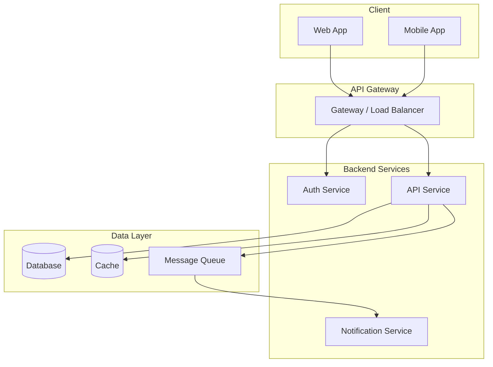
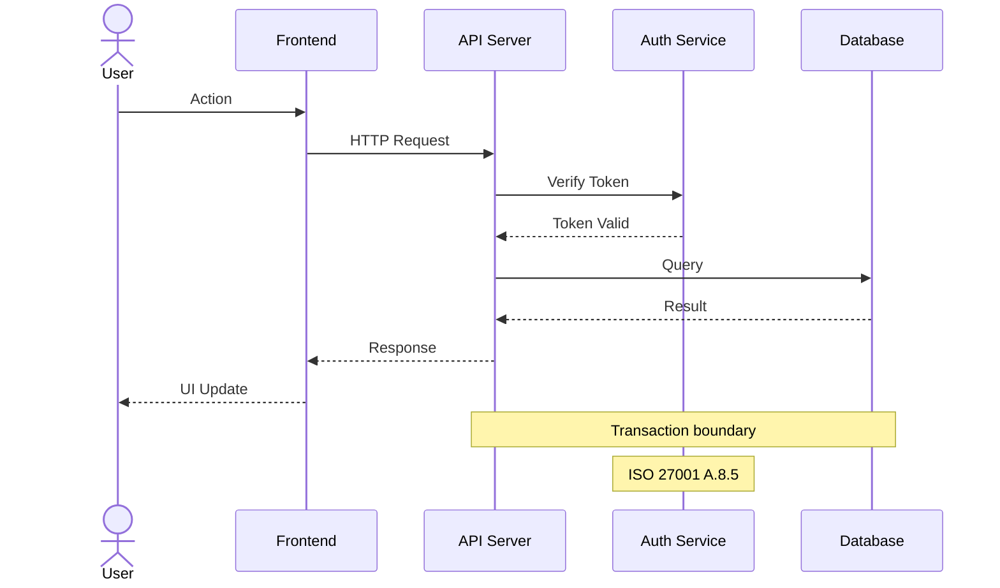
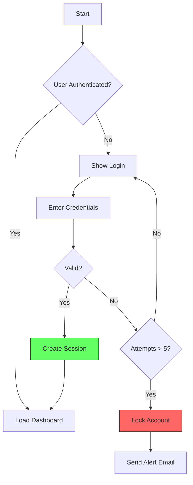
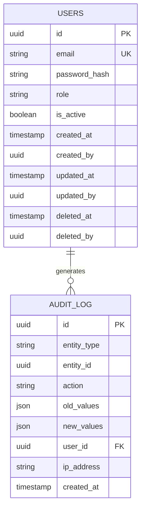
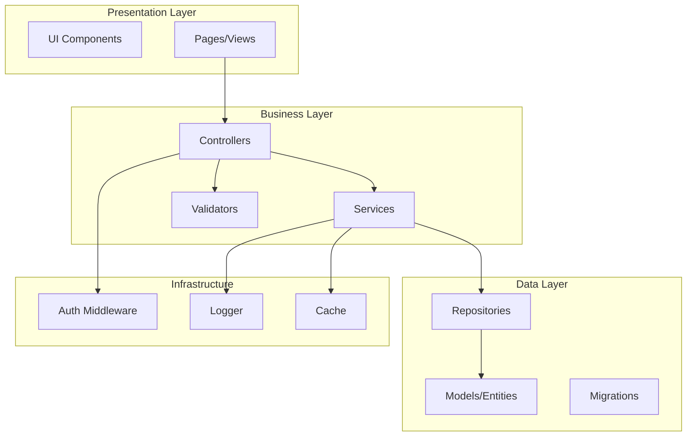
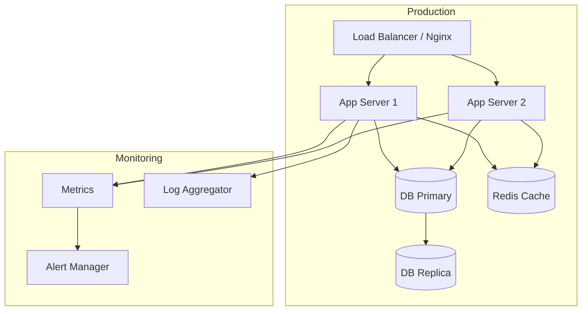
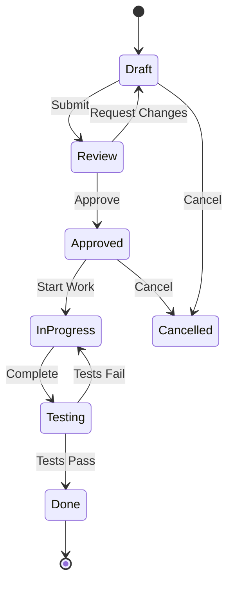

# Project Diagrams

> Visual documentation of every development step.
> Diagrams are written in Mermaid (Markdown-compatible) format.

---

## Diagram Types and When to Use

| Type | Code | When | Mandatory |
|------|------|------|-----------|
| System Architecture | ARCH-XXX | During architecture design | Yes (Gate 2) |
| Sequence Diagram | SEQ-XXX | For API/operation flows | Yes (every endpoint) |
| Flow Diagram | FLOW-XXX | For business logic flows | Yes (every feature) |
| ER Diagram | ER-XXX | During DB design | Yes (Gate 2) |
| Component Diagram | COMP-XXX | For module structure | Yes (Gate 2) |
| Deployment Diagram | DEPLOY-XXX | During infrastructure design | Yes (Gate 4) |
| State Diagram | STATE-XXX | For features with state transitions | When needed |
| Class Diagram | CLASS-XXX | For complex OOP structures | When needed |

---

## Diagram Registry Table

| Dia ID | Type | Title | Related Req/Dev | Date | Version | File |
|--------|------|-------|----------------|------|---------|------|
| | | | | | | |

---

## Diagram Templates (Mermaid)

### System Architecture (ARCH)

### Sequence Diagram (SEQ)

### Flow Diagram (FLOW)

### ER Diagram (ER)

### Component Diagram (COMP)

### Deployment Diagram (DEPLOY)

### State Diagram (STATE)

---

## Diagram Writing Rules

1. **Give each diagram an ID** (ARCH-001, SEQ-001, etc.)
2. **Link to RTM** - Specify which requirement it relates to
3. **ISO 27001 notes** - Mark security points with Notes
4. **Version tracking** - Changed diagrams get version numbers
5. **Record in Dev Log** - Every diagram creation/update is added to the DEV log
