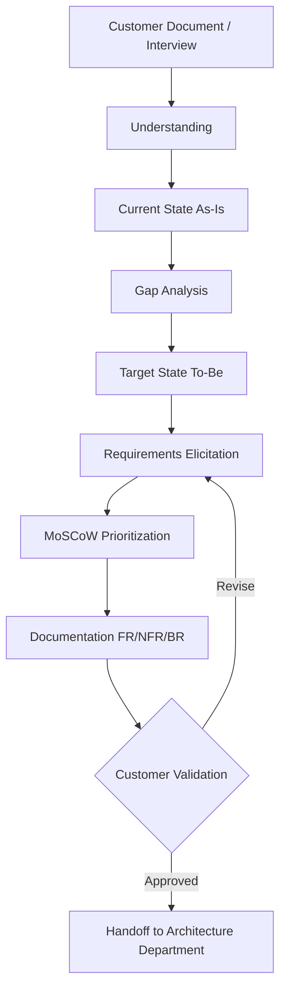
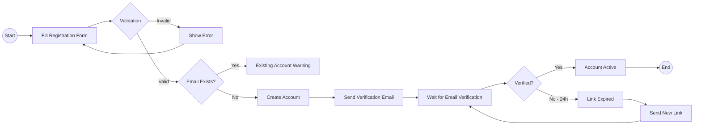

# Business Analyst Skill Definition

## Role
Translating business requirements into technical requirements, gap analysis, process mapping, and stakeholder management.

---

## Responsibilities

| Area | Detail |
|------|--------|
| Requirements Elicitation | Customer interviews, workshops, document analysis |
| Gap Analysis | Current vs target state analysis |
| Process Modeling | BPMN diagrams, workflow maps |
| Data Analysis | Data needs, reporting requirements |
| Stakeholder Management | Stakeholder identification, expectation management |
| Acceptance Criteria | Measurable acceptance criteria for user stories |
| Impact Analysis | Change impact assessment |
| Documentation | BRD, use case, process flow, data flow |

---

## Business Analysis Process



---

## MoSCoW Prioritization

| Priority | Meaning | Rule |
|----------|---------|------|
| **Must** | Essential | Project FAILS without this |
| **Should** | Important | Important but workaround exists |
| **Could** | Nice to have | Would be nice, if time permits |
| **Won't** | Not this release | Consciously deferred |

---

## Requirement Types

### Functional (FR)
```
FR-001: The system MUST allow users to register with email and password.
Acceptance Criteria:
- Email format is validated
- Password min 8 characters, 1 uppercase letter, 1 digit
- Verification email is sent after registration
- Re-registration with the same email is prevented
```

### Non-Functional (NFR)
```
NFR-001: The system MUST respond to 1000 concurrent users in under 500ms.
Measurement: k6 load test, p95 metric
```

### Business Rule (BR)
```
BR-001: If the order total is over 500 TL, shipping is FREE.
Source: Customer meeting 2026-04-01
Implementation: OrderService.calculateShipping()
```

---

## BPMN Process Diagram Example



---

## Deliverables
| Deliverable | Template | Phase |
|-------------|----------|-------|
| Stakeholder Register | STAKEHOLDER_REGISTER.md | Phase 0 |
| As-Is / To-Be analysis | Workspace document | Phase 1 |
| Requirements list (FR/NFR/BR) | SRS_TEMPLATE.md | Phase 1 |
| Process diagrams | Mermaid BPMN | Phase 1 |
| Use Case document | USE_CASE_TEMPLATE.md | Phase 1 |
| Data flow diagram | Mermaid | Phase 1-2 |
| MoSCoW priority table | Within PRD | Phase 1 |
| Gap analysis report | Workspace document | Phase 1 |

---

## Related Documents
- `governance/templates/SRS_TEMPLATE.md`
- `governance/templates/USE_CASE_TEMPLATE.md`
- `governance/templates/PRD_TEMPLATE.md`
- `governance/templates/DOCUMENT_ANALYSIS_TEMPLATE.md`
- `governance/traceability/REQUIREMENTS_TRACEABILITY_MATRIX.md`
