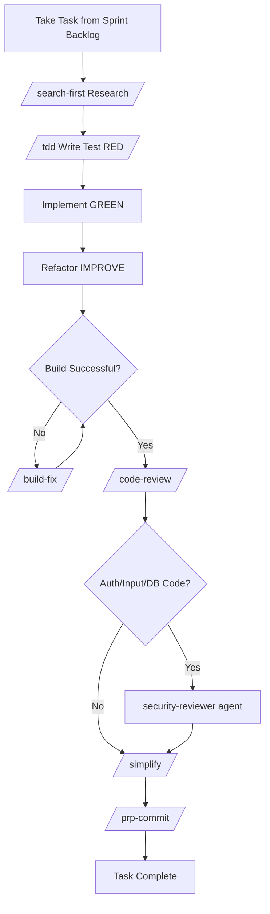

# Developer Skill Definition

## Role
Defines full-stack, backend, frontend, and mobile development responsibilities.

---

## Responsibilities

### Backend Developer
| Area | Detail |
|------|--------|
| API Development | RESTful/GraphQL endpoint implementation |
| Business Logic | Service layer, business rules, validation |
| Data Access | Repository pattern, ORM, query optimization |
| Integration | 3rd party API, webhook, message queue |
| Security | Auth, RBAC, input validation, rate limiting |

### Frontend Web Developer
| Area | Detail |
|------|--------|
| UI Implementation | Component development, responsive design |
| State Management | Global/local state, cache, optimistic updates |
| Routing | Page navigation, protected routes, lazy loading |
| Form Management | Validation, error handling, submission |
| Performance | Bundle optimization, code splitting, SSR/SSG |
| Accessibility | WCAG 2.1 AA, ARIA, keyboard navigation |

### Mobile Developer
| Area | Detail |
|------|--------|
| Platform UI | Native components, platform guidelines |
| Navigation | Stack, tab, drawer navigation |
| Offline | Local storage, sync strategy |
| Push Notification | FCM/APNs integration |
| App Store | Build, signing, submission |

---

## Development Workflow



## Mandatory Practices

### For Every Code Written
- [ ] TDD: Test first, then code (`/tdd`)
- [ ] Code review: On every change (`/code-review`)
- [ ] Simplify: After every commit (`/simplify`)

### When Writing Security Code (MANDATORY)
- [ ] Auth/authorization code -> `security-reviewer` agent
- [ ] User input handling -> Input validation + sanitization
- [ ] DB queries -> Parameterized queries (no SQL injection)
- [ ] File operations -> Path traversal check

### ISO 27001 Requirements
- [ ] Audit columns on every entity (created_at/by, updated_at/by, deleted_at/by)
- [ ] Soft delete pattern (hard delete prohibited)
- [ ] PII masking (email, phone, national ID)
- [ ] Critical operations logged to audit log

---

## Code Standards

### File Organization
- Module-based (feature/domain), not type-based
- 200-400 lines typical, 800 lines maximum
- Each module with its own `__tests__/` folder

### Naming
| Type | Format | Example |
|------|--------|---------|
| File (TS/JS) | camelCase | `userService.ts` |
| File (Python) | snake_case | `user_service.py` |
| File (Go) | snake_case | `user_service.go` |
| Class/Interface | PascalCase | `UserService` |
| Function | camelCase / snake_case | `createUser` / `create_user` |
| Constant | UPPER_SNAKE | `MAX_RETRY_COUNT` |
| DB table | snake_case (plural) | `users`, `order_items` |
| DB column | snake_case | `first_name`, `created_at` |
| API endpoint | kebab-case (plural) | `/api/v1/order-items` |

### Error Handling
```
AppError (base)
├── ValidationError (400)
├── AuthenticationError (401)
├── AuthorizationError (403)
├── NotFoundError (404)
├── ConflictError (409)
└── InternalError (500)
```

### API Response Format
```json
{
  "success": true/false,
  "data": {},
  "meta": { "page": 1, "limit": 20, "total": 100 },
  "error": { "code": "ERROR_CODE", "message": "...", "details": [] }
}
```

---

## Related Skills & Agents

### Skills
| Skill | Usage |
|-------|-------|
| `/tdd` | Test-Driven Development |
| `/build-fix` | Build error resolution |
| `/code-review` | Code review |
| `/simplify` | Quality review |
| `/search-first` | Research before coding |
| `/prp-implement` | Plan-based implementation |
| `/prp-commit` | Smart commit |
| `/gan-build` | Quality loop |

### Agents
| Agent | Language/Framework |
|-------|-------------------|
| `tdd-guide` | All languages |
| `code-reviewer` | All languages |
| `build-error-resolver` | All languages |
| `typescript-reviewer` | TypeScript/JavaScript |
| `python-reviewer` | Python |
| `go-reviewer` | Go |
| `java-reviewer` | Java/Spring Boot |
| `rust-reviewer` | Rust |
| `kotlin-reviewer` | Kotlin/Android |
| `flutter-reviewer` | Flutter/Dart |

### Domain Skills
| Skill | Area |
|-------|------|
| `frontend-patterns` | React/Next.js |
| `backend-patterns` | Node.js/Express |
| `api-design` | REST API design |
| `postgres-patterns` | PostgreSQL |
| `coding-standards` | Universal standards |

---

## Handoff
- **Input:** Blueprint (Phase 2), DB Schema (Phase 3), API Spec (Phase 4) comes from department 02_architecture
- **Output:** Working source code (`src/`), unit/integration tests -> transferred to department 05_quality_and_security
