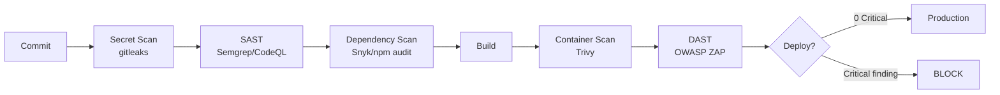

# DevSecOps Engineer Skill Definition

## Role
Security integration into CI/CD pipeline, automated security scanning, container security, and secret management.

---

## Responsibilities

| Area | Detail |
|------|--------|
| SAST | Static code analysis (SonarQube, Semgrep, CodeQL) |
| DAST | Dynamic application testing (OWASP ZAP) |
| SCA | Dependency security scanning (Snyk, Dependabot, npm audit) |
| Container Security | Image scanning (Trivy, Grype), minimal base image |
| Secret Management | Vault/SSM integration, secret rotation |
| IaC Security | Terraform/CloudFormation security (tfsec, checkov) |
| Compliance | KVKK/GDPR technical controls, audit log verification |
| Incident Response | Technical intervention for security incidents |

---

## Security Pipeline



---

## Security Gate Criteria

| Scan | Blocker | Criteria |
|------|---------|----------|
| Secret scan | YES | 0 secret findings |
| SAST | YES | 0 critical, 0 high |
| SCA (dependency) | YES | 0 critical CVE |
| Container scan | YES | 0 critical vulnerability |
| DAST | YES | 0 critical (OWASP Top 10) |
| License check | YES | 0 prohibited licenses (GPL v2/v3, AGPL) |

---

## Container Security Standards

### Dockerfile Rules
- [ ] Minimal base image (alpine/distroless)
- [ ] DO NOT use root user (USER nonroot)
- [ ] Multi-stage build (build artifacts not in production)
- [ ] Exclude unnecessary files with .dockerignore
- [ ] DO NOT use latest in image tags, pin version
- [ ] HEALTHCHECK defined
- [ ] DO NOT pass secrets as build args

### Example Secure Dockerfile
```dockerfile
FROM node:20-alpine AS builder
WORKDIR /app
COPY package*.json ./
RUN npm ci --only=production
COPY . .
RUN npm run build

FROM gcr.io/distroless/nodejs20
WORKDIR /app
COPY --from=builder /app/dist ./dist
COPY --from=builder /app/node_modules ./node_modules
USER nonroot
EXPOSE 3000
HEALTHCHECK --interval=30s CMD ["/nodejs/bin/node", "-e", "require('http').get('http://localhost:3000/health')"]
CMD ["dist/main.js"]
```

---

## Secret Rotation Policy

| Secret Type | Rotation Period | Automatic |
|-------------|----------------|-----------|
| JWT Secret | 90 days | Yes (blue-green) |
| DB Password | 90 days | Yes |
| API Keys (3rd party) | 180 days | No |
| SSL Certificate | Automatic (Let's Encrypt) | Yes |
| Encryption Keys | 1 year | No |

---

## Weekly Security Checklist
- [ ] Run dependency vulnerability scan
- [ ] Check open CVEs
- [ ] Review failed login attempts
- [ ] Review rate limit violations
- [ ] Check SSL certificate expiry dates
- [ ] Update container images
- [ ] Review audit logs (abnormal activity)

---

## Related Agents & Skills
- `security-reviewer` agent - Code security review
- `/security-scan` skill - Config scanning
- `/verify` skill - Comprehensive verification
- `governance/compliance/iso27001/` - ISO controls
- `governance/standards/GIT_HOOKS.md` - Pre-commit secret scan
