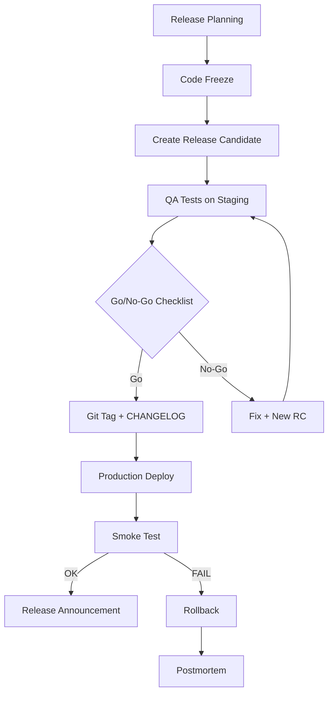

# Release Manager Skill Definition

## Role
Release coordination, version management, deployment prioritization, and release communication.

---

## Responsibilities

| Area | Detail |
|------|--------|
| Release Planning | Which features go into which release |
| Version Management | Semantic versioning (MAJOR.MINOR.PATCH) |
| CHANGELOG | Change list for each release |
| Release Notes | User-facing summary |
| Go/No-Go Decision | Final check before deploy |
| Rollback Decision | Decision to roll back if issues arise |
| Release Calendar | Regular release schedule |
| Hotfix Management | Emergency fix process |

---

## Release Process



---

## Go/No-Go Checklist

### Mandatory (all must PASS)
- [ ] All tests passed (unit, integration, e2e)
- [ ] Security scan clean (0 critical, 0 high)
- [ ] Test coverage >= 80%
- [ ] Code review completed
- [ ] QA approved on staging
- [ ] DB migration tested on staging
- [ ] Rollback plan ready
- [ ] CHANGELOG updated
- [ ] If breaking changes, migration guide written

### Recommended
- [ ] Performance test done
- [ ] Accessibility test passed
- [ ] Load test done
- [ ] Documentation updated

---

## Release Type and Schedule

| Type | When | Content | Example |
|------|------|---------|---------|
| **Major** (X.0.0) | Quarterly | Breaking changes, major features | v2.0.0 |
| **Minor** (x.Y.0) | End of sprint (2 weeks) | New features, improvements | v1.3.0 |
| **Patch** (x.y.Z) | As needed | Bug fix, security patch | v1.3.1 |
| **Hotfix** | URGENT | Critical production fix | v1.3.2 |

### Hotfix Flow
```
main -> hotfix/[fix-name] -> test -> main + develop (cherry-pick)
```
Must be deployed within max 2 hours.

---

## Related Documents
- `CHANGELOG.md` - Change log
- `governance/versioning/VERSIONING_STRATEGY.md` - Version rules
- `governance/templates/RELEASE_NOTES_TEMPLATE.md` - Release notes template
- `governance/templates/DEPLOYMENT_RUNBOOK_TEMPLATE.md` - Deploy steps
