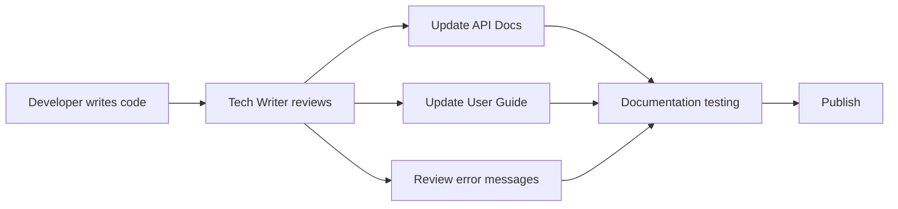

# Technical Writer Skill Definition

## Role
API documentation, user guide, in-app help text, and quality control for all technical documentation.

---

## Responsibilities

| Area | Detail |
|------|--------|
| API Documentation | OpenAPI/Swagger, endpoint descriptions, sample request/response |
| User Guide | Step-by-step guide for end users |
| In-App Help | Tooltip, help text, onboarding tour texts |
| Developer Docs | README, contributing guide, architecture overview |
| Release Notes | Change summary for each release (CHANGELOG) |
| Error Messages | User-friendly, solution-suggesting error texts |
| Terminology | Data dictionary and glossary updates |

---

## Documentation Standards

### Writing Rules
| Rule | Example |
|------|---------|
| Use active voice | "Click the button" (passive: "The button should be clicked") |
| Short sentences (max 25 words) | - |
| Avoid technical jargon (user docs) | "Your files have been saved" (not "Persist operation completed") |
| Consistent terminology | Always the same word for the same thing |
| Step numbers | 1, 2, 3... (not bullet points, for sequencing) |
| Screenshots | One visual every 3-5 steps |

### Error Message Format
```
[What happened] + [Why it happened (optional)] + [What you can do]

Examples:
- "Email address is already registered. Use your password to log in."
- "File upload failed. Maximum file size is 10 MB. Select a smaller file."
- "An error occurred during the operation. Please try again. If the problem persists, contact support."
```

### Empty State Texts
```
[Title: What's missing] + [Description: Why it's missing] + [Action: What to do]

Example:
- Title: "You don't have any orders yet"
- Description: "They will appear here when you place an order"
- Button: "Explore Products"
```

---

## Workflow



### Every Sprint
- [ ] Document new/changed API endpoints
- [ ] Write user guide for new screens
- [ ] Review and improve error messages
- [ ] Update CHANGELOG
- [ ] Update Data Dictionary

---

## Deliverables
| Deliverable | Location |
|-------------|----------|
| API Docs | `src/docs/api/` or Swagger UI |
| User Guide | `src/docs/user-guide/` |
| CHANGELOG | `CHANGELOG.md` |
| Data Dictionary | `governance/glossary/DATA_DICTIONARY.md` |
| Error Message Catalogue | `src/locales/[lang]/errors.json` |

---

## Related Skills
- `/update-docs` - Documentation update
- `/update-codemaps` - Codemap update
- `doc-updater` agent
