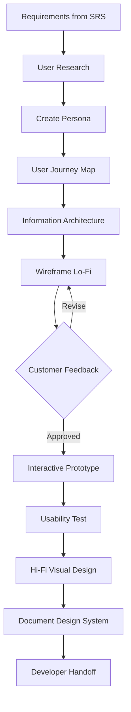

# UI/UX Designer Skill Definition

## Role
User research, wireframing, prototyping, design system, and visual design responsibilities.

---

## Responsibilities

| Area | Detail |
|------|--------|
| User Research | Persona creation, user interviews, surveys, competitive analysis |
| Information Architecture | Site map, navigation structure, content hierarchy |
| Wireframing | Low-fidelity wireframes (Figma/Excalidraw/Mermaid) |
| Prototyping | Interactive prototype (Figma/Framer) |
| Design System | Color palette, typography, spacing, component library |
| Visual Design | High-fidelity mockups, icons, illustrations |
| Usability Testing | Task-based testing, SUS score, heuristic evaluation |
| Handoff | Design delivery to developers (spacing, color codes, assets) |

---

## Workflow



---

## Design System Standards

### Color Palette
```
Primary:    #[hex] - Main brand color
Secondary:  #[hex] - Secondary color
Success:    #16A34A - Success (green)
Warning:    #F59E0B - Warning (yellow)
Error:      #DC2626 - Error (red)
Info:       #2563EB - Info (blue)
Neutral:    #6B7280 - Neutral (gray)
Background: #FFFFFF / #0F172A (dark mode)
```

### Typography
```
Heading (H1):  32px / 40px line-height / Bold
Heading (H2):  24px / 32px / Semibold
Heading (H3):  20px / 28px / Semibold
Body:          16px / 24px / Regular
Small:         14px / 20px / Regular
Caption:       12px / 16px / Regular
```

### Spacing Scale
```
4px  (xs)  | 8px  (sm)  | 12px (md)
16px (lg)  | 24px (xl)  | 32px (2xl)
48px (3xl) | 64px (4xl)
```

### Component List (Minimum)
- [ ] Button (primary, secondary, outline, ghost, danger, sizes)
- [ ] Input (text, email, password, search, textarea)
- [ ] Select / Dropdown
- [ ] Checkbox / Radio / Toggle
- [ ] Modal / Dialog
- [ ] Toast / Notification
- [ ] Card
- [ ] Table (sortable, paginated)
- [ ] Tabs
- [ ] Breadcrumb
- [ ] Avatar
- [ ] Badge / Tag
- [ ] Skeleton / Loading
- [ ] Empty State
- [ ] Error State

---

## Accessibility Requirements
- WCAG 2.1 AA compliance (MANDATORY)
- Color contrast ratio >= 4.5:1 (normal text)
- Touch target min 44x44px
- Visible focus indicator
- Screen reader compatible
- Full keyboard navigation

> Detail: `governance/standards/ACCESSIBILITY_GUIDELINES.md`

---

## Deliverables
| Deliverable | Format | Delivery |
|-------------|--------|----------|
| Persona documents | Markdown | Phase 1 |
| User Journey Map | Mermaid diagram | Phase 1 |
| Wireframe (Lo-Fi) | Mermaid / ASCII / Figma link | Phase 2 |
| Design System | Markdown + color/font definitions | Phase 2 |
| Hi-Fi Mockup | Figma link or screenshot | Phase 2 |
| Component Spec | Markdown (states, sizes, variants) | Phase 6 |

---

## Related Documents
- `governance/standards/ACCESSIBILITY_GUIDELINES.md`
- `governance/standards/UI_UX_TESTING_STRATEGY.md`
- `governance/standards/I18N_GUIDE.md`
