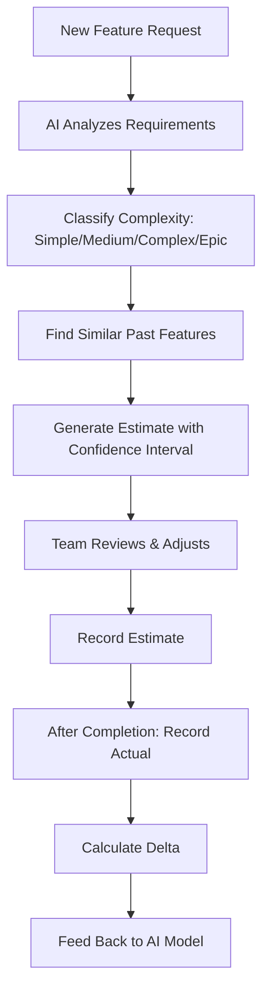

# AI-Powered Estimation Engine

> **Compliance References:**
> - Based on: COCOMO II (Boehm 2000), ISBSG Data Repository
> - Spec: IFPUG Function Points 4.3.1
> - Controls: MMRE measurement
> - See also: [governance/STANDARDS_COMPLIANCE_MATRIX.md](../STANDARDS_COMPLIANCE_MATRIX.md)

## Overview

Combines historical data, function point analysis, and AI to estimate effort, cost, and duration. Learns from actual vs estimated deltas.

---

## 1. Estimation Methods

| Method | When | Accuracy |
|--------|------|----------|
| **T-shirt sizing** | Epic level, early planning | Low (±50%) |
| **Story points** | Sprint planning | Medium (±30%) |
| **Function points** | Contract/budget estimation | Medium-High (±20%) |
| **AI-assisted** | All levels, with historical data | High (±15%) |

---

## 2. AI Estimation Workflow



---

## 3. Complexity Classifier

| Level | Criteria | Typical Effort |
|-------|---------|---------------|
| **Simple** | Single module, < 3 files, well-understood pattern | 1-3 days |
| **Medium** | 2-3 modules, 5-10 files, some unknowns | 3-8 days |
| **Complex** | Cross-module, 10+ files, new patterns needed | 1-3 weeks |
| **Epic** | System-wide, architectural changes | 3+ weeks, decompose first |

---

## 4. Effort Distribution Model

| Activity | % of Total Effort |
|----------|------------------|
| Development | 40% |
| Testing | 25% |
| Code Review | 15% |
| Deployment & Config | 10% |
| Documentation | 10% |

---

## 5. Confidence Intervals

Every estimate has three values:

| Scenario | Meaning | Probability |
|----------|---------|------------|
| Optimistic | Everything goes smoothly | 10th percentile |
| Likely | Normal conditions | 50th percentile |
| Pessimistic | Significant obstacles | 90th percentile |

**Use for budgeting:** Pessimistic estimate for budget, Likely for planning.

---

## 6. Accuracy Tracking

### MMRE (Mean Magnitude of Relative Error)
```
MRE per feature = |Actual - Estimated| / Actual
MMRE = Average of all MREs
```

| MMRE | Rating | Action |
|------|--------|--------|
| < 15% | Excellent | Maintain approach |
| 15-25% | Good | Minor calibration |
| 25-40% | Fair | Review estimation process |
| > 40% | Poor | Major calibration needed |

---

## 7. Sprint Tracking Template

| Feature | Estimated (SP) | Actual (SP) | MRE | Notes |
|---------|---------------|-------------|-----|-------|
| [feature] | [X] | [Y] | [Z]% | |

---

## 8. Integration with VSH

| Standard | Connection |
|----------|-----------|
| ESTIMATION_GUIDE.md | Estimation techniques |
| VALUE_STREAM_MANAGEMENT.md | Flow time data |
| AI_COST_TRACKING.md | AI cost in estimates |
| PROCESS_BASELINES.md | Historical velocity data |
