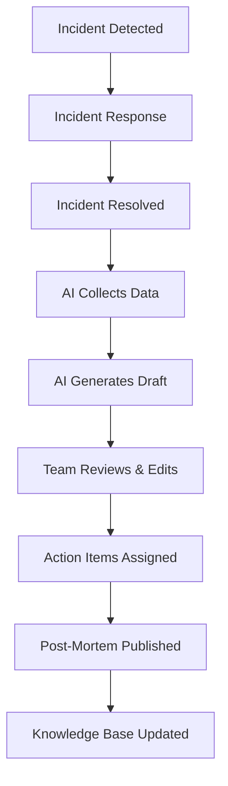

# AI-Assisted Incident Post-Mortem Generator

> **Compliance References:**
> - Based on: Google SRE Post-Mortem Culture, Etsy Blameless Post-Mortem
> - Spec: NIST SP 800-61r2
> - Controls: Blameless analysis
> - See also: [governance/STANDARDS_COMPLIANCE_MATRIX.md](../STANDARDS_COMPLIANCE_MATRIX.md)

## Overview

After every significant incident, a blameless post-mortem must be conducted. This standard defines how AI agents assist in generating comprehensive post-mortem documents from incident data, reducing effort from days to hours while ensuring consistency.

---

## 1. Blameless Post-Mortem Principles

1. **No blame, no shame** - Focus on systems, not individuals
2. **Assume good intent** - Everyone acted with best information available
3. **Focus on learning** - Goal is to prevent recurrence, not assign fault
4. **Be specific** - Concrete facts, timestamps, and evidence
5. **Action-oriented** - Every finding must have a remediation action

---

## 2. AI Generation Workflow



### AI Data Collection Sources
1. **Monitoring alerts** - Alert timestamps, severity, affected services
2. **Incident channel logs** - Communication timeline
3. **Git history** - Recent deployments and changes
4. **CI/CD logs** - Pipeline runs around incident time
5. **Application logs** - Error traces, stack traces
6. **Metrics dashboards** - Latency, error rate, throughput graphs

---

## 3. Post-Mortem Template (AI-Generated)

```markdown
# Post-Mortem: [INCIDENT_TITLE]

## Metadata
- **Incident ID:** INC-[XXX]
- **Date:** [YYYY-MM-DD]
- **Severity:** [P1/P2/P3/P4]
- **Duration:** [X hours Y minutes]
- **Impact:** [X users affected, Y% error rate]
- **Author:** AI-Generated, Reviewed by [NAME]

## Executive Summary
[2-3 sentences describing what happened, impact, and resolution]

## Timeline
| Time (UTC) | Event | Source |
|-----------|-------|--------|
| HH:MM | [First alert triggered] | Monitoring |
| HH:MM | [Incident declared] | Slack |
| HH:MM | [Root cause identified] | Investigation |
| HH:MM | [Fix deployed] | CI/CD |
| HH:MM | [Service restored] | Monitoring |
| HH:MM | [Incident closed] | Incident Mgmt |

## Root Cause Analysis
### Category: [Code / Config / Infrastructure / Dependency / Process]
[Detailed explanation of root cause]

### 5-Why Analysis
1. Why did service fail? → [answer]
2. Why did [answer 1] happen? → [answer]
3. Why did [answer 2] happen? → [answer]
4. Why did [answer 3] happen? → [answer]
5. Why did [answer 4] happen? → [ROOT CAUSE]

## Impact Assessment
| Dimension | Value |
|-----------|-------|
| Users affected | [number] |
| Revenue impact | $[amount] |
| SLO budget consumed | [X]% |
| Data loss | [yes/no, details] |
| Reputation impact | [low/medium/high] |

## What Went Well
- [Detection was fast (< X minutes)]
- [Communication was clear]
- [Rollback worked as expected]

## What Went Wrong
- [Monitoring gap: X was not alerted]
- [Runbook was outdated]
- [Recovery took longer than expected because...]

## Action Items
| # | Action | Owner | Priority | Deadline | Status |
|---|--------|-------|----------|----------|--------|
| 1 | [Fix root cause] | [name] | P1 | [date] | Open |
| 2 | [Add monitoring for X] | [name] | P2 | [date] | Open |
| 3 | [Update runbook] | [name] | P3 | [date] | Open |

## Lessons Learned
[Key takeaways for the organization]

## References
- Incident channel: [link]
- Dashboard: [link]
- Related ADR: [link]
```

---

## 4. Root Cause Taxonomy

| Category | Subcategory | Example |
|----------|------------|---------|
| **Code** | Logic error | Off-by-one, null pointer |
| **Code** | Performance | N+1 query, memory leak |
| **Code** | Security | Injection, auth bypass |
| **Config** | Environment | Wrong env variable |
| **Config** | Feature flag | Flag misconfigured |
| **Infra** | Capacity | Disk full, OOM |
| **Infra** | Network | DNS failure, timeout |
| **Infra** | Cloud | Provider outage |
| **Dependency** | Third-party | API down, SDK bug |
| **Dependency** | Internal | Upstream service failure |
| **Process** | Deployment | Bad rollout, missing migration |
| **Process** | Communication | Missed handoff |

---

## 5. Severity Classification

| Severity | Criteria | Response Time | Post-Mortem Required |
|----------|----------|--------------|---------------------|
| **P1 - Critical** | Service down, data loss, security breach | Immediate | YES (within 48h) |
| **P2 - Major** | Degraded performance, partial outage | < 1 hour | YES (within 1 week) |
| **P3 - Minor** | Non-critical feature affected | < 4 hours | Optional |
| **P4 - Low** | Cosmetic, no user impact | Next business day | No |

---

## 6. Action Item Tracking

All post-mortem action items are tracked in:
1. `governance/audit_trail/` - Audit record
2. `governance/backlog/` - Added to product backlog
3. `governance/tech_debt/TECH_DEBT_REGISTER.md` - If technical debt related

### Follow-up Schedule
- **Week 1:** P1 actions completed
- **Week 2:** P2 actions completed
- **Sprint end:** All actions reviewed
- **Next sprint:** Remaining actions carried forward

---

## 7. Integration with VSH

| Component | Connection |
|-----------|-----------|
| INCIDENT_RESPONSE_PLAN.md | Triggers post-mortem after resolution |
| CAUSAL_ANALYSIS.md | Deep root cause analysis for recurring issues |
| RISK_REGISTER.md | New risks identified during post-mortem |
| TECH_DEBT_REGISTER.md | Technical debt actions from post-mortem |
| DORA_METRICS.md | MTTR and CFR updated |
| SRE_ERROR_BUDGET.md | Error budget impact calculated |
