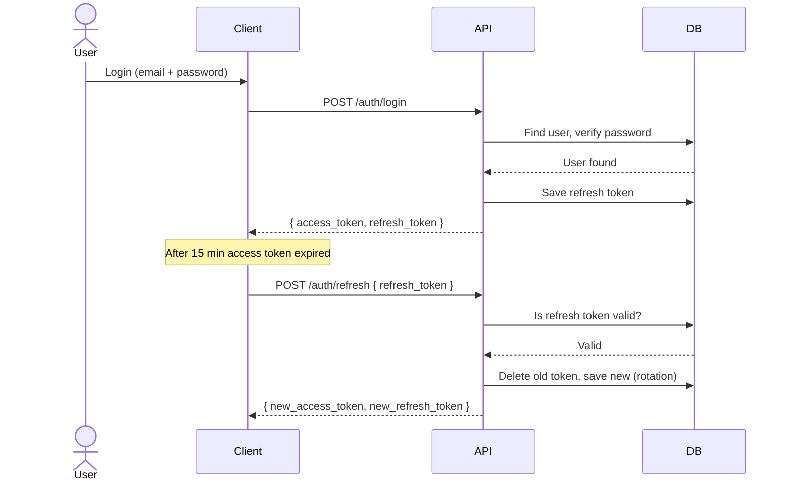
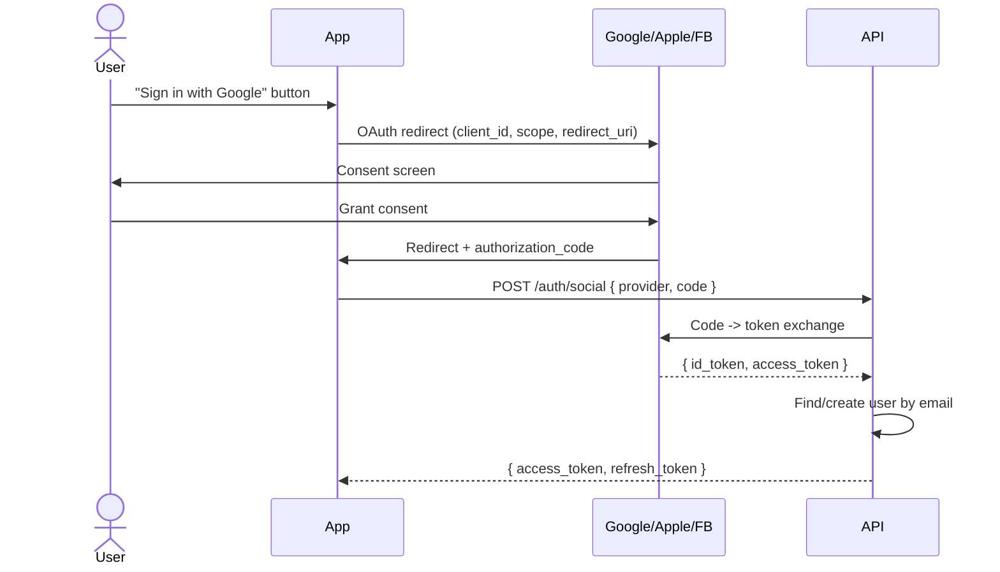

# Authentication & 3rd Party Auth Guide

> **Compliance References:**
> - Based on: OAuth 2.1, OpenID Connect, NIST SP 800-63B
> - Spec: RFC 6749, RFC 9126
> - Controls: AAL1-AAL3
> - See also: [governance/STANDARDS_COMPLIANCE_MATRIX.md](../STANDARDS_COMPLIANCE_MATRIX.md)

## Purpose
Standards for JWT, OAuth 2.0, social login, and MFA integration.

---

## 1. Auth Strategy Selection

| Strategy | Usage | Complexity |
|----------|-------|------------|
| **JWT (self-managed)** | Standard web/mobile application | Medium |
| **OAuth 2.0 + OIDC** | SSO, enterprise integration | High |
| **Session-based** | Server-rendered web app | Low |
| **Auth provider (Clerk/Auth0/Supabase)** | Quick start, hosted | Low |

---

## 2. JWT Flow (Self-managed)

### Token Structure
```
Access Token:  Short-lived (15 min), API access
Refresh Token: Long-lived (7 days), for obtaining new access token
```

### Security Rules
| Rule | Detail |
|------|--------|
| Access token duration | Max 15 minutes |
| Refresh token duration | Max 7 days |
| JWT Secret | Min 256 bit, environment variable, rotate every 90 days |
| Token storage (web) | httpOnly + Secure + SameSite=Strict cookie |
| Token storage (mobile) | Keychain (iOS) / EncryptedSharedPreferences (Android) |
| Refresh token | Store in DB, single-use (rotation) |
| Logout | Delete refresh token from DB |
| Device tracking | Bind device/IP to each refresh token |

### Flow


---

## 3. Social Login (OAuth 2.0)

### Supported Providers
| Provider | Client ID Env | Scope |
|----------|-------------|-------|
| Google | GOOGLE_CLIENT_ID | openid email profile |
| Apple | APPLE_CLIENT_ID | name email |
| Facebook | FACEBOOK_APP_ID | email public_profile |
| GitHub | GITHUB_CLIENT_ID | read:user user:email |
| Microsoft | AZURE_CLIENT_ID | openid email profile |

### Social Login Flow


### CRITICAL Rules
- [ ] `redirect_uri` must be in whitelist (prevent open redirect)
- [ ] Use `state` parameter (CSRF prevention)
- [ ] Use `nonce` (replay attack prevention)
- [ ] Email verification: check `email_verified` claim
- [ ] Support linking multiple providers with the same email

---

## 4. MFA (Multi-Factor Authentication)

### Supported Methods
| Method | Security | UX | Usage |
|--------|----------|-----|-------|
| TOTP (Google Auth) | High | Medium | Default recommended |
| SMS OTP | Medium | Easy | Fallback |
| Email OTP | Medium | Easy | Fallback |
| WebAuthn/Passkey | Very high | Easy | Modern devices |

### Cases Where MFA Must Be Mandatory
- Admin panel access
- Payment info changes
- Password changes
- 2FA removal (ironic but necessary)
- First login from a new device

---

## 5. RBAC (Role-Based Access Control)

### Default Roles
| Role | Description | Example Permissions |
|------|-------------|---------------------|
| super_admin | Full access | * |
| admin | Management | users:*, settings:* |
| moderator | Content management | content:*, comments:* |
| user | Standard user | profile:own, orders:own |
| viewer | Read-only | read:* |

### Permission Format
```
resource:action
users:create, users:read, users:update, users:delete
orders:read:own (only own orders)
```

---

## Related Documents
- `governance/compliance/iso27001/USER_OPERATIONS_CONTROLS.md`
- `governance/standards/API_STYLE_GUIDE.md`
- `governance/compliance/KVKK_GDPR_CHECKLIST.md`
