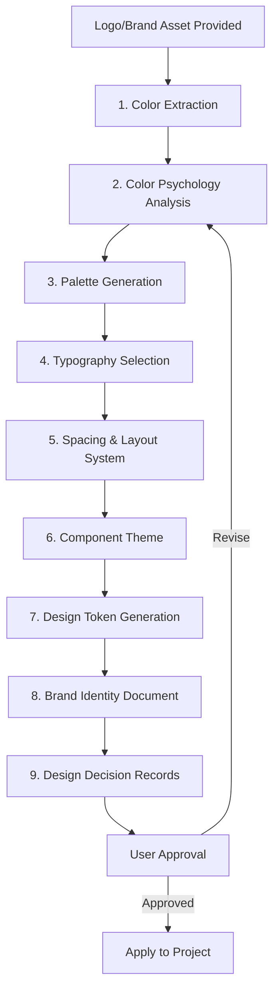

# Brand Identity Pipeline — Logo to Design System

> **Compliance References:**
> - Based on: Material Design 3, Apple HIG, W3C WCAG 2.1 AA
> - Spec: Design Tokens W3C Community Group Draft
> - Controls: Color extraction, typography pairing, accessibility contrast
> - See also: [governance/STANDARDS_COMPLIANCE_MATRIX.md](../STANDARDS_COMPLIANCE_MATRIX.md)

## Overview

When a logo or brand asset is provided, this pipeline automatically extracts colors, derives a full design system, selects typography, and generates all design documentation with **detailed rationale for every decision**.

---

## 1. Pipeline Flow



**RULE: Logo arrives = Design pipeline starts automatically. No user prompt needed.**

---

## 2. Step 1: Color Extraction from Logo

### Process
1. Analyze logo image (colors, shapes, mood)
2. Extract dominant colors (primary, secondary, accent)
3. Extract supporting colors (if logo has multiple elements)
4. Note color proportions (which color dominates)

### Output: Raw Color Palette
```
Extracted Colors:
  Dominant:  #XXXXXX (XX% of logo area) — [color name]
  Secondary: #XXXXXX (XX% of logo area) — [color name]
  Accent:    #XXXXXX (XX% of logo area) — [color name]
  Neutral:   Derived from dominant (desaturated)
```

---

## 3. Step 2: Color Psychology Analysis

**Every color choice MUST include a "Why" explanation.**

### Color Psychology Reference

| Color Family | Psychology | Best For | Avoid When |
|-------------|-----------|----------|-----------|
| **Blue** | Trust, stability, professionalism | Finance, healthcare, B2B, tech | Food, energy, urgency |
| **Red** | Energy, urgency, passion | Food, retail, entertainment | Healthcare, finance |
| **Green** | Growth, health, nature | Health, eco, finance (wealth) | Luxury, tech |
| **Purple** | Luxury, creativity, wisdom | Premium, beauty, education | Budget brands |
| **Orange** | Enthusiasm, warmth, action | E-commerce, SaaS CTAs, youth | Luxury, corporate |
| **Yellow** | Optimism, clarity, warmth | Children, food, caution | Luxury, serious B2B |
| **Black** | Sophistication, luxury, power | Luxury, fashion, tech | Children, health |
| **White** | Clean, minimal, space | Tech, healthcare, minimal | Bold/energetic brands |

### Output Format
```markdown
## Color Psychology Report

### Primary: [Color Name] (#XXXXXX)
- **Emotion:** [what it evokes]
- **Why chosen:** [specific reason based on logo + industry]
- **Industry alignment:** [how it fits the project domain]
- **Cultural considerations:** [any cultural meanings to note]
- **Accessibility:** Contrast ratio against white: [X.XX:1] — [PASS/FAIL WCAG AA]

### Secondary: [Color Name] (#XXXXXX)
- **Emotion:** [what it evokes]
- **Why chosen:** [complements primary because...]
- **Relationship to primary:** [complementary/analogous/triadic]
- **Color theory basis:** [which color harmony rule]
```

---

## 4. Step 3: Full Palette Generation

### Palette Structure

| Token | Source | Purpose | Rationale |
|-------|--------|---------|-----------|
| `primary-50` to `primary-900` | Logo dominant | 10-shade scale | Ensures flexibility from subtle backgrounds to bold accents |
| `secondary-50` to `secondary-900` | Logo secondary | 10-shade scale | Provides visual hierarchy differentiation |
| `accent` | Logo accent or complementary | Call-to-action, highlights | Draws attention to key interactive elements |
| `neutral-50` to `neutral-900` | Desaturated primary | Text, borders, backgrounds | Maintains brand warmth in neutral areas |
| `success` | Green family | Positive feedback | Universal association with success/go |
| `warning` | Amber/yellow family | Caution states | Universal association with caution |
| `error` | Red family | Error states | Universal association with stop/danger |
| `info` | Cyan/blue family | Informational | Calm, non-urgent information |

### Shade Generation Method
```
50:  Primary at 95% lightness (very subtle background)
100: Primary at 90% lightness
200: Primary at 80% lightness
300: Primary at 70% lightness (hover states)
400: Primary at 60% lightness
500: Primary at 50% lightness (BASE - extracted from logo)
600: Primary at 40% lightness (pressed states)
700: Primary at 30% lightness (dark mode primary)
800: Primary at 20% lightness
900: Primary at 10% lightness (headings on light bg)
```

### Contrast Requirements (WCAG 2.1 AA)
| Combination | Minimum Ratio | Usage |
|-------------|--------------|-------|
| Text on background | 4.5:1 | Body text |
| Large text on background | 3:1 | Headings (18px+) |
| UI components | 3:1 | Buttons, inputs, icons |
| Focus indicators | 3:1 | Keyboard focus rings |

**Every color pairing MUST be tested for contrast. Non-compliant pairs are flagged and alternatives suggested.**

---

## 5. Step 4: Typography Selection

### Selection Criteria (with rationale for each)

| Criterion | Weight | Why It Matters |
|-----------|--------|---------------|
| **Readability** | 30% | Users spend 80% of time reading; poor readability = high bounce |
| **Brand alignment** | 25% | Font personality must match brand identity |
| **Language support** | 15% | Must cover all project languages (Latin, Cyrillic, CJK, Arabic) |
| **Web performance** | 15% | Font file size affects LCP (Core Web Vitals) |
| **License** | 10% | Must be free/commercial license compatible |
| **Pairing harmony** | 5% | Multiple fonts must work together |

### Font Personality Mapping

| Brand Personality | Serif | Sans-Serif | Monospace |
|------------------|-------|-----------|-----------|
| **Corporate/Trust** | Merriweather, Lora | Inter, IBM Plex Sans | IBM Plex Mono |
| **Modern/Tech** | — | Inter, Geist, SF Pro | JetBrains Mono, Fira Code |
| **Creative/Playful** | Playfair Display | Poppins, Nunito | — |
| **Luxury/Premium** | Cormorant, Libre Baskerville | Montserrat, Raleway | — |
| **Minimal/Clean** | — | Inter, Helvetica Neue | SF Mono |
| **Friendly/Approachable** | — | Nunito, DM Sans | — |

### Font Pairing Rules

| Rule | Rationale |
|------|-----------|
| Max 2 font families (3 absolute max) | Each font adds 20-100KB load time; more fonts = visual noise |
| Heading + Body must contrast | Creates visual hierarchy without competing |
| Same x-height preferred | Ensures visual harmony when mixed inline |
| Serif heading + Sans body = classic | Time-tested pairing with clear hierarchy |
| Sans heading + Sans body = modern | Clean, contemporary feel for tech/SaaS |
| Never pair similar fonts | Comic Sans + Papyrus = chaos; fonts must be distinct or identical |

### Output Format
```markdown
## Typography Decision

### Primary Font: [Font Name]
- **Category:** [Serif/Sans-Serif/Monospace]
- **Usage:** [Headings / Body / Both]
- **Why chosen:** [specific reasons — personality match, readability score, brand alignment]
- **Alternative considered:** [Font B] — rejected because [reason]
- **License:** [Google Fonts / Open source / Commercial]
- **File size:** [XX KB for Latin subset]
- **Language support:** [Latin, Cyrillic, Greek, etc.]
- **Web performance impact:** [LCP impact estimate]

### Secondary Font: [Font Name] (if applicable)
- **Category:** [Serif/Sans-Serif/Monospace]
- **Usage:** [Body text / Captions / Code blocks]
- **Why paired with primary:** [contrast type, x-height compatibility, mood complement]
- **Pairing rule applied:** [which rule from above]

### Why NOT [other font]:
- [Font X]: Rejected because [too similar to primary / poor language support / heavy file size / wrong personality]
```

### Type Scale

| Level | Size | Weight | Line Height | Usage | Rationale |
|-------|------|--------|-------------|-------|-----------|
| Display | 48-64px | 700 | 1.1 | Hero sections | Large enough to command attention |
| H1 | 36-40px | 700 | 1.2 | Page titles | Clear page hierarchy |
| H2 | 28-32px | 600 | 1.25 | Section headers | Distinct from H1, groups content |
| H3 | 22-24px | 600 | 1.3 | Sub-sections | Detail level hierarchy |
| H4 | 18-20px | 600 | 1.4 | Card titles | Content group labels |
| Body | 16px | 400 | 1.5 | Paragraphs | Optimal reading size (WCAG) |
| Small | 14px | 400 | 1.5 | Captions, labels | Supporting text |
| Caption | 12px | 400 | 1.5 | Timestamps, meta | Minimal information |

**Scale ratio:** 1.25 (Major Third) — Why: balanced hierarchy that's neither too compressed (1.125) nor too dramatic (1.618). Works well for both mobile and desktop.

---

## 6. Step 5: Spacing & Layout System

### Spacing Scale (4px base)

| Token | Value | Usage | Rationale |
|-------|-------|-------|-----------|
| `space-1` | 4px | Inline element gap | Minimum perceivable space |
| `space-2` | 8px | Icon-to-text gap | Standard inline spacing |
| `space-3` | 12px | Form field internal | Comfortable touch target padding |
| `space-4` | 16px | Card padding, list gap | Standard content breathing room |
| `space-6` | 24px | Section gap | Clear content separation |
| `space-8` | 32px | Component gap | Distinct content blocks |
| `space-12` | 48px | Section separation | Major content boundary |
| `space-16` | 64px | Page section gap | Full section break |

**Why 4px base:** Aligns with 4px grid system used by Material Design, iOS HIG, and most design tools. Ensures pixel-perfect rendering on all screen densities.

---

## 7. Step 6: Design Token Output

### CSS Custom Properties
```css
:root {
  /* Colors — extracted from [LOGO_NAME] */
  --color-primary-500: #XXXXXX; /* Why: dominant logo color */
  --color-secondary-500: #XXXXXX; /* Why: logo secondary element */
  --color-accent: #XXXXXX; /* Why: complementary for CTAs */
  
  /* Typography — [Font Name] chosen for [reason] */
  --font-heading: '[Font]', [fallback], sans-serif;
  --font-body: '[Font]', [fallback], sans-serif;
  --font-mono: '[Font]', [fallback], monospace;
  
  /* Spacing — 4px grid, Major Third scale */
  --space-1: 4px;
  --space-2: 8px;
  /* ... */
  
  /* Border radius — [rounded/sharp] to match brand personality */
  --radius-sm: 4px;
  --radius-md: 8px;
  --radius-lg: 16px;
  --radius-full: 9999px;
  
  /* Shadows — [subtle/dramatic] based on brand mood */
  --shadow-sm: 0 1px 2px rgba(0,0,0,0.05);
  --shadow-md: 0 4px 6px rgba(0,0,0,0.07);
  --shadow-lg: 0 10px 15px rgba(0,0,0,0.1);
}
```

### Tailwind Config (if applicable)
```javascript
module.exports = {
  theme: {
    extend: {
      colors: {
        primary: { /* 50-900 scale */ },
        secondary: { /* 50-900 scale */ },
      },
      fontFamily: {
        heading: ['[Font]', ...defaultTheme.fontFamily.sans],
        body: ['[Font]', ...defaultTheme.fontFamily.sans],
      },
    },
  },
};
```

---

## 8. Step 7: Brand Identity Document

A complete brand identity document is generated:

```
BRAND_IDENTITY_[PROJECT_NAME].md

1. Brand Overview
   - Project name, tagline, mission
   - Brand personality keywords (3-5 words)
   - Target audience

2. Logo Usage
   - Clear space rules
   - Minimum size
   - Do's and don'ts
   - Background usage (light/dark)

3. Color Palette (with full rationale)
   - Primary + why
   - Secondary + why
   - Accent + why
   - Semantic colors + why
   - Contrast compliance table

4. Typography (with full rationale)
   - Font choices + why
   - Pairing rationale
   - Type scale
   - Font loading strategy

5. Spacing & Layout
   - Grid system
   - Spacing tokens
   - Breakpoints

6. Component Themes
   - Buttons (primary, secondary, ghost, danger)
   - Inputs (default, focus, error, disabled)
   - Cards, modals, navigation
   - All themed from brand palette

7. Iconography
   - Icon style (outline/solid/duotone)
   - Icon library recommendation + why
   - Size scale

8. Motion & Animation
   - Easing curves + why
   - Duration scale
   - Entrance/exit patterns

9. Dark Mode Strategy
   - Color inversions
   - Contrast adjustments
   - Which elements change, which don't

10. Design Decision Log
    - Every decision with rationale
    - Alternatives considered
    - Trade-offs accepted
```

---

## 9. Design Decision Record (DDR) Format

Every design choice is documented:

```markdown
# DDR-[XXX]: [Decision Title]

## Decision
[What was decided]

## Context
[Why this decision was needed]

## Options Considered
| Option | Pros | Cons |
|--------|------|------|
| [Option A] | [pros] | [cons] |
| [Option B] | [pros] | [cons] |
| [Option C] | [pros] | [cons] |

## Decision Rationale
[Why Option X was chosen over alternatives]

## Trade-offs Accepted
[What we're giving up with this choice]

## Impact
- Visual: [how it affects the look]
- Performance: [font size, image load, etc.]
- Accessibility: [WCAG compliance impact]
- Brand: [brand perception impact]
```

---

## 10. Integration with VSH

| Phase | Design Pipeline Action |
|-------|----------------------|
| Phase 0 | Ask user for logo/brand assets |
| Phase 1 | Extract colors, generate Brand Identity Document |
| Phase 2 | Design tokens inform architecture (theme system) |
| Phase 3 | — |
| Phase 4 | API responses include design token references |
| Phase 5 | Design tokens deployed as CSS/config |
| Phase 6 | Components themed using generated tokens |
| Phase 7 | Visual regression tests validate design compliance |

| Standard | Connection |
|----------|-----------|
| DESIGN_SYSTEM_GUIDE.md | Receives generated palette + typography |
| UI_UX_TESTING_STRATEGY.md | Visual regression validates brand consistency |
| ACCESSIBILITY_GUIDELINES.md | Contrast ratios from color pipeline |
| GOLDEN_PATH_SCAFFOLDING.md | Design tokens in scaffolded projects |
