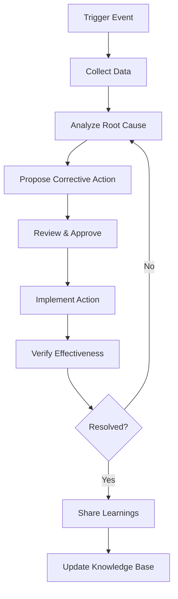

# Causal Analysis and Resolution (CAR) - CMMI Level 5

> **Compliance References:**
> - Based on: CMMI-DEV v2.0 CAR, Ishikawa (1968)
> - Spec: CMMI Level 5 Optimizing
> - Controls: 5-Why, fishbone, Pareto
> - See also: [governance/STANDARDS_COMPLIANCE_MATRIX.md](../STANDARDS_COMPLIANCE_MATRIX.md)

## Overview

CAR is a systematic process for identifying root causes of defects and process problems, implementing corrective actions, and preventing recurrence. Required for CMMI Level 5 "Optimizing."

---

## 1. When to Trigger CAR

| Trigger | Threshold | Priority |
|---------|-----------|----------|
| Defect cluster | 3+ defects in same module per sprint | High |
| SLO violation | Error budget < 25% | Critical |
| Recurring incident | Same root cause 2+ times | Critical |
| Test failure pattern | Same test type failing across features | Medium |
| Process bottleneck | Lead time > 2x baseline | Medium |
| Customer-reported bug | Any P1/P2 escaped defect | High |

---

## 2. Analysis Methods

### 2.1 Five Whys
```
Problem: Production API returned 500 errors for 30 minutes

Why 1: Database connection pool was exhausted
Why 2: A long-running query held connections for 45 seconds
Why 3: The query had no timeout configured
Why 4: The query review checklist doesn't include timeout verification
Why 5: The code review process doesn't check database query timeouts
→ ROOT CAUSE: Missing query timeout in code review checklist
```

### 2.2 Fishbone (Ishikawa) Diagram Categories
| Category | Look For |
|----------|---------|
| Code | Logic errors, missing validation, complexity |
| Design | Architecture gaps, missing patterns |
| Process | Review gaps, unclear requirements, communication |
| Environment | Config drift, dependency issues, infra |
| People | Knowledge gaps, training needs |
| Tools | IDE, CI/CD, monitoring gaps |

### 2.3 Pareto Analysis
- Collect all defects by category
- Sort by frequency (descending)
- Focus on top 20% of causes (which cause 80% of defects)

---

## 3. CAR Process Flow



---

## 4. Defect Taxonomy

| Category | Subcategory | Example |
|----------|------------|---------|
| **Requirements** | Incomplete | Missing edge case |
| **Requirements** | Ambiguous | Multiple interpretations |
| **Design** | Architecture | Wrong pattern choice |
| **Design** | Interface | API contract mismatch |
| **Code** | Logic | Off-by-one error |
| **Code** | Performance | N+1 query |
| **Code** | Security | Input not validated |
| **Test** | Missing | No test for edge case |
| **Test** | Incorrect | Test passes but wrong assertion |
| **Config** | Environment | Wrong env variable |
| **Config** | Feature flag | Misconfigured flag |
| **Process** | Communication | Missed handoff |
| **Process** | Review | Defect escaped review |

---

## 5. CAR Record Template

```markdown
# CAR-[XXX]: [Title]

## Metadata
- Date: [YYYY-MM-DD]
- Trigger: [trigger type]
- Severity: [Critical/High/Medium]
- Analyst: [name]
- Status: [Open/In Progress/Resolved/Verified]

## Problem Statement
[Clear description of the problem]

## Impact
- Users affected: [X]
- Duration: [X hours]
- Business impact: [description]

## Root Cause Analysis
Method: [5-Why / Fishbone / Pareto]
[Analysis details]

Root Cause: [single sentence]
Category: [from taxonomy]

## Corrective Actions
| # | Action | Owner | Deadline | Status |
|---|--------|-------|----------|--------|
| 1 | [immediate fix] | | | |
| 2 | [process change] | | | |
| 3 | [prevention] | | | |

## Verification
- [ ] Corrective action implemented
- [ ] No recurrence for 2 sprints
- [ ] Related tests added
- [ ] Knowledge base updated

## Lessons Learned
[Key takeaway for organization]
```

---

## 6. Trend Analysis

Track monthly/quarterly:
- CAR records by category → Which areas generate most issues?
- Time to resolution → Are we getting faster?
- Recurrence rate → Are fixes effective?
- Escaped defects → Is quality improving?

---

## 7. Integration with VSH

| Standard | Connection |
|----------|-----------|
| INCIDENT_RESPONSE_PLAN.md | CAR triggered by incidents |
| AI_POSTMORTEM_GENERATOR.md | Post-mortem feeds CAR |
| TECH_DEBT_REGISTER.md | CAR may identify tech debt |
| PROCESS_BASELINES.md | CAR triggered by baseline violations |
| DORA_METRICS.md | CFR and MTTR improvement via CAR |
