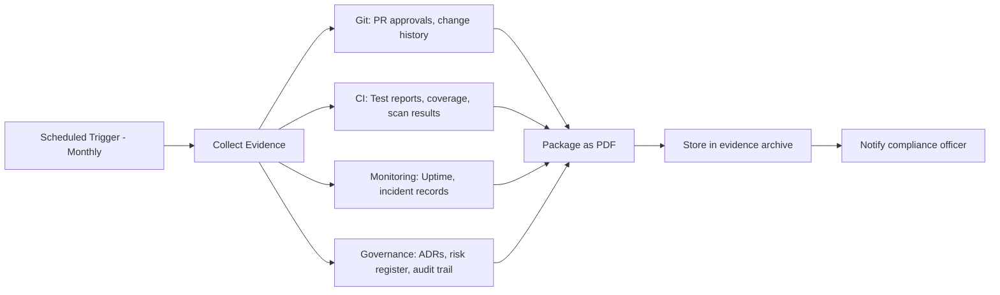

# Automated Compliance Evidence Collection

> **Compliance References:**
> - Based on: ISO 27001:2022, SOC 2 Type II
> - Spec: A.5.35-A.5.36, CC6-CC9
> - Controls: Automated evidence collection
> - See also: [governance/STANDARDS_COMPLIANCE_MATRIX.md](../STANDARDS_COMPLIANCE_MATRIX.md)

## Overview

Auto-generate audit-ready evidence packages for ISO 27001, SOC 2, and GDPR. Reduces audit prep from weeks to hours.

---

## 1. Evidence Categories

| Category | Evidence Type | Source |
|----------|-------------|--------|
| **Access Control** | User access logs, RBAC config | Auth service, IAM |
| **Change Management** | Git history, PR approvals, ADRs | GitHub, governance/ |
| **Testing** | Test reports, coverage | CI/CD artifacts |
| **Security** | Scan results, pentest reports | Security pipeline |
| **Deployment** | Deploy logs, rollback records | CI/CD, audit_trail/ |
| **Incident** | Incident records, post-mortems | governance/incidents/ |
| **Training** | Completion records | HR system |
| **Data Protection** | DPIAs, retention evidence | governance/compliance/ |

---

## 2. Automated Collection Pipeline



---

## 3. Evidence Mapping to Standards

### ISO 27001
| Control | Evidence Required | Automated Source |
|---------|------------------|-----------------|
| A.9.2 User access | Access logs, RBAC review | Auth service logs |
| A.12.1 Operational | Change management records | Git PR history |
| A.14.2 Security in dev | Security test results | CI security scan |
| A.16.1 Incident mgmt | Incident records | governance/incidents/ |
| A.18.1 Compliance | Audit trail | governance/audit_trail/ |

### SOC 2
| Criteria | Evidence Required | Automated Source |
|----------|------------------|-----------------|
| CC6.1 Logical access | Access controls | RBAC config + logs |
| CC7.1 System operations | Monitoring records | Monitoring dashboard |
| CC8.1 Change management | Change records | Git history + PR |
| CC9.1 Risk mitigation | Risk assessments | RISK_REGISTER.md |

---

## 4. Evidence Package Format

```
evidence/
├── YYYY-MM/
│   ├── INDEX.md                    # Table of contents
│   ├── access-control/
│   │   ├── rbac-config.pdf
│   │   └── access-logs-summary.pdf
│   ├── change-management/
│   │   ├── pr-approvals.pdf
│   │   └── deployment-log.pdf
│   ├── testing/
│   │   ├── test-coverage-report.pdf
│   │   └── security-scan-results.pdf
│   ├── incidents/
│   │   └── incident-summary.pdf
│   └── compliance/
│       ├── risk-register-snapshot.pdf
│       └── audit-trail-summary.pdf
```

---

## 5. Schedule

| Activity | Frequency | Owner |
|----------|-----------|-------|
| Evidence collection | Monthly (automated) | CI/CD |
| Evidence review | Quarterly | Compliance Officer |
| Audit preparation | Annual (or on-demand) | Compliance + CTO |
| Evidence retention | Per DATA_RETENTION_POLICY.md | Automated |

---

## 6. Auditor-Friendly Report

```
Compliance Evidence Report
Period: [MONTH YEAR]
Standard: [ISO 27001 / SOC 2 / GDPR]

SUMMARY
  Controls evidenced: [X] of [Y] ([Z]%)
  Gaps identified: [X]
  Actions required: [X]

EVIDENCE INVENTORY
| Control | Evidence | Status | Location |
|---------|----------|--------|----------|
| A.9.2 | Access logs | Complete | evidence/2024-01/access-control/ |
| A.12.1 | Change records | Complete | evidence/2024-01/change-management/ |

GAPS
| Control | Missing Evidence | Action Required | Deadline |
|---------|-----------------|----------------|----------|
| [ctrl] | [what's missing] | [action] | [date] |
```

---

## 7. Integration with VSH

| Standard | Connection |
|----------|-----------|
| ISO 27001 controls | Primary evidence source |
| KVKK_GDPR_CHECKLIST.md | Data protection evidence |
| DATA_RETENTION_POLICY.md | Retention compliance |
| UNIFIED_SECURITY_PIPELINE.md | Security scan evidence |
| DORA_METRICS.md | Performance evidence |
