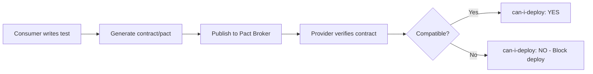

# Consumer-Driven Contract Testing (Pact)

> **Compliance References:**
> - Based on: Pact Specification v4, Ian Robinson (2006)
> - Spec: Consumer-Driven Contracts
> - Controls: Pact workflow
> - See also: [governance/STANDARDS_COMPLIANCE_MATRIX.md](../STANDARDS_COMPLIANCE_MATRIX.md)

## Overview

Contract testing verifies that services can communicate without running full E2E tests. Consumers define expected interactions; providers verify compatibility.

---

## 1. Contract Testing vs Integration Testing

| Aspect | Contract Testing | Integration Testing |
|--------|-----------------|-------------------|
| Speed | Fast (seconds) | Slow (minutes) |
| Dependencies | None (mocked) | All services running |
| Scope | API boundary only | Full flow |
| Maintenance | Low | High (fragile) |
| When | Every PR | Nightly/pre-release |
| Feedback | Immediate | Delayed |

---

## 2. Pact Workflow



### Steps
1. **Consumer side:** Write test describing expected API interaction
2. **Generate pact:** Test produces a contract file (JSON)
3. **Publish:** Upload contract to Pact Broker
4. **Provider side:** Replay consumer expectations against real provider
5. **Verify:** Provider confirms it meets all consumer contracts
6. **Deploy check:** `can-i-deploy` ensures compatibility before deployment

---

## 3. Setup by Language

### Node.js (Pact-JS)
```javascript
// Consumer test
const { PactV3 } = require('@pact-foundation/pact');

const provider = new PactV3({ consumer: 'WebApp', provider: 'UserAPI' });

describe('User API', () => {
  it('returns user by id', async () => {
    provider.addInteraction({
      states: [{ description: 'user 1 exists' }],
      uponReceiving: 'a request for user 1',
      withRequest: { method: 'GET', path: '/api/users/1' },
      willRespondWith: {
        status: 200,
        body: { id: 1, name: like('John'), email: like('john@example.com') }
      }
    });
    // Execute consumer code against mock
  });
});
```

### Python (Pact-Python)
```python
pact = Consumer('WebApp').has_pact_with(Provider('UserAPI'))
(pact.given('user 1 exists')
 .upon_receiving('a request for user 1')
 .with_request('GET', '/api/users/1')
 .will_respond_with(200, body={'id': 1, 'name': Like('John')}))
```

---

## 4. CI/CD Integration

### Consumer Pipeline
```yaml
- name: Run contract tests
  run: npm test -- --contract
- name: Publish pacts
  run: npx pact-broker publish pacts/ --consumer-app-version=${{ github.sha }}
```

### Provider Pipeline
```yaml
- name: Verify contracts
  run: npx pact-broker verify --provider=UserAPI --provider-app-version=${{ github.sha }}
- name: Can I deploy?
  run: npx pact-broker can-i-deploy --pacticipant=UserAPI --version=${{ github.sha }}
```

---

## 5. Contract Versioning

| Strategy | When | Example |
|----------|------|---------|
| Git SHA | Every commit | `a1b2c3d4` |
| Semantic | Releases | `1.2.3` |
| Branch-based | Feature branches | `feature/auth-a1b2c3` |

### Breaking Change Detection
- New required field → BREAKING
- Removed field → BREAKING
- Changed field type → BREAKING
- New optional field → Compatible
- New endpoint → Compatible

---

## 6. Migration from E2E to Contract Tests

| Phase | Action |
|-------|--------|
| 1 | Identify API boundaries between services |
| 2 | Write consumer contracts for critical paths first |
| 3 | Verify contracts on provider side |
| 4 | Set up Pact Broker |
| 5 | Integrate into CI/CD |
| 6 | Gradually replace E2E tests covering same paths |
| 7 | Keep E2E only for critical user journeys |

---

## 7. Integration with VSH

| Standard | Connection |
|----------|-----------|
| API_STYLE_GUIDE.md | API contract conventions |
| DEFINITION_OF_DONE.md | Contract tests required for API changes |
| PROGRESSIVE_DELIVERY.md | can-i-deploy gate before rollout |
