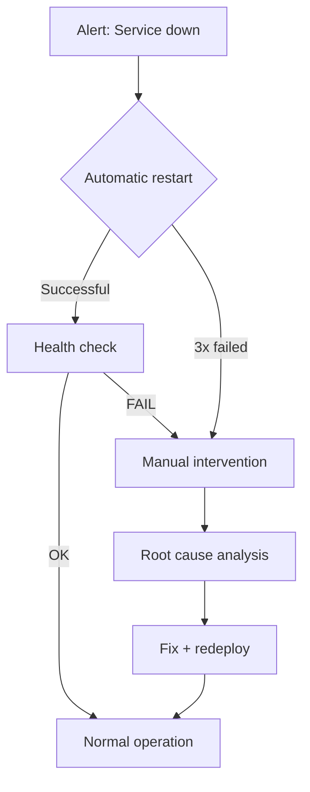

# Disaster Recovery Plan

> **Compliance References:**
> - Based on: ISO 22301:2019, NIST SP 800-34r1
> - Spec: Business Continuity Management
> - Controls: BIA, RPO/RTO targets
> - See also: [governance/STANDARDS_COMPLIANCE_MATRIX.md](../STANDARDS_COMPLIANCE_MATRIX.md)

## Purpose
If the system completely crashes, recover in the shortest time possible while minimizing data loss.

---

## 1. Objectives

| Metric | Target | Description |
|--------|--------|-------------|
| **RPO** (Recovery Point Objective) | < 1 hour | Max 1 hour of data loss is acceptable |
| **RTO** (Recovery Time Objective) | < 4 hours | System back online within 4 hours |
| **MTTR** (Mean Time To Recover) | < 2 hours | Average recovery time |

---

## 2. Disaster Levels

| Level | Description | Example | Response |
|-------|-------------|---------|----------|
| **DR-1** | Single service crashed | API server crash | Automatic restart + failover |
| **DR-2** | Data layer affected | DB primary crashed | Replica promote + backup |
| **DR-3** | Entire environment unusable | Data center crashed | Switch to DR site |
| **DR-4** | Data breach / ransomware | Data encrypted | Restore from clean backup |

---

## 3. DR-1: Single Service Crashed



**Automatic:**
- Container restart policy (max 3 retries, 30s interval)
- Load balancer removes unhealthy instance
- Auto-scale starts new instance

---

## 4. DR-2: Database Crashed

### PostgreSQL Failover
```
1. Primary crashed
2. Monitoring alert triggered (< 30 sec)
3. Replica promoted -> new Primary (< 5 min)
4. Application connection string updated
5. Old primary investigated
6. New replica created
```

### Restore from Backup
```bash
# 1. Find the latest backup
ls -la backups/ | sort -r | head -5

# 2. Create new DB
createdb proje_restore

# 3. Restore from backup
pg_restore -d proje_restore backup_20260407.dump

# 4. WAL replay (PITR - Point in Time Recovery)
# recovery_target_time = '2026-04-07 14:00:00'

# 5. Point application to new DB

# 6. Run verification queries
```

---

## 5. DR-3: Entire Environment Crashed

### Multi-Region / DR Site

```
Production (Primary Region)     DR Site (Secondary Region)
  [App Servers]                   [Standby App Servers]
  [DB Primary]  ----async--->     [DB Replica (cross-region)]
  [Redis]                         [Redis Standby]
  [S3 Bucket]   ----sync---->    [S3 Cross-region Replica]
```

### Switchover Procedure
| Step | Time | Action |
|------|------|--------|
| 1 | 0 min | Primary region unreachable - alert |
| 2 | 5 min | DR decision: proceed with switchover? |
| 3 | 10 min | DNS failover (redirect to DR site) |
| 4 | 15 min | DR DB promote (replica -> primary) |
| 5 | 20 min | Start app servers |
| 6 | 30 min | Health check + smoke test |
| 7 | 45 min | Notify users: "System is back" |
| 8 | 60 min | Fully operational |

---

## 6. DR-4: Ransomware / Data Breach

| Step | Action |
|------|--------|
| 1 | ISOLATE ALL SYSTEMS (cut network) |
| 2 | Preserve logs (for forensics) |
| 3 | Determine affected scope |
| 4 | Restore from CLEAN backup (pre-breach) |
| 5 | Rotate all credentials |
| 6 | Close the security vulnerability |
| 7 | KVKK/GDPR notification (within 72 hours) |
| 8 | Forensic analysis + postmortem |

---

## 7. DR Test Schedule

| Test | Frequency | Environment | Responsibility |
|------|-----------|-------------|----------------|
| Backup restore test | **Monthly** | Staging | DBA |
| Failover test (DB) | Quarterly | Staging | DBA + DevOps |
| DR site switchover test | Annually | DR site | Entire team |
| Tabletop exercise (drill) | Quarterly | - | Entire team |

> **RULE:** An untested DR plan = no DR plan.

---

## Related Documents
- `governance/incidents/INCIDENT_RESPONSE_PLAN.md`
- `governance/standards/CHAOS_ENGINEERING.md`
- `governance/standards/MONITORING_STRATEGY.md`
- `governance/templates/POSTMORTEM_TEMPLATE.md`
- `governance/standards/RUNBOOK_INDEX.md`
