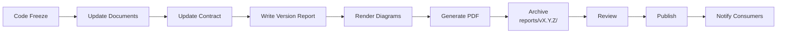

# Document Publishing and PDF Generation Guide

> **Compliance References:**
> - Based on: Pandoc documentation pipeline
> - Spec: Markdown to PDF conversion
> - Controls: Version archiving, SVG generation
> - See also: [governance/STANDARDS_COMPLIANCE_MATRIX.md](../STANDARDS_COMPLIANCE_MATRIX.md)

## Purpose
Archiving, versioning, and distributing all project documents as PDF.

---

## 1. PDF Generation Tools

| Tool | Input Format | Output | Installation | Usage |
|------|-------------|--------|-------------|-------|
| **Pandoc + LaTeX** | Markdown | PDF (professional) | `apt install pandoc texlive` | Official documents |
| **md-to-pdf** | Markdown | PDF | `npm i -g md-to-pdf` | Quick, simple |
| **Prince** | HTML/CSS | PDF (highest quality) | Paid | Customer delivery |
| **Mermaid CLI** | .mmd | SVG/PNG | `npm i -g @mermaid-js/mermaid-cli` | Diagram render |
| **WeasyPrint** | HTML/CSS | PDF | `pip install weasyprint` | Python projects |
| **Playwright** | Web page | PDF | Already installed | Web-based content |

---

## 2. Markdown -> PDF Pipeline

### Step 1: Render Mermaid diagrams
```bash
# Convert .mmd files to SVG
mmdc -i governance/diagrams/faz2_architecture/DG-201_system_context_c4l1.mmd -o output/DG-201.svg
```

### Step 2: Convert Markdown to PDF
```bash
# With Pandoc (via LaTeX - highest quality)
pandoc governance/templates/API_SPEC_v1.0.0.md \
  -o output/API_SPEC_v1.0.0.pdf \
  --pdf-engine=xelatex \
  -V geometry:margin=2.5cm \
  -V fontsize=11pt \
  -V lang=tr \
  --toc \
  --toc-depth=3 \
  -V header-includes='\usepackage{fancyhdr}\pagestyle{fancy}\fancyhead[L]{[PROJECT_NAME]}\fancyhead[R]{v1.0.0}'

# OR with md-to-pdf (simple, fast)
md-to-pdf governance/templates/API_SPEC_v1.0.0.md --dest output/API_SPEC_v1.0.0.pdf
```

### Step 3: PDF from web page via Playwright
```typescript
// For example, PDF from OpenAPI/Swagger UI
const browser = await chromium.launch();
const page = await browser.newPage();
await page.goto('http://localhost:3000/api-docs');
await page.pdf({
  path: 'output/API_DOCS_v1.0.0.pdf',
  format: 'A4',
  printBackground: true,
  margin: { top: '2cm', bottom: '2cm', left: '2cm', right: '2cm' }
});
```

---

## 3. Automation Script

```bash
#!/bin/bash
# generate_docs.sh - Convert all documents to PDF
VERSION="${1:?Version required: ./generate_docs.sh v1.0.0}"
ROOT="$(cd "$(dirname "$0")/../.." && pwd)"
OUTPUT="$ROOT/governance/versioning/reports/$VERSION"
mkdir -p "$OUTPUT"

echo "[docs] Generating PDFs for $VERSION..."

# 1. Render Mermaid diagrams
echo "[docs] Rendering diagrams..."
for mmd in "$ROOT"/governance/diagrams/**/*.mmd; do
  name=$(basename "$mmd" .mmd)
  mmdc -i "$mmd" -o "$OUTPUT/${name}.svg" 2>/dev/null || echo "  WARNING: $name could not be rendered"
done

# 2. Convert core documents to PDF
echo "[docs] Generating PDFs..."
DOCS=(
  "CHANGELOG.md:CHANGELOG_${VERSION}.pdf"
  "governance/versioning/API_CHANGELOG.md:API_CHANGELOG_${VERSION}.pdf"
)

for doc_pair in "${DOCS[@]}"; do
  IFS=':' read -r src dest <<< "$doc_pair"
  if [ -f "$ROOT/$src" ]; then
    pandoc "$ROOT/$src" -o "$OUTPUT/$dest" \
      --pdf-engine=xelatex \
      -V geometry:margin=2.5cm \
      -V fontsize=11pt \
      --toc 2>/dev/null || \
    md-to-pdf "$ROOT/$src" --dest "$OUTPUT/$dest" 2>/dev/null || \
    echo "  WARNING: $src PDF could not be generated (install pandoc/md-to-pdf)"
  fi
done

# 3. Copy contracts
if [ -d "$ROOT/governance/contracts/versions/$VERSION" ]; then
  cp "$ROOT/governance/contracts/versions/$VERSION"/*.pdf "$OUTPUT/" 2>/dev/null
fi

echo ""
echo "[docs] Generated files:"
ls -la "$OUTPUT/"
echo ""
echo "[docs] COMPLETED: $OUTPUT"
```

---

## 4. Which Documents Become PDFs

### MANDATORY PDF per Release
| Document | Source | PDF Name |
|----------|--------|----------|
| Version Development Report | VERSION_DEVELOPMENT_REPORT_TEMPLATE | VERSION_REPORT_vX.Y.Z.pdf |
| API Contract | Service contract MD | API_CONTRACT_vX.Y.Z.pdf |
| SLA | SLA template | SLA_vX.Y.Z.pdf |
| Release Notes | RELEASE_NOTES_TEMPLATE | RELEASE_NOTES_vX.Y.Z.pdf |
| CHANGELOG | CHANGELOG.md | CHANGELOG_vX.Y.Z.pdf |
| API Changelog | API_CHANGELOG.md | API_CHANGELOG_vX.Y.Z.pdf |
| Test Report | Test results | TEST_REPORT_vX.Y.Z.pdf |
| Security Report | SECURITY_ASSESSMENT | SECURITY_REPORT_vX.Y.Z.pdf |
| SBOM | CycloneDX | SBOM_vX.Y.Z.json |

### Additional PDFs at Project End
| Document | Source |
|----------|--------|
| SRS (Software Requirements Specification) | SRS_TEMPLATE |
| Blueprint (System Architecture) | BLUEPRINT_TEMPLATE |
| DB Design | DB_DESIGN_TEMPLATE |
| Test Plan | TEST_PLAN_TEMPLATE |
| UAT Plan | UAT_PLAN_TEMPLATE |
| User Manual | Tech Writer output |
| Handoff/Knowledge Transfer | HANDOFF_DOCUMENT |
| Lessons Learned | LESSONS_LEARNED_TEMPLATE |

### Diagrams (SVG/PNG)
| Diagram | Format |
|---------|--------|
| All DG-XXX diagrams | SVG (vector, scalable) |
| ER diagram | SVG + PNG |

---

## 5. PDF Archive Structure

```
governance/versioning/reports/
├── v1.0.0/
│   ├── VERSION_REPORT_v1.0.0.pdf
│   ├── API_CONTRACT_v1.0.0.pdf
│   ├── SLA_v1.0.0.pdf
│   ├── RELEASE_NOTES_v1.0.0.pdf
│   ├── CHANGELOG_v1.0.0.pdf
│   ├── API_CHANGELOG_v1.0.0.pdf
│   ├── TEST_REPORT_v1.0.0.pdf
│   ├── SECURITY_REPORT_v1.0.0.pdf
│   ├── SBOM_v1.0.0.json
│   └── diagrams/
│       ├── DG-201_system_context.svg
│       ├── DG-301_er_diagram.svg
│       └── ...
├── v1.1.0/
│   └── ...
└── latest -> v1.1.0/
```

---

## 6. Document Pipeline at Release



### Automatic Triggers
- When git tag (vX.Y.Z) is created -> `generate_docs.sh vX.Y.Z` runs automatically
- When contract changes -> PDF is regenerated
- When diagram is updated -> SVG is re-rendered

---

## 7. PDF Quality Control

For every generated PDF:
- [ ] Cover page exists (project name, version, date)
- [ ] Page numbers present
- [ ] Table of contents (TOC) present
- [ ] Diagrams are at readable resolution
- [ ] Turkish characters display correctly
- [ ] Links are clickable (internal + external)
- [ ] Header/footer contains version number
- [ ] File size is reasonable (< 10MB)

---

## Related Documents
- `governance/versioning/SERVICE_CONTRACT_MANAGEMENT.md`
- `governance/versioning/API_CHANGELOG.md`
- `governance/templates/VERSION_DEVELOPMENT_REPORT_TEMPLATE.md`
- `governance/templates/RELEASE_NOTES_TEMPLATE.md`
- `automation/scripts/generate_docs.sh`
