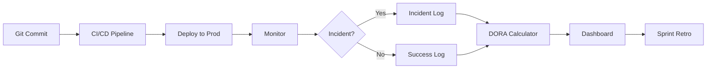

# DORA Metrics Dashboard & Tracking

> **Compliance References:**
> - Based on: DORA Research Program (2014-2023)
> - Spec: "Accelerate" (Forsgren, Humble, Kim 2018)
> - Controls: DF, LT, CFR, MTTR
> - See also: [governance/STANDARDS_COMPLIANCE_MATRIX.md](../STANDARDS_COMPLIANCE_MATRIX.md)

## Overview

DORA (DevOps Research and Assessment) metrics are the industry standard for measuring software delivery performance. Based on research across thousands of organizations, these four key metrics predict organizational performance.

---

## 1. The Four Key Metrics

### 1.1 Deployment Frequency (DF)
How often code is deployed to production.

| Tier | Frequency | Target |
|------|-----------|--------|
| Elite | On-demand (multiple times/day) | < 1 hour between deploys |
| High | Weekly to monthly | 1-7 days |
| Medium | Monthly to semi-annually | 1-6 months |
| Low | Less than once per 6 months | > 6 months |

**Data Source:** CI/CD pipeline logs, deployment audit trail
**Formula:** `DF = Total successful deployments / Time period`

### 1.2 Lead Time for Changes (LT)
Time from code commit to running in production.

| Tier | Lead Time | Target |
|------|-----------|--------|
| Elite | Less than 1 hour | < 60 min |
| High | 1 day to 1 week | < 7 days |
| Medium | 1 week to 1 month | < 30 days |
| Low | More than 1 month | > 30 days |

**Data Source:** Git commit timestamps, deployment timestamps
**Formula:** `LT = median(deploy_time - commit_time)` for all changes in period

### 1.3 Change Failure Rate (CFR)
Percentage of deployments causing a failure in production.

| Tier | Failure Rate | Target |
|------|-------------|--------|
| Elite | 0-5% | < 5% |
| High | 5-10% | < 10% |
| Medium | 10-15% | < 15% |
| Low | 16-30%+ | > 15% |

**Data Source:** Incident logs, rollback records, hotfix deployments
**Formula:** `CFR = (Failed deployments / Total deployments) * 100`

### 1.4 Mean Time to Recovery (MTTR)
How long it takes to restore service after a failure.

| Tier | Recovery Time | Target |
|------|-------------|--------|
| Elite | Less than 1 hour | < 60 min |
| High | Less than 1 day | < 24 hours |
| Medium | 1 day to 1 week | < 7 days |
| Low | More than 1 week | > 7 days |

**Data Source:** Incident timestamps (detection → resolution)
**Formula:** `MTTR = sum(recovery_times) / number_of_incidents`

---

## 2. Overall Classification

| Tier | DF | LT | CFR | MTTR | Score |
|------|----|----|-----|------|-------|
| **Elite** | Multiple/day | < 1 hour | < 5% | < 1 hour | 4/4 |
| **High** | Weekly-Monthly | 1 day-1 week | 5-10% | < 1 day | 3/4 |
| **Medium** | Monthly-Biannual | 1 week-1 month | 10-15% | < 1 week | 2/4 |
| **Low** | < 1 per 6 months | > 1 month | > 15% | > 1 week | 1/4 |

**Overall Tier = Lowest individual metric tier** (weakest link principle)

---

## 3. Sprint-Level Tracking Template

| Sprint | DF | LT (median) | CFR | MTTR (avg) | Tier | Trend |
|--------|----|----|-----|------|------|-------|
| Sprint 1 | - | - | - | - | - | Baseline |
| Sprint 2 | | | | | | |
| Sprint 3 | | | | | | |

## 4. Release-Level Tracking Template

| Release | Version | DF (30d) | LT (median) | CFR | MTTR | Incidents | Tier |
|---------|---------|----------|-------------|-----|------|-----------|------|
| v1.0.0 | | | | | | | |
| v1.1.0 | | | | | | | |

---

## 5. Measurement Pipeline



### Data Collection Points
1. **Git webhook** → commit timestamp, author, branch
2. **CI/CD pipeline** → build start, build end, deploy start, deploy end
3. **Monitoring** → alert timestamp, severity
4. **Incident management** → detection time, resolution time, root cause
5. **Rollback log** → rollback trigger, recovery time

---

## 6. Improvement Action Plans

### If Deployment Frequency is Low:
- [ ] Reduce batch size (smaller PRs)
- [ ] Automate deployment pipeline
- [ ] Implement feature flags for decoupling deploy from release
- [ ] Reduce manual approval gates

### If Lead Time is High:
- [ ] Parallelize CI pipeline stages
- [ ] Reduce code review bottlenecks (SLA: 4 hours)
- [ ] Automate testing (reduce manual QA)
- [ ] Implement trunk-based development

### If Change Failure Rate is High:
- [ ] Increase test coverage (80%+ minimum)
- [ ] Add canary deployments
- [ ] Implement contract testing
- [ ] Strengthen code review process

### If MTTR is High:
- [ ] Improve observability (traces, logs, metrics)
- [ ] Create runbooks for common failures
- [ ] Practice incident response (game days)
- [ ] Implement automated rollback

---

## 7. Quarterly DORA Review

### Agenda
1. Present current DORA metrics vs previous quarter
2. Identify tier changes (improved/degraded)
3. Root cause analysis for any degradation
4. Set improvement targets for next quarter
5. Assign action items with owners

### Review Template
```
Quarter: Q[X] [YEAR]
Current Tier: [Elite/High/Medium/Low]
Previous Tier: [Elite/High/Medium/Low]
Trend: [Improving/Stable/Degrading]

Metric Breakdown:
- DF: [value] ([tier]) - [trend]
- LT: [value] ([tier]) - [trend]
- CFR: [value] ([tier]) - [trend]
- MTTR: [value] ([tier]) - [trend]

Top Improvement: [metric] improved from [X] to [Y]
Biggest Risk: [metric] degraded because [reason]
Action Items: [list]
```

---

## 8. Integration with VSH

| VSH Phase | DORA Relevance |
|-----------|---------------|
| Phase 5 (Infrastructure) | Set up measurement pipeline |
| Phase 6 (Development) | Track per-sprint DF and LT |
| Phase 7 (QA & Delivery) | Measure CFR and MTTR |
| Post-Release | Quarterly DORA review |

## References
- [DORA Research Program](https://dora.dev)
- [Accelerate: The Science of Lean Software and DevOps](https://itrevolution.com/product/accelerate/)
- [DORA Metrics Guide](https://dora.dev/guides/dora-metrics/)
