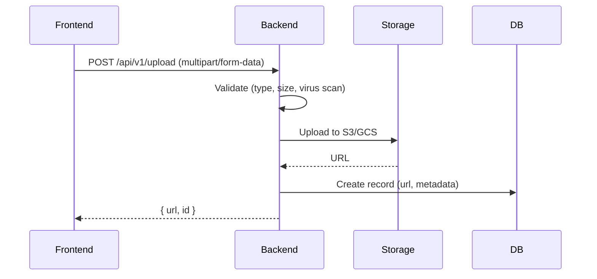
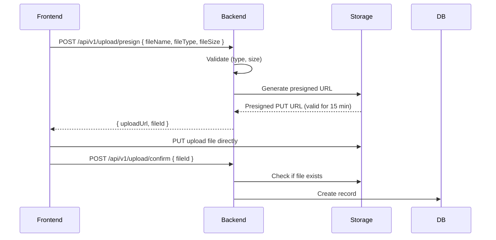

# File Upload Strategy

> **Compliance References:**
> - Based on: OWASP File Upload Cheat Sheet
> - Spec: Presigned URL pattern
> - Controls: Virus scan, size limits, type validation
> - See also: [governance/STANDARDS_COMPLIANCE_MATRIX.md](../STANDARDS_COMPLIANCE_MATRIX.md)

## Purpose
Secure, performant, and scalable file upload/storage.

---

## 1. Accepted File Types

### Images
| Format | Max Size | Usage |
|--------|----------|-------|
| JPEG/JPG | 5 MB | Photo, product image |
| PNG | 5 MB | Screenshot, logo (transparent) |
| WebP | 5 MB | Optimized image |
| SVG | 500 KB | Icon, logo (vector) |
| GIF | 2 MB | Animation |

### Documents
| Format | Max Size | Usage |
|--------|----------|-------|
| PDF | 10 MB | Invoice, contract, report |
| DOCX | 10 MB | Word document |
| XLSX | 10 MB | Excel spreadsheet |

### FORBIDDEN (NEVER accept)
```
.exe, .bat, .cmd, .sh, .ps1, .msi, .dll, .com, .scr,
.vbs, .js (script), .php, .py, .rb, .pl, .jar, .war
```

---

## 2. Security Controls

| Control | Description |
|---------|-------------|
| **MIME type validation** | Check magic bytes, not extension |
| **File name sanitization** | Clean special characters, path traversal (`../`) |
| **Size limit** | Check on backend (frontend validation is not enough) |
| **Virus scanning** | ClamAV or cloud-based scanning |
| **Unique naming** | Use UUID, store original name in metadata |
| **Access control** | Signed URL with time-limited access |

### File Name Sanitization
```typescript
function sanitizeFileName(original: string): string {
  const ext = path.extname(original).toLowerCase();
  const uuid = crypto.randomUUID();
  return `${uuid}${ext}`;
  // Example: "a1b2c3d4-e5f6-7890-abcd-ef1234567890.jpg"
}
```

---

## 3. Upload Flow

### Small File (< 5MB): Direct to Backend


### Large File (> 5MB): Presigned URL


---

## 4. Image Processing

### Automatic Resizing
| Variant | Width | Usage |
|---------|-------|-------|
| thumbnail | 150px | List view, avatar |
| medium | 600px | Detail page |
| large | 1200px | Full screen |
| original | Unchanged | Archive (restricted access) |

### Processing Pipeline
```
Upload -> Virus Scan -> Resize (3 variants) -> WebP Convert -> Upload to CDN -> DB record
```

---

## 5. Storage Architecture

| Environment | Storage | CDN | Reason |
|-------------|---------|-----|--------|
| Development | Local disk (`./uploads/`) | - | Simplicity |
| Staging | S3/GCS | - | Production-like |
| Production | S3/GCS | CloudFront/CloudFlare | Performance |

### Folder Structure (S3)
```
s3://[bucket]/
├── users/[user_id]/
│   ├── avatar/           # Profile photos
│   └── documents/        # User documents
├── products/[product_id]/
│   └── images/           # Product images
├── orders/[order_id]/
│   └── invoices/         # Invoices
└── temp/                 # Temporary (24 hour TTL)
```

---

## 6. Database

```sql
CREATE TABLE files (
    id UUID PRIMARY KEY DEFAULT gen_random_uuid(),
    original_name VARCHAR(255) NOT NULL,
    stored_name VARCHAR(255) NOT NULL,       -- UUID based
    mime_type VARCHAR(100) NOT NULL,
    size_bytes BIGINT NOT NULL,
    storage_provider VARCHAR(20) NOT NULL,   -- 'local', 's3', 'gcs'
    storage_path VARCHAR(500) NOT NULL,
    cdn_url VARCHAR(500),
    entity_type VARCHAR(50),                 -- 'user_avatar', 'product_image'
    entity_id UUID,
    uploaded_by UUID REFERENCES users(id),
    virus_scanned BOOLEAN DEFAULT false,
    virus_clean BOOLEAN,
    created_at TIMESTAMP NOT NULL DEFAULT NOW(),
    deleted_at TIMESTAMP
);
```

---

## Related Documents
- `governance/compliance/KVKK_GDPR_CHECKLIST.md` - Personal file security
- `governance/compliance/DATA_RETENTION_POLICY.md` - File retention period
- `governance/standards/API_STYLE_GUIDE.md` - API design
