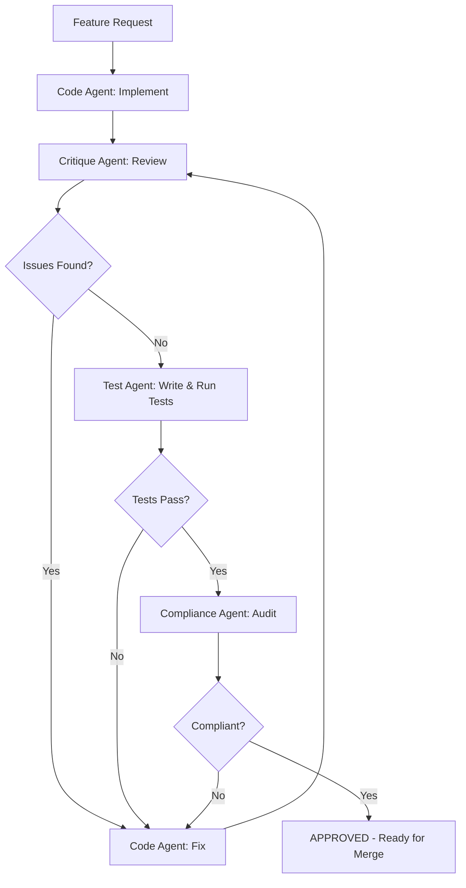

# Multi-Agent Validation Pipeline

> **Compliance References:**
> - Based on: N-Version Programming (Avizienis 1985)
> - Spec: Diverse redundancy, independent validation
> - Controls: 4-layer pipeline
> - See also: [governance/STANDARDS_COMPLIANCE_MATRIX.md](../STANDARDS_COMPLIANCE_MATRIX.md)

## Overview

4-layer independent validation where each agent checks from a different perspective, preventing single-model blind spots.

---

## 1. Four Validation Layers

| Layer | Agent Role | Focus | Model |
|-------|-----------|-------|-------|
| 1. **Code** | Generator | Write implementation | Sonnet |
| 2. **Critique** | Reviewer | Quality, patterns, bugs | Sonnet (different context) |
| 3. **Test** | Tester | Coverage, edge cases | Sonnet |
| 4. **Compliance** | Auditor | Security, ISO 27001, standards | Opus |

---

## 2. Validation Flow

---

## 3. Independence Principle

Each agent MUST be independent:
- Different system prompts (no shared context about previous agent's work)
- Focus only on their layer's concerns
- Cannot be influenced by previous agent's "approval"
- Report findings independently

---

## 4. Pass/Fail Criteria

| Layer | Pass | Fail |
|-------|------|------|
| Code | Compiles, implements requirements | Build errors, missing requirements |
| Critique | No CRITICAL/HIGH issues | Any CRITICAL finding |
| Test | 80%+ coverage, all tests pass | Coverage < 80% or test failures |
| Compliance | No security violations, ISO controls present | Missing auth, audit columns, validation |

---

## 5. When to Use Which

| Scenario | Approach | Why |
|----------|----------|-----|
| Standard feature | Santa Loop (2 reviewers) | Sufficient for most code |
| Auth/payment/PII code | Full 4-layer validation | High-risk requires maximum scrutiny |
| Critical infrastructure | Full 4-layer + human review | Maximum safety |
| Bug fix | Code + Test layers only | Lower risk, faster feedback |
| Documentation | Single reviewer | Low risk |

---

## 6. Configuration

| Criticality | Layers Active | Approval Required |
|-------------|--------------|-------------------|
| Standard | Code + Critique + Test | 2 of 3 |
| High | All 4 layers | 3 of 4 |
| Critical | All 4 layers | 4 of 4 + Human |

---

## 7. Metrics

| Metric | Target | Measurement |
|--------|--------|-------------|
| Defect escape rate | < 2% | Defects found in production / total defects |
| False positive rate | < 10% | False findings / total findings |
| Validation time | < 15 min | Time from code to approval |
| Layer agreement rate | > 80% | Layers agreeing on pass/fail |

---

## 8. Integration with VSH

| Standard | Connection |
|----------|-----------|
| CODE_REVIEW_CHECKLIST.md | Critique agent checklist |
| SHIFT_LEFT_SECURITY.md | Compliance agent scope |
| DEFINITION_OF_DONE.md | Validation required for DoD |
