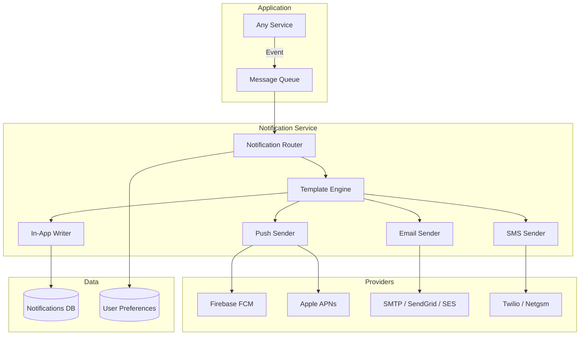

# Notification System Architecture

> **Compliance References:**
> - Based on: Firebase Cloud Messaging, AWS SNS/SES
> - Spec: Push notification best practices
> - Controls: Template engine, delivery tracking
> - See also: [governance/STANDARDS_COMPLIANCE_MATRIX.md](../STANDARDS_COMPLIANCE_MATRIX.md)

## Purpose
Design and implementation of push, email, SMS, and in-app notifications.

---

## 1. Notification Channels

| Channel | Usage | Priority | Cost |
|---------|-------|----------|------|
| **In-App** | Notification bell within the application | All notifications | Free |
| **Push** | Mobile/desktop push notification | Important events | Low |
| **Email** | Official notifications, reports | Medium/low priority | Low |
| **SMS** | OTP, critical alerts | Critical only | High |
| **WebSocket** | Real-time UI updates | Live data | Free |

---

## 2. Notification Events

| Event | In-App | Push | Email | SMS |
|-------|--------|------|-------|-----|
| Welcome (registration) | - | - | MANDATORY | - |
| Email verification | - | - | MANDATORY | - |
| Password reset | - | - | MANDATORY | - |
| Order created | Yes | Yes | Yes | - |
| Order shipped | Yes | Yes | Yes | Optional |
| Order delivered | Yes | Yes | Yes | - |
| Payment successful | Yes | - | Yes | - |
| Payment failed | Yes | Yes | Yes | - |
| Security alarm | Yes | Yes | Yes | MANDATORY |
| OTP | - | - | - | MANDATORY |
| New message | Yes | Yes | - | - |
| System maintenance | Yes | Yes | Yes | - |

---

## 3. Architecture



---

## 4. User Preferences

### Preferences Table
```sql
CREATE TABLE notification_preferences (
    user_id UUID REFERENCES users(id),
    channel VARCHAR(20) NOT NULL,        -- 'in_app', 'push', 'email', 'sms'
    category VARCHAR(50) NOT NULL,       -- 'order', 'payment', 'marketing', 'security'
    enabled BOOLEAN NOT NULL DEFAULT true,
    PRIMARY KEY (user_id, channel, category)
);
```

### Rules
- Users CAN disable **marketing** notifications
- Users CANNOT disable **security** notifications (OTP, password change)
- Default: all notifications ON
- Preference changes take effect immediately

---

## 5. Email Templates

### Template Structure
```
src/templates/email/
├── base.html              # Main layout (header, footer, style)
├── welcome.html           # Welcome
├── verify-email.html      # Email verification
├── reset-password.html    # Password reset
├── order-confirmation.html # Order confirmation
├── order-shipped.html     # Shipped
└── invoice.html           # Invoice
```

### Email Rules
| Rule | Detail |
|------|--------|
| From | `noreply@[domain].com` or `support@[domain].com` |
| Reply-To | `support@[domain].com` |
| Subject | Max 60 characters, clear |
| Unsubscribe | MANDATORY in marketing emails (CAN-SPAM / KVKK) |
| Responsive | Readable on mobile (600px max width) |
| Plain text | HTML + plain text version |
| Test | Test with Litmus/Email on Acid |

---

## 6. Rate Limiting

| Channel | Limit | Period | Reason |
|---------|-------|--------|--------|
| Push | 5 | 1 hour | User annoyance |
| Email | 3 | 1 hour | Spam prevention |
| SMS | 3 | 1 hour | Cost + annoyance |
| In-App | Unlimited | - | Free, non-intrusive |

---

## Related Documents
- `governance/standards/MONITORING_STRATEGY.md` - Notification metric monitoring
- `governance/templates/INTEGRATION_SPEC_TEMPLATE.md` - 3rd party integration
- `governance/compliance/KVKK_GDPR_CHECKLIST.md` - Marketing email consent
