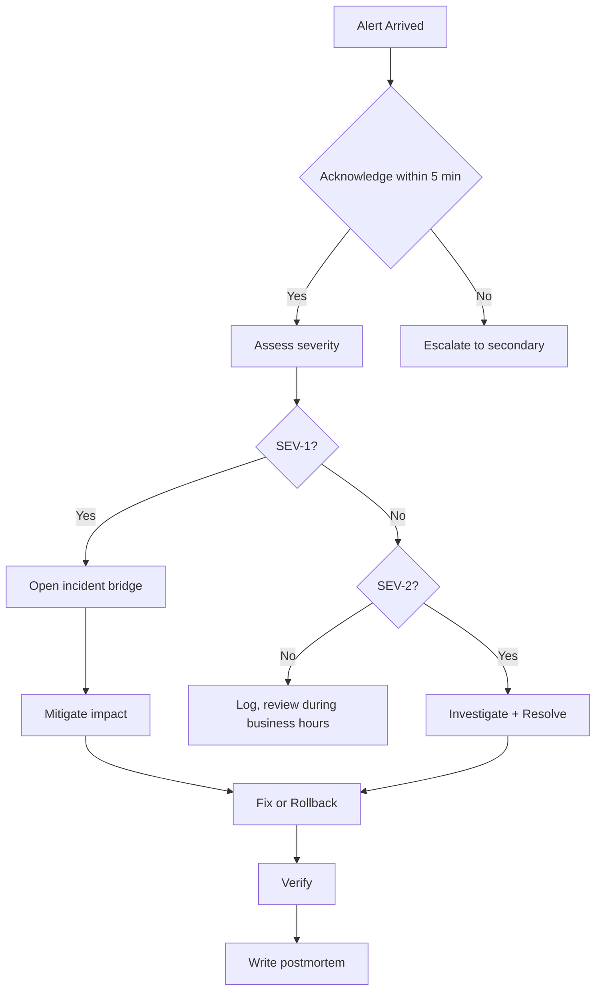

# On-Call Procedure

> **Compliance References:**
> - Based on: PagerDuty Incident Response Guide
> - Spec: Escalation policy patterns
> - Controls: Rotation schedule, alert severity
> - See also: [governance/STANDARDS_COMPLIANCE_MATRIX.md](../STANDARDS_COMPLIANCE_MATRIX.md)

## Purpose
Defines who does what and when during production issues.

---

## 1. On-Call Rotation

### Roles
| Role | Responsibility |
|------|---------------|
| **Primary On-Call** | First response, 5 min reply |
| **Secondary On-Call** | Backup, takes over if primary unreachable |
| **Escalation** | CTO/Lead - SEV-1 or no resolution within 30 min |

### Rotation Table
| Week | Primary | Secondary |
|------|---------|-----------|
| [Date range] | [Name/Agent] | [Name/Agent] |

> In VSH, Claude handles all roles. In customer projects, this table is filled in.

---

## 2. When Alert Arrives



---

## 3. Severity-Based Response

### SEV-1: System Unusable
| Step | Time | Action |
|------|------|--------|
| Acknowledge | 5 min | Acknowledge the alert |
| Notify | 10 min | Slack/email: "Incident started, investigating" |
| Diagnose | 15 min | Check runbook, examine logs |
| Intervene | 30 min | Fix or rollback |
| Verify | 45 min | Health check + user verification |
| Notify | 1 hour | "Issue resolved" notification |
| Postmortem | 48 hours | Write postmortem document |

### SEV-2: Major Function Broken
| Step | Time | Action |
|------|------|--------|
| Acknowledge | 15 min | Acknowledge the alert |
| Diagnose | 1 hour | Analyze |
| Intervene | 4 hours | Deploy fix or workaround |
| Postmortem | 1 week | Postmortem (optional) |

### SEV-3/4: Minor Issue
| Step | Time | Action |
|------|------|--------|
| Log | Next business day | Create ticket |
| Plan | Next sprint | Add to sprint |

---

## 4. Communication Templates

### Incident Start
```
[INCIDENT] [SEV-X] [Title]
Status: Investigating
Impact: [How many users / which service]
Next update: [30 min / 1 hour]
```

### Update
```
[UPDATE] [SEV-X] [Title]
Status: [Root cause identified / Fix being applied]
ETA: [Estimated resolution time]
```

### Resolution
```
[RESOLVED] [SEV-X] [Title]
Duration: [Start - End]
Root cause: [Brief description]
Postmortem: [Link/date]
```

---

## 5. On-Call Tools

| Tool | Purpose |
|------|---------|
| Monitoring dashboard | Real-time system status |
| Log tool (ELK/Loki) | Log analysis |
| `health_check.sh` | Quick health check |
| `rollback.sh` | Emergency rollback |
| Runbook Index | Scenario-based resolution steps |
| Postmortem Template | Post-incident analysis |
