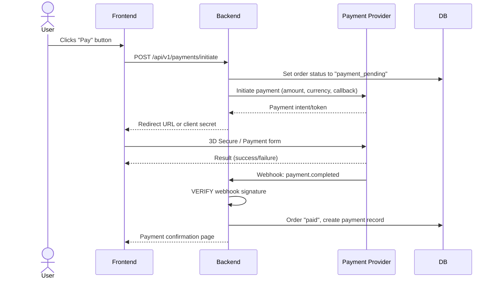
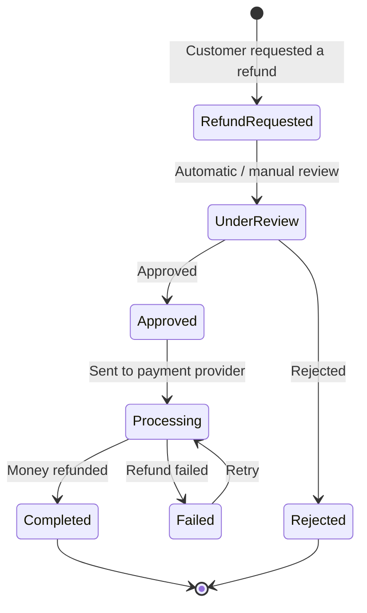

# Payment Integration Guide

> **Compliance References:**
> - Based on: PCI DSS v4.0, 3D Secure 2.0
> - Spec: SAQ-A, Strong Customer Authentication
> - Controls: Tokenization, PCI compliance
> - See also: [governance/STANDARDS_COMPLIANCE_MATRIX.md](../STANDARDS_COMPLIANCE_MATRIX.md)

## Purpose
Standards and best practices for secure payment system integration.

---

## 1. Payment Providers

### Turkey
| Provider | Type | Commission | Integration |
|----------|------|-----------|------------|
| iyzico | Virtual POS + Marketplace | 2-3.5% | REST API |
| PayTR | Virtual POS | 1.5-2.5% | iframe / API |
| Paynet | Virtual POS | Variable | REST API |
| Hepsipay | Marketplace | Variable | REST API |

### International
| Provider | Type | Commission | Integration |
|----------|------|-----------|------------|
| Stripe | Full payment infrastructure | 2.9% + $0.30 | SDK + API |
| PayPal | Digital wallet | 2.9% + $0.30 | SDK + API |
| Adyen | Enterprise payment | Variable | API |

---

## 2. Security Rules (PCI DSS)

### NEVER Do
- [ ] Store credit card numbers in YOUR OWN DB
- [ ] Store CVV ANYWHERE
- [ ] Write card information to LOGS
- [ ] Send card information via email/message
- [ ] Send card information over HTTP (HTTPS only)

### Always Do
- [ ] Use the payment provider's tokenization
- [ ] 3D Secure (3DS) REQUIRED
- [ ] Verify payment status via webhook (do not trust the client side)
- [ ] Use idempotency key (prevent double charges)
- [ ] Card information in payment logs MUST BE MASKED (****1234)

---

## 3. Payment Flow



### CRITICAL: Double Verification
```
1. Do NOT TRUST the "success" message from the frontend
2. WAIT for the webhook and VERIFY the signature
3. Only mark the order as "paid" when the webhook confirms it
```

---

## 4. Refund Flow



---

## 5. Test Cards

### Stripe Test
| Card | Result |
|------|--------|
| 4242 4242 4242 4242 | Successful payment |
| 4000 0000 0000 0002 | Declined |
| 4000 0000 0000 3220 | 3D Secure required |
| 4000 0000 0000 9995 | Insufficient funds |

### iyzico Test
| Card | Result |
|------|--------|
| 5528 7900 0000 0008 | Successful (Mastercard) |
| 5400 0100 0000 0004 | Successful (Visa) |
| 4111 1111 1111 1129 | 3D Secure failed |

---

## 6. Database Design

```sql
-- Payments table
CREATE TABLE payments (
    id UUID PRIMARY KEY DEFAULT gen_random_uuid(),
    order_id UUID NOT NULL REFERENCES orders(id),
    provider VARCHAR(50) NOT NULL,           -- 'stripe', 'iyzico'
    provider_payment_id VARCHAR(255),        -- Provider reference
    amount DECIMAL(12,2) NOT NULL,
    currency VARCHAR(3) NOT NULL DEFAULT 'TRY',
    status VARCHAR(20) NOT NULL DEFAULT 'pending',
    -- status: pending -> processing -> completed -> refunded
    --         pending -> failed
    card_last_four VARCHAR(4),               -- Last 4 digits only
    card_brand VARCHAR(20),                  -- visa, mastercard
    threed_secure BOOLEAN DEFAULT false,
    error_code VARCHAR(50),
    error_message TEXT,
    webhook_received_at TIMESTAMP,
    metadata JSONB,
    created_at TIMESTAMP NOT NULL DEFAULT NOW(),
    created_by VARCHAR(255) NOT NULL,
    updated_at TIMESTAMP NOT NULL DEFAULT NOW(),
    updated_by VARCHAR(255) NOT NULL
);

-- Idempotency table (prevent double charges)
CREATE TABLE payment_idempotency (
    idempotency_key VARCHAR(255) PRIMARY KEY,
    payment_id UUID REFERENCES payments(id),
    created_at TIMESTAMP NOT NULL DEFAULT NOW()
);
```

---

## Related Documents
- `governance/compliance/KVKK_GDPR_CHECKLIST.md` - Payment data KVKK compliance
- `governance/standards/API_STYLE_GUIDE.md` - API design
- `governance/standards/MONITORING_STRATEGY.md` - Payment monitoring
- `governance/standards/RUNBOOK_INDEX.md` - Payment issues
