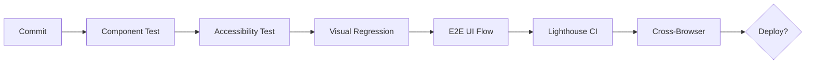

# UI/UX Testing Strategy

> **Compliance References:**
> - Based on: Nielsen's 10 Heuristics (1994), Core Web Vitals
> - Spec: W3C WCAG 2.1 AA
> - Controls: Visual regression, usability evaluation
> - See also: [governance/STANDARDS_COMPLIANCE_MATRIX.md](../STANDARDS_COMPLIANCE_MATRIX.md)

## Purpose
Standards for systematic testing of user interface and experience.

---

## 1. UI Test Pyramid

```
            / Usability Test \           <- Manual, few (end of sprint)
           / Visual Regression \          <- Automated, every PR
          / Cross-Browser+Responsive \    <- Automated, every deploy
         / Component (Storybook) Tests \  <- Automated, every commit
        / Accessibility (a11y) Tests      <- Automated, every commit
       / Core Web Vitals + Performance \  <- Automated, every deploy
      /     E2E UI Flow Tests             <- Automated, every PR
```

---

## 2. Visual Regression Testing

### Purpose
Catch invisible UI breakages through screenshot comparison.

### Tools
| Tool | Type | Integration |
|------|------|------------|
| Playwright Screenshots | Free | CI/CD + custom comparison |
| Percy (BrowserStack) | SaaS | Visual diff on GitHub PR |
| Chromatic (Storybook) | SaaS | Storybook component-based |
| BackstopJS | Open source | Docker + CI/CD |
| reg-suit | Open source | S3/GCS + CI/CD |

### Visual Test with Playwright
```typescript
import { test, expect } from '@playwright/test';

test('homepage visual regression', async ({ page }) => {
  await page.goto('/');
  await expect(page).toHaveScreenshot('homepage.png', {
    maxDiffPixels: 100,       // Max pixel difference
    threshold: 0.2,            // Color threshold (20%)
    animations: 'disabled',    // Disable animations
  });
});

test('login page visual regression', async ({ page }) => {
  await page.goto('/login');
  await expect(page).toHaveScreenshot('login.png');
});

test('responsive - mobile view', async ({ page }) => {
  await page.setViewportSize({ width: 375, height: 812 }); // iPhone
  await page.goto('/');
  await expect(page).toHaveScreenshot('homepage-mobile.png');
});
```

### CI/CD Integration
```yaml
# Run visual regression on every PR
- name: Visual Regression Test
  run: npx playwright test --grep @visual
  
# Store screenshots as artifacts
- uses: actions/upload-artifact@v4
  if: failure()
  with:
    name: visual-diff
    path: test-results/
```

### Rules
- [ ] Baseline screenshot exists for every critical page
- [ ] Reviewer inspects visual diff if there are visual changes in PR
- [ ] Dark mode and light mode are tested separately
- [ ] Mobile and desktop are tested separately

---

## 3. Responsive Testing

### Breakpoints
| Breakpoint | Width | Example Device |
|-----------|-------|---------------|
| Mobile S | 320px | iPhone SE |
| Mobile M | 375px | iPhone 12/13/14 |
| Mobile L | 425px | iPhone 14 Pro Max |
| Tablet | 768px | iPad |
| Laptop | 1024px | iPad Pro / Small laptop |
| Desktop | 1440px | Standard monitor |
| Large | 1920px | Full HD |

### Playwright Responsive Test
```typescript
const devices = [
  { name: 'Mobile', width: 375, height: 812 },
  { name: 'Tablet', width: 768, height: 1024 },
  { name: 'Desktop', width: 1440, height: 900 },
];

for (const device of devices) {
  test(`responsive - ${device.name}`, async ({ page }) => {
    await page.setViewportSize({ width: device.width, height: device.height });
    await page.goto('/');
    
    // Hamburger menu should be visible on mobile
    if (device.width < 768) {
      await expect(page.locator('[data-testid="mobile-menu"]')).toBeVisible();
      await expect(page.locator('[data-testid="desktop-nav"]')).toBeHidden();
    }
    
    await expect(page).toHaveScreenshot(`home-${device.name}.png`);
  });
}
```

### Checklist
- [ ] Text does not overflow (overflow hidden/scroll)
- [ ] Images are responsive (max-width: 100%)
- [ ] Touch target min 44x44px (mobile)
- [ ] Hamburger menu works on mobile
- [ ] Forms are usable on mobile
- [ ] Tables scroll or stack on mobile
- [ ] Modals are fullscreen on mobile

---

## 4. Cross-Browser Testing

### Supported Browsers
| Browser | Version | Engine | Priority |
|---------|---------|--------|----------|
| Chrome | Last 2 | Chromium | P1 |
| Firefox | Last 2 | Gecko | P1 |
| Safari | Last 2 | WebKit | P1 |
| Edge | Last 2 | Chromium | P2 |
| Samsung Internet | Last 1 | Chromium | P3 |

### Playwright Multi-Browser
```typescript
// playwright.config.ts
export default defineConfig({
  projects: [
    { name: 'chromium', use: { ...devices['Desktop Chrome'] } },
    { name: 'firefox', use: { ...devices['Desktop Firefox'] } },
    { name: 'webkit', use: { ...devices['Desktop Safari'] } },
    { name: 'Mobile Chrome', use: { ...devices['Pixel 5'] } },
    { name: 'Mobile Safari', use: { ...devices['iPhone 13'] } },
  ],
});
```

---

## 5. Component Testing (Storybook)

### Purpose
Test and document each UI component in isolation.

### Structure
```
src/components/
├── Button/
│   ├── Button.tsx
│   ├── Button.test.tsx          # Unit test
│   ├── Button.stories.tsx       # Storybook
│   └── Button.module.css
```

### Story Example
```typescript
// Button.stories.tsx
import type { Meta, StoryObj } from '@storybook/react';
import { Button } from './Button';

const meta: Meta<typeof Button> = {
  component: Button,
  tags: ['autodocs'],
};
export default meta;

type Story = StoryObj<typeof Button>;

export const Primary: Story = {
  args: { variant: 'primary', children: 'Button', size: 'md' },
};
export const Disabled: Story = {
  args: { ...Primary.args, disabled: true },
};
export const Loading: Story = {
  args: { ...Primary.args, loading: true },
};
```

### Interaction Test
```typescript
// Inside Button.stories.tsx
export const ClickTest: Story = {
  play: async ({ canvasElement }) => {
    const canvas = within(canvasElement);
    const button = canvas.getByRole('button');
    await userEvent.click(button);
    await expect(button).toHaveAttribute('aria-pressed', 'true');
  },
};
```

---

## 6. Core Web Vitals

### Metrics and Targets
| Metric | Description | Good | Needs Improvement | Poor |
|--------|------------|------|-------------------|------|
| **LCP** | Largest Contentful Paint | < 2.5s | < 4.0s | > 4.0s |
| **INP** | Interaction to Next Paint | < 200ms | < 500ms | > 500ms |
| **CLS** | Cumulative Layout Shift | < 0.1 | < 0.25 | > 0.25 |
| **FCP** | First Contentful Paint | < 1.8s | < 3.0s | > 3.0s |
| **TTFB** | Time to First Byte | < 800ms | < 1.8s | > 1.8s |

### Lighthouse CI
```yaml
# Run before every deploy in CI/CD
- name: Lighthouse CI
  run: |
    npm install -g @lhci/cli
    lhci autorun --config=lighthouserc.json
```

```json
// lighthouserc.json
{
  "ci": {
    "assert": {
      "assertions": {
        "categories:performance": ["error", { "minScore": 0.9 }],
        "categories:accessibility": ["error", { "minScore": 0.9 }],
        "categories:best-practices": ["warn", { "minScore": 0.9 }],
        "categories:seo": ["warn", { "minScore": 0.9 }]
      }
    }
  }
}
```

### Web Vitals Monitoring (RUM)
```typescript
// Real User Monitoring
import { onLCP, onINP, onCLS } from 'web-vitals';

onLCP((metric) => analytics.send('LCP', metric.value));
onINP((metric) => analytics.send('INP', metric.value));
onCLS((metric) => analytics.send('CLS', metric.value));
```

---

## 7. UI/UX Heuristic Evaluation

### Nielsen's 10 Heuristic Rules
This checklist is reviewed at every sprint demo:

| # | Rule | Check | Status |
|---|------|-------|--------|
| 1 | **Visibility of system status** | Are loading indicators, progress bars, toast messages present? | [ ] |
| 2 | **Match between system and real world** | Is language user-friendly? No technical jargon? | [ ] |
| 3 | **User control and freedom** | Are undo, cancel, back buttons available? | [ ] |
| 4 | **Consistency and standards** | Are buttons, colors, fonts consistent? | [ ] |
| 5 | **Error prevention** | Is there a confirmation dialog for dangerous actions? Inline form validation? | [ ] |
| 6 | **Recognition rather than recall** | Are options visible? Not relying on user memory? | [ ] |
| 7 | **Flexibility and efficiency** | Are keyboard shortcuts, autocomplete, recent searches available? | [ ] |
| 8 | **Aesthetic and minimalist design** | No unnecessary information? Clear visual hierarchy? | [ ] |
| 9 | **Error diagnosis and recovery** | Are error messages understandable? Solution suggestions provided? | [ ] |
| 10 | **Help and documentation** | Are tooltips, help text, FAQ accessible? | [ ] |

---

## 8. Usability Test Plan

### Test Format
| Field | Value |
|-------|-------|
| Number of participants | 5 (catches 85% of issues) |
| Duration | 30-45 min / participant |
| Environment | Staging (close to real data) |
| Recording | Screen + audio (with permission) |

### Example Test Tasks
| # | Task | Success Criteria | Max Duration |
|---|------|-----------------|-------------|
| 1 | Register for the system | Account created | 3 min |
| 2 | Search for a product and add to cart | 1 product in cart | 2 min |
| 3 | Place an order | Order confirmation page | 3 min |
| 4 | Cancel your order | Cancellation confirmation message | 2 min |

### Measurement Metrics
| Metric | Description | Target |
|--------|------------|--------|
| Task Success Rate | % who completed the task | > 90% |
| Time on Task | Task completion time | Close to target time |
| Error Rate | Errors per task | < 1 |
| SUS Score | System Usability Scale | > 68 (above average) |

---

## 9. CI/CD Integration



### Gate Criteria
| Test | Blocker? | Criteria |
|------|----------|---------|
| Component test | Yes | 100% pass |
| Accessibility | Yes | 0 critical violations |
| Visual regression | No (warning) | Reviewer approval |
| E2E UI flow | Yes | Critical flows 100% |
| Lighthouse performance | No (warning) | Score > 90 |
| Lighthouse accessibility | Yes | Score > 90 |
| Cross-browser | Yes | Chrome + Firefox + Safari pass |

---

## 10. Agent and Skill Mapping

| Test Type | Agent/Skill | Description |
|----------|-------------|------------|
| E2E UI Flow | `e2e-runner` + `/e2e` | Flow testing with Playwright |
| Visual Regression | `e2e-runner` + Playwright | Screenshot comparison |
| Performance | `performance-optimizer` | Web Vitals, Lighthouse |
| Heuristic Evaluation | `gan-evaluator` | Rubric-based scoring |
| Accessibility | `/verify` + axe-core | WCAG 2.1 AA compliance check |
| Demo Video | `/ui-demo` | Video for sprint demo |
| Quality Loop | `/gan-build` | Write -> test -> score -> iterate |
