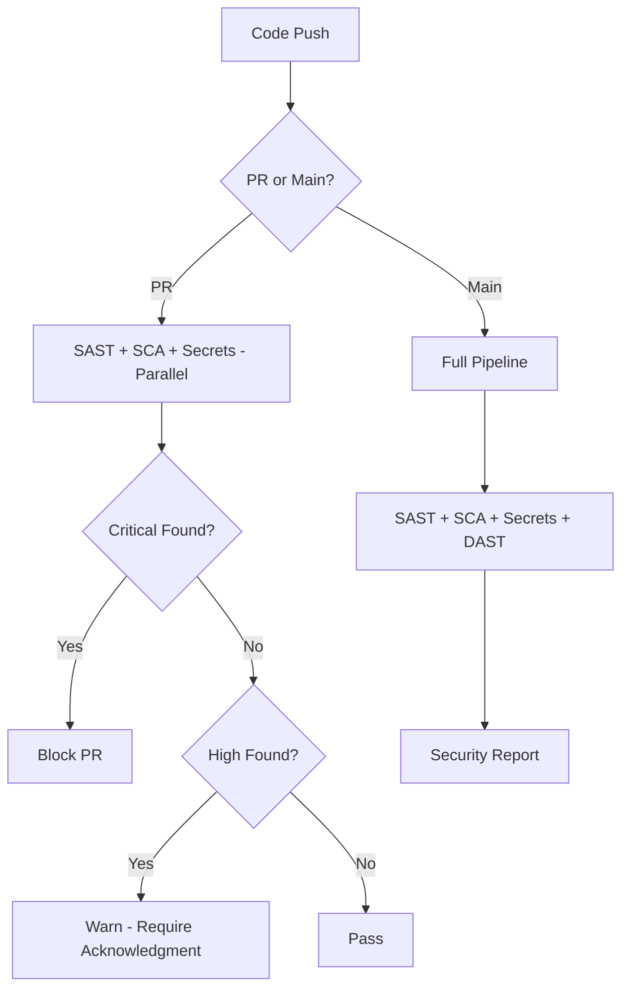

# Unified Security Pipeline (SAST + DAST + SCA + Secrets)

> **Compliance References:**
> - Based on: OWASP ASVS v4.0.3, NIST SP 800-53
> - Spec: SA-11, RA-5
> - Controls: SAST, DAST, SCA, Secrets
> - See also: [governance/STANDARDS_COMPLIANCE_MATRIX.md](../STANDARDS_COMPLIANCE_MATRIX.md)

## Overview

Four security testing pillars running in a single pipeline. Blocks PRs on critical findings, warns on high severity.

---

## 1. Four Pillars

| Pillar | What It Tests | When | Tools |
|--------|--------------|------|-------|
| **SAST** | Source code vulnerabilities | Every PR | Semgrep, CodeQL |
| **DAST** | Running application vulnerabilities | Nightly, pre-release | OWASP ZAP, Nuclei |
| **SCA** | Dependency vulnerabilities | Every PR | Snyk, npm audit, pip-audit |
| **Secrets** | Leaked credentials | Every PR | TruffleHog, GitLeaks |

---

## 2. Tool Selection by Language

| Language | SAST | SCA | Secrets |
|----------|------|-----|---------|
| Node.js/TS | Semgrep, CodeQL | npm audit, Snyk | TruffleHog |
| Python | Bandit, Semgrep | pip-audit, Safety | TruffleHog |
| Go | gosec, Semgrep | govulncheck | TruffleHog |
| Java | SpotBugs, CodeQL | OWASP Dependency-Check | TruffleHog |
| Rust | cargo-audit, clippy | cargo-audit | TruffleHog |

---

## 3. Pipeline Flow



---

## 4. Severity Actions

| Severity | PR Action | Timeline | Owner |
|----------|-----------|----------|-------|
| **Critical** | BLOCK merge | Fix immediately | Developer + Security |
| **High** | WARN, require ack | Fix within sprint | Developer |
| **Medium** | Info comment | Fix within 30 days | Tech debt backlog |
| **Low** | Log only | Fix at convenience | Optional |

---

## 5. False Positive Management

| Action | When | How |
|--------|------|-----|
| Inline suppress | Confirmed false positive | `// nosemgrep: rule-id` |
| Config exclude | Tool-specific false positive | `.semgrepignore`, `.snyk` |
| Global exclude | Framework pattern (not vuln) | Pipeline config |
| Review suppress | Quarterly | Remove stale suppressions |

**Rule:** Every suppression must have a comment explaining WHY.

---

## 6. Weekly Security Summary Template

```
Security Pipeline Summary - Week [X]
Period: [start] to [end]

FINDINGS
| Severity | New | Fixed | Open | Suppressed |
|----------|-----|-------|------|-----------|
| Critical | [X] | [X] | [X] | [X] |
| High | [X] | [X] | [X] | [X] |
| Medium | [X] | [X] | [X] | [X] |
| Low | [X] | [X] | [X] | [X] |

TOP ISSUES
1. [CVE/Finding]: [description] - [status]
2. [CVE/Finding]: [description] - [status]

ACTIONS
- [ ] [action item]
```

---

## 7. Integration with VSH

| Standard | Connection |
|----------|-----------|
| SHIFT_LEFT_SECURITY.md | Security at every phase |
| SBOM_PIPELINE.md | SCA uses SBOM data |
| PENETRATION_TEST_PLAN.md | DAST complements pentesting |
| SOURCE_CONTROL_SECURITY.md | Secrets detection |
| COMPLIANCE_EVIDENCE_AUTOMATION.md | Security reports as evidence |
