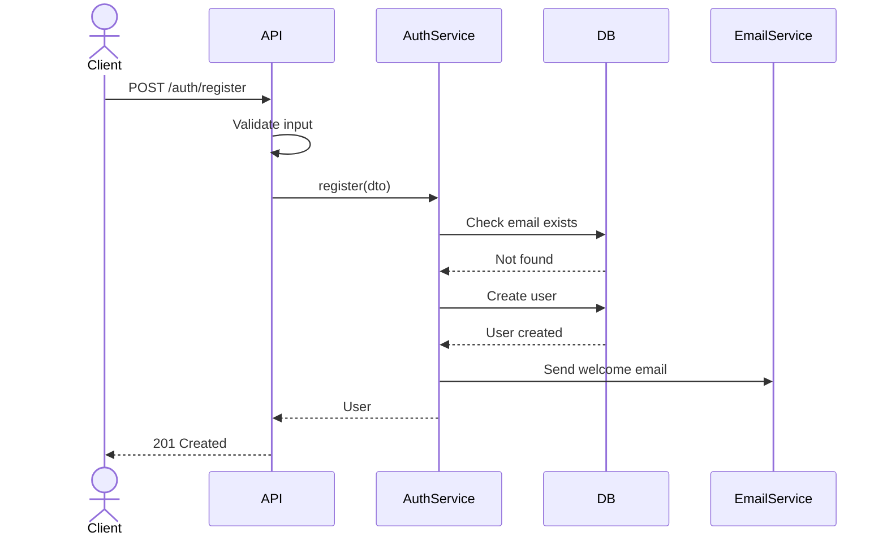

# API Specification Document

## Document Information
| Field | Value |
|-------|-------|
| Project Name | [PROJECT_NAME] |
| Version | v1.0 |
| Author | Architecture Dept. |
| Date | [DATE] |
| Status | Draft / Review / Approved |
| Base URL | `https://api.[domain].com/v1` |
| Related Blueprint | SAD-[NUMBER] |

---

## 1. API General Information

### 1.1 Authentication
| Method | Detail |
|--------|--------|
| Type | Bearer Token (JWT) |
| Header | `Authorization: Bearer <token>` |
| Token duration | Access: 15 min, Refresh: 7 days |
| Token renewal | `POST /auth/refresh` |

### 1.2 Rate Limiting
| Tier | Limit | Window |
|------|-------|--------|
| Anonymous | 30 req | 1 minute |
| Authenticated | 100 req | 1 minute |
| Admin | 500 req | 1 minute |

Rate limit headers:
```
X-RateLimit-Limit: 100
X-RateLimit-Remaining: 95
X-RateLimit-Reset: 1620000000
```

### 1.3 Common Response Format
**Success:**
```json
{
  "success": true,
  "data": { },
  "meta": {
    "page": 1,
    "limit": 20,
    "total": 150,
    "totalPages": 8
  }
}
```

**Error:**
```json
{
  "success": false,
  "error": {
    "code": "ERROR_CODE",
    "message": "User-visible message",
    "details": []
  }
}
```

### 1.4 HTTP Status Codes
| Code | Meaning | Usage |
|------|---------|-------|
| 200 | OK | Successful GET/PUT/PATCH |
| 201 | Created | Successful POST |
| 204 | No Content | Successful DELETE |
| 400 | Bad Request | Invalid input |
| 401 | Unauthorized | Token missing/invalid |
| 403 | Forbidden | Unauthorized access |
| 404 | Not Found | Record not found |
| 409 | Conflict | Data conflict |
| 422 | Unprocessable | Business rule violation |
| 429 | Too Many Requests | Rate limit exceeded |
| 500 | Internal Error | Server error |

### 1.5 Pagination
```
GET /api/v1/resources?page=1&limit=20&sort=created_at&order=desc
```

### 1.6 Filtering
```
GET /api/v1/resources?status=active&created_after=2026-01-01&search=keyword
```

---

## 2. Endpoint Definitions

### 2.1 Auth Module

#### POST /auth/register
**Description:** New user registration

**Request:**
```json
{
  "email": "user@example.com",
  "password": "SecurePass123!",
  "first_name": "Ahmet",
  "last_name": "Yilmaz"
}
```

**Validation:**
| Field | Rule |
|-------|------|
| email | Required, valid email, unique |
| password | Required, min 8 char, 1 upper, 1 number, 1 special |
| first_name | Required, 2-50 char |
| last_name | Required, 2-50 char |

**Response (201):**
```json
{
  "success": true,
  "data": {
    "id": "uuid",
    "email": "user@example.com",
    "first_name": "Ahmet",
    "last_name": "Yilmaz",
    "created_at": "2026-01-01T00:00:00Z"
  }
}
```

**Errors:**
| Code | Error Code | Description |
|------|-----------|------------|
| 400 | VALIDATION_ERROR | Invalid input |
| 409 | EMAIL_EXISTS | Email already registered |

**Sequence Diagram:**


---

#### POST /auth/login
**Description:** User login

**Request:**
```json
{
  "email": "user@example.com",
  "password": "SecurePass123!"
}
```

**Response (200):**
```json
{
  "success": true,
  "data": {
    "access_token": "eyJhbGci...",
    "refresh_token": "eyJhbGci...",
    "token_type": "Bearer",
    "expires_in": 900
  }
}
```

**Errors:**
| Code | Error Code | Description |
|------|-----------|------------|
| 401 | INVALID_CREDENTIALS | Email or password incorrect |
| 423 | ACCOUNT_LOCKED | Account locked (5 failed attempts) |

---

### 2.2 [Module Name] - CRUD

#### GET /api/v1/[resources]
**Description:** Record list (paginated)

**Query Parameters:**
| Parameter | Type | Default | Description |
|-----------|------|---------|------------|
| page | integer | 1 | Page number |
| limit | integer | 20 | Records per page (max 100) |
| sort | string | created_at | Sort field |
| order | string | desc | asc / desc |
| search | string | - | Search term |
| status | string | - | Status filter |

**Response (200):**
```json
{
  "success": true,
  "data": [ { "id": "uuid", "..." : "..." } ],
  "meta": { "page": 1, "limit": 20, "total": 50, "totalPages": 3 }
}
```

#### GET /api/v1/[resources]/:id
**Description:** Single record detail

#### POST /api/v1/[resources]
**Description:** Create new record

#### PUT /api/v1/[resources]/:id
**Description:** Update record (full update)

#### PATCH /api/v1/[resources]/:id
**Description:** Update record (partial update)

#### DELETE /api/v1/[resources]/:id
**Description:** Delete record (soft delete)

---

## 3. WebSocket API (if applicable)

### 3.1 Connection
```
wss://api.[domain].com/ws?token=<jwt_token>
```

### 3.2 Events
| Event | Direction | Payload | Description |
|-------|-----------|---------|------------|
| notification | Server->Client | `{ type, message, data }` | Notification |
| ping | Client->Server | `{ timestamp }` | Liveness check |
| pong | Server->Client | `{ timestamp }` | Liveness response |

---

## 4. Webhook API (if applicable)

### 4.1 Webhook Registration
```json
POST /api/v1/webhooks
{
  "url": "https://your-server.com/webhook",
  "events": ["order.created", "order.updated"],
  "secret": "whsec_..."
}
```

### 4.2 Webhook Payload
```json
{
  "id": "evt_...",
  "type": "order.created",
  "created_at": "2026-01-01T00:00:00Z",
  "data": { }
}
```

### 4.3 Signature Verification
```
X-Webhook-Signature: sha256=...
```

---

## 5. Error Code Reference

| Error Code | HTTP | Description |
|-----------|------|------------|
| VALIDATION_ERROR | 400 | Input validation error |
| INVALID_CREDENTIALS | 401 | Invalid credentials |
| TOKEN_EXPIRED | 401 | Token expired |
| INSUFFICIENT_PERMISSIONS | 403 | Unauthorized operation |
| RESOURCE_NOT_FOUND | 404 | Record not found |
| EMAIL_EXISTS | 409 | Email already exists |
| BUSINESS_RULE_VIOLATION | 422 | Business rule violation |
| RATE_LIMIT_EXCEEDED | 429 | Request limit exceeded |
| INTERNAL_ERROR | 500 | Internal server error |

---

## 6. Approval

| Role | Name | Date | Status |
|------|------|------|--------|
| Lead Architect | VSH | [DATE] | Pending |
| Dev Lead | VSH | [DATE] | Pending |
| Security Lead | VSH | [DATE] | Pending |
