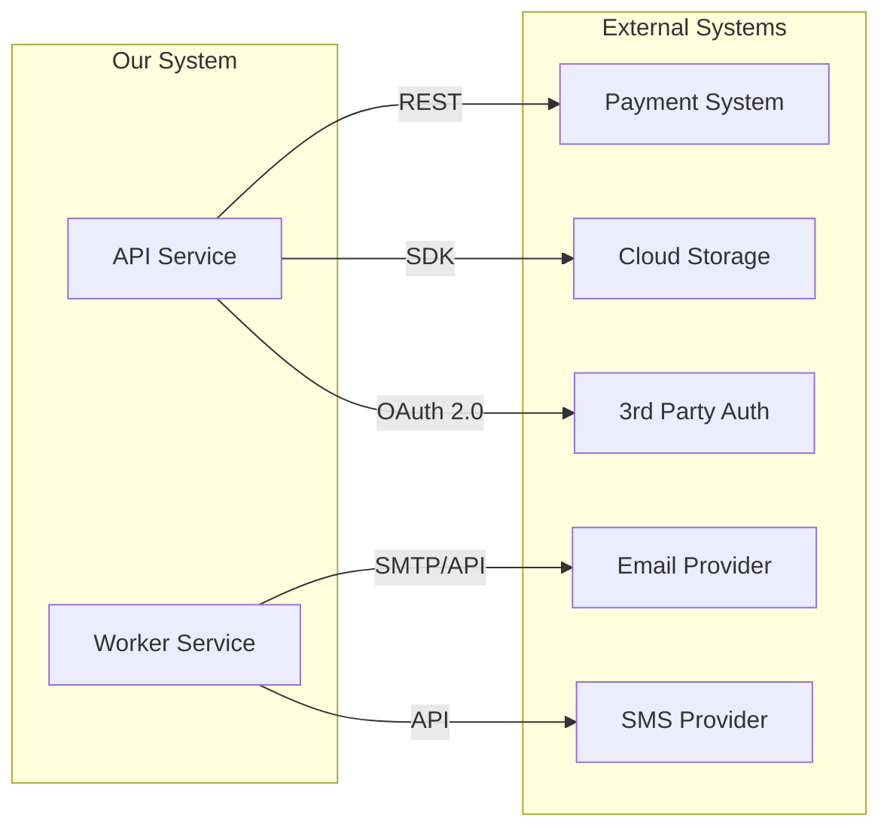
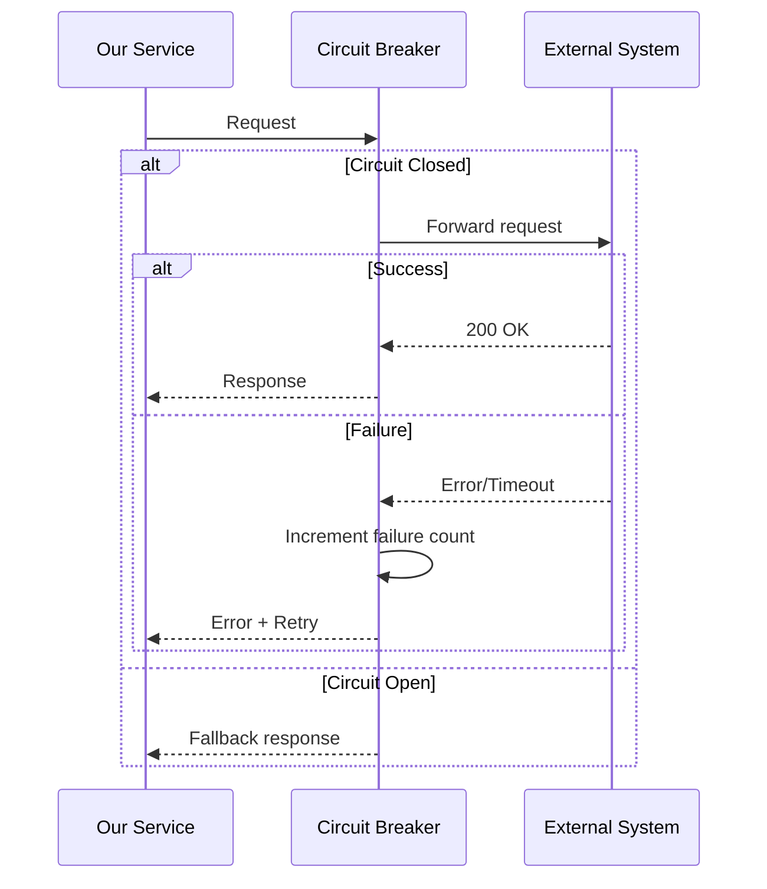

# Integration Specification

## Document Information
| Field | Value |
|-------|-------|
| Project Name | [PROJECT_NAME] |
| Version | 1.0 |
| Author | Architecture Dept. |
| Date | [DATE] |
| Status | Draft / Review / Approved |
| Related API Spec | API_SPEC-[NUMBER] |

---

## 1. Integration Overview

### 1.1 Integration Map


### 1.2 Integration List
| ID | External System | Protocol | Direction | Criticality | Status |
|----|----------------|----------|-----------|-------------|--------|
| INT-001 | [System] | REST/GraphQL/gRPC | Inbound/Outbound/Bidirectional | Critical/High/Normal | Planned |

---

## 2. Integration Details

### INT-001: [External System Name]

#### 2.1 General Information
| Field | Value |
|-------|-------|
| External System | [System name] |
| Documentation | [URL] |
| Environment | Sandbox: [url] / Production: [url] |
| Auth Method | API Key / OAuth 2.0 / mTLS / HMAC |
| Data Format | JSON / XML / Protobuf |
| Rate Limit | [N req/minute] |

#### 2.2 Authentication
```
# Example auth header
Authorization: Bearer <api_key>
X-API-Key: <key>
```

**Secret Management:**
| Secret | Environment Variable | Where Stored |
|--------|---------------------|-------------|
| API Key | [SYS_API_KEY] | Secret Manager |
| Secret Key | [SYS_SECRET] | Secret Manager |

#### 2.3 API Endpoints

**Endpoints We Use:**
| Method | Endpoint | Purpose | Timeout |
|--------|----------|---------|---------|
| POST | /v1/[endpoint] | [Purpose] | 10s |
| GET | /v1/[endpoint] | [Purpose] | 5s |

**Request Example:**
```json
{
  "field": "value"
}
```

**Response Example:**
```json
{
  "status": "success",
  "data": {}
}
```

#### 2.4 Data Mapping (Field Mapping)
| Our Field | External System Field | Transformation | Note |
|-----------|----------------------|---------------|------|
| user.email | customer_email | Direct | - |
| order.total | amount_cents | TL -> kurus (*100) | Integer |

#### 2.5 Error Handling
| External System Error | Our Action | Retry | Fallback |
|----------------------|------------|-------|----------|
| 400 Bad Request | Log + return error | No | - |
| 401 Unauthorized | Refresh token, retry | 1 time | - |
| 429 Rate Limited | Exponential backoff | 3 times | Push to queue |
| 500 Server Error | Log + retry | 3 times | Circuit breaker |
| Timeout | Log + retry | 2 times | Fallback response |
| Network Error | Log + retry | 3 times | Circuit breaker |

#### 2.6 Circuit Breaker Settings
| Parameter | Value |
|-----------|-------|
| Failure threshold | 5 failures |
| Recovery timeout | 60 seconds |
| Half-open requests | 3 |
| Monitoring window | 60 seconds |

#### 2.7 Sequence Diagram


---

### INT-002: [External System Name]
[Same format repeated]

---

## 3. Webhook Integrations (Inbound)

### 3.1 Our Webhook Endpoints
| Endpoint | External System | Event | Description |
|----------|----------------|-------|------------|
| POST /webhooks/[system] | [System] | [event.type] | [Description] |

### 3.2 Signature Verification
```
# Verify every webhook with signature
X-Signature: sha256=HMAC(payload, secret)
```

### 3.3 Idempotency
- Every webhook comes with an event_id
- Do not reprocess the same event_id
- Keep records in processed_events table

---

## 4. Integration Test Strategy

| Test Type | Tool | Environment | Description |
|----------|------|------------|------------|
| Unit | Mock/Stub | Local | External system is mocked |
| Integration | Sandbox API | CI/CD | Test with real sandbox |
| Contract | Pact/Prism | CI/CD | API contract test |
| E2E | Real API | Staging | End-to-end flow test |

---

## 5. Monitoring & Alerting

| Metric | Threshold | Alert |
|--------|-----------|-------|
| [System] response time p95 | > 2s | Warning |
| [System] error rate | > 5% | Critical |
| [System] circuit breaker open | Open | Critical |
| Webhook processing delay | > 30s | Warning |

---

## 6. Approval

| Role | Name | Date | Status |
|------|------|------|--------|
| Lead Architect | VSH | [DATE] | Pending |
| Dev Lead | VSH | [DATE] | Pending |
| Security Lead | VSH | [DATE] | Pending |
