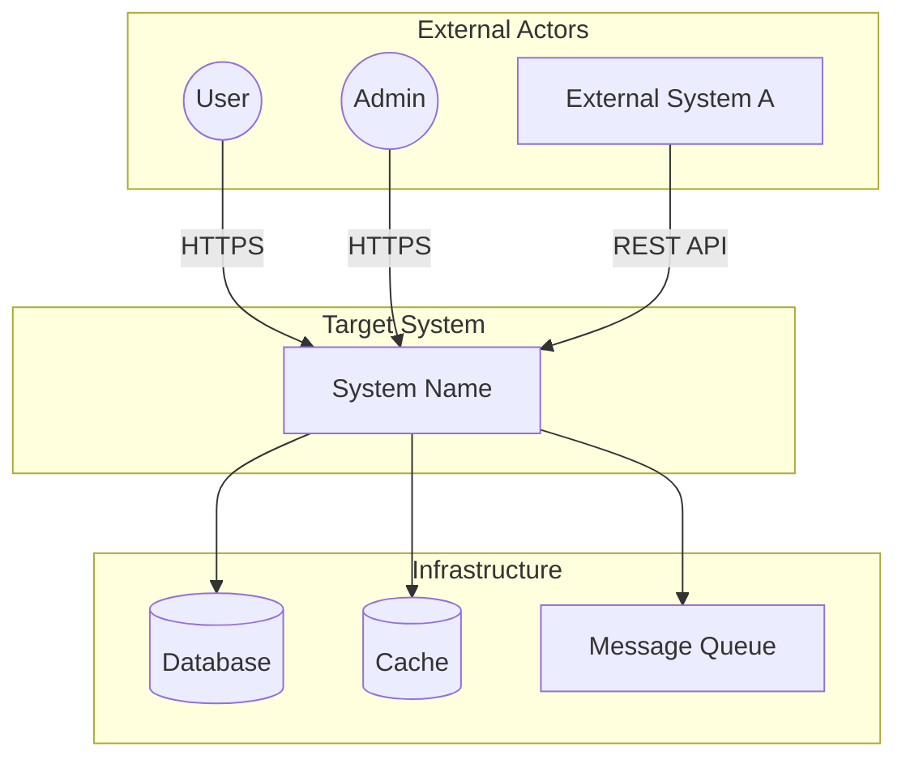
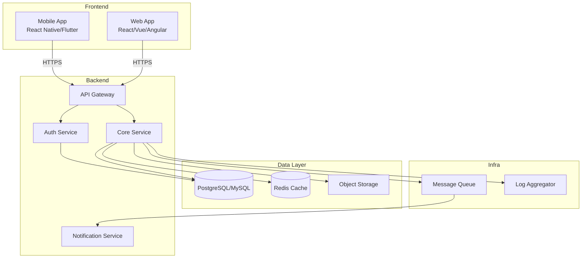
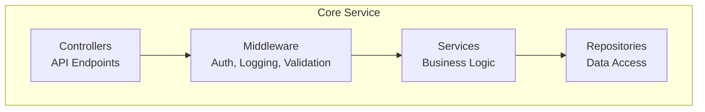
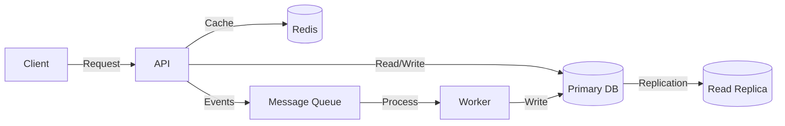
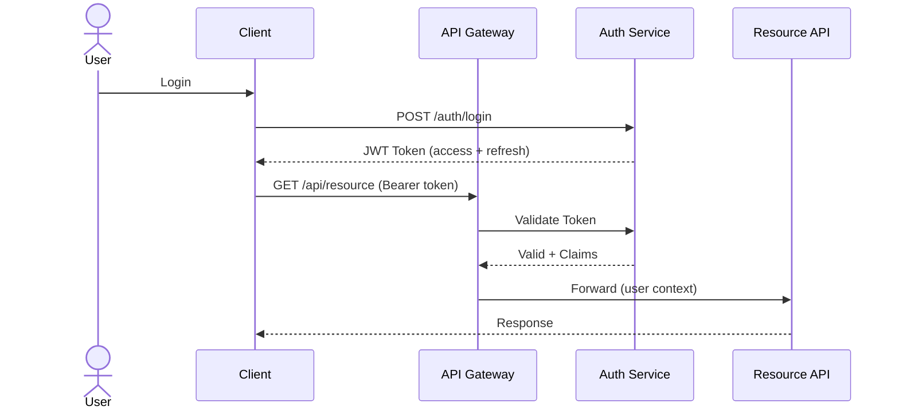
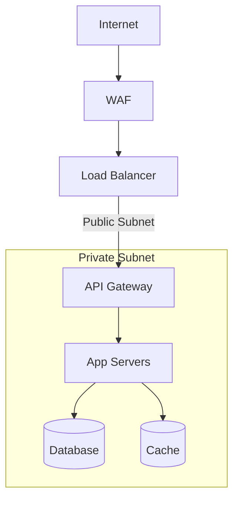
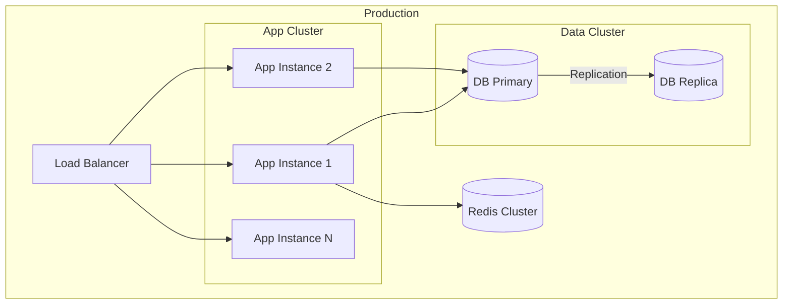
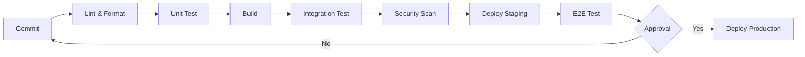

# System Architecture Document (Blueprint / SAD)

## Document Information
| Field | Value |
|-------|-------|
| Project Name | [PROJECT_NAME] |
| Version | 1.0 |
| Author | Architecture Dept. |
| Date | [DATE] |
| Status | Draft / Review / Approved |
| Related SRS | SRS-[NUMBER] |
| Related PRD | PRD-[NUMBER] |

---

## 1. Executive Summary
[3-5 sentence summary of the architectural approach, key decisions, and why this path was chosen]

---

## 2. Architectural Goals and Constraints

### 2.1 Architectural Goals
| Goal | Priority | Description |
|------|----------|------------|
| Scalability | High | [Description] |
| Performance | High | [Description] |
| Security | High | [Description] |
| Maintainability | Medium | [Description] |
| Cost optimization | Medium | [Description] |

### 2.2 Constraints
| Constraint | Source | Impact |
|-----------|--------|--------|
| [Technical] | [Source] | [Impact] |
| [Business] | [Source] | [Impact] |
| [Legal] | [Source] | [Impact] |

---

## 3. System Overview

### 3.1 Context Diagram (C4 Level 1)

### 3.2 Container Diagram (C4 Level 2)

---

## 4. Technology Stack

### 4.1 Chosen Technologies
| Layer | Technology | Version | Why Chosen |
|-------|-----------|---------|------------|
| Frontend | [React/Vue/Angular] | [v] | [Reason] |
| Backend | [Node.js/Python/Go/Java] | [v] | [Reason] |
| Database | [PostgreSQL/MySQL/MongoDB] | [v] | [Reason] |
| Cache | [Redis/Memcached] | [v] | [Reason] |
| Message Queue | [RabbitMQ/Kafka/SQS] | [v] | [Reason] |
| Container | [Docker] | [v] | [Reason] |
| Orchestration | [K8s/ECS/Docker Compose] | [v] | [Reason] |
| CI/CD | [GitHub Actions/GitLab CI] | - | [Reason] |
| Monitoring | [Prometheus+Grafana/DataDog] | - | [Reason] |
| Log | [ELK/Loki] | - | [Reason] |

### 4.2 Evaluated Alternatives
| Decision | Chosen | Alternative | Why Not Chosen |
|----------|--------|-----------|----------------|
| [Decision 1] | [Choice] | [Alt.] | [Reason] |

---

## 5. Component Architecture (C4 Level 3)

### 5.1 [Component 1: Core Service]

**Responsibilities:**
- [Responsibility 1]
- [Responsibility 2]

**API Endpoints:**
| Method | Endpoint | Description |
|--------|----------|------------|
| GET | /api/v1/[resource] | [Description] |
| POST | /api/v1/[resource] | [Description] |

### 5.2 [Component 2: Auth Service]
[Same format]

---

## 6. Data Architecture

### 6.1 Data Flow Diagram

### 6.2 Data Storage Strategy
| Data Type | Storage | Encryption | Backup | Retention |
|-----------|---------|-----------|--------|-----------|
| Transactional | PostgreSQL | At-rest AES-256 | Daily | 7 years |
| Session/Cache | Redis | - | - | TTL |
| Files | S3/Object Storage | At-rest | Cross-region | 5 years |
| Log | ELK/Loki | - | Weekly | 1 year |

### 6.3 Caching Strategy
| Cache Layer | Technology | TTL | Invalidation |
|------------|----------|-----|-------------|
| Browser | HTTP Cache | 5m | ETag |
| CDN | CloudFront/CloudFlare | 1h | Purge API |
| Application | Redis | 15m | Write-through |
| Query | Redis | 5m | Event-based |

---

## 7. Security Architecture

### 7.1 Authentication and Authorization

### 7.2 Security Controls
| Control | Implementation | Layer |
|---------|---------------|-------|
| Authentication | JWT + Refresh Token | API Gateway |
| Authorization | RBAC | Service Layer |
| Input Validation | Schema validation (Zod/Joi/Pydantic) | Controller |
| Rate Limiting | Token bucket | API Gateway |
| CORS | Whitelist | API Gateway |
| CSRF | Double submit cookie | Frontend |
| XSS | Content Security Policy | Frontend |
| SQL Injection | Parameterized queries | Repository |
| Encryption (transit) | TLS 1.3 | Infra |
| Encryption (rest) | AES-256 | Database |
| Audit Logging | Append-only log | Service Layer |

### 7.3 Network Security Topology

---

## 8. Infrastructure Architecture

### 8.1 Deployment Diagram

### 8.2 Environment Configuration
| Environment | Resources | Replicas | Auto-scale |
|-------------|----------|---------|-----------|
| Development | Minimal | 1 | No |
| Staging | Medium | 2 | No |
| Production | Full | 3+ | Yes |

### 8.3 CI/CD Pipeline

---

## 9. Cross-Cutting Concerns

### 9.1 Logging
| Log Level | Usage | Example |
|-----------|-------|---------|
| ERROR | Unexpected errors | DB connection failure |
| WARN | Potential issues | High response time |
| INFO | Business events | User registration |
| DEBUG | Development details | SQL query |

### 9.2 Monitoring & Alerting
| Metric | Threshold | Alert |
|--------|-----------|-------|
| CPU | > 80% | Warning |
| Memory | > 85% | Warning |
| Error rate | > 1% | Critical |
| Response time p95 | > 2s | Warning |
| Disk | > 90% | Critical |

### 9.3 Error Management
[Central error management strategy, error boundaries, retry policy]

---

## 10. Decision Records (ADR References)

| ADR No | Decision | Date | Status |
|--------|----------|------|--------|
| ADR-001 | [Architectural decision] | [DATE] | Accepted |
| ADR-002 | [Architectural decision] | [DATE] | Accepted |

---

## 11. Risk Analysis

| Risk | Probability | Impact | Mitigation |
|------|------------|--------|-----------|
| [Risk 1] | High/Medium/Low | High/Medium/Low | [Strategy] |
| [Risk 2] | High/Medium/Low | High/Medium/Low | [Strategy] |

---

## 12. Approval

| Role | Name | Date | Status |
|------|------|------|--------|
| CTO | VSH | [DATE] | Pending |
| Lead Architect | VSH | [DATE] | Pending |
| Security Lead | VSH | [DATE] | Pending |
| DevOps Lead | VSH | [DATE] | Pending |
