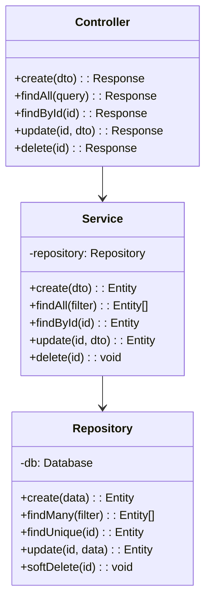
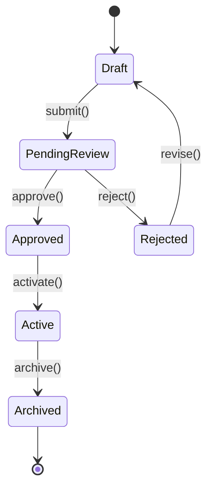
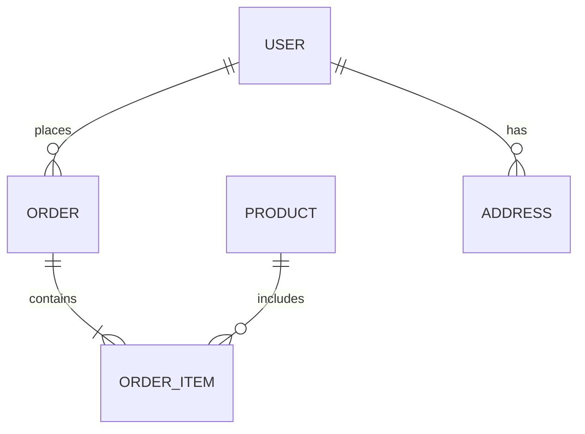

# System Design Document (SDD)

## Document Information
| Field | Value |
|-------|-------|
| Project Name | [PROJECT_NAME] |
| Version | 1.0 |
| Author | Architecture Dept. |
| Date | [DATE] |
| Status | Draft / Review / Approved |
| Related Blueprint | SAD-[NUMBER] |
| Related SRS | SRS-[NUMBER] |

---

## 1. Introduction
### 1.1 Purpose
[Purpose of this document - brings the architecture from the blueprint down to detailed design level]

### 1.2 Scope
[Which components/modules this design covers]

---

## 2. Module Designs

### 2.1 [Module Name]

#### 2.1.1 Responsibility
[What this module does, Single Responsibility from SOLID principles]

#### 2.1.2 Class/File Structure
```
src/modules/[module_name]/
├── controllers/
│   └── [module].controller.ts
├── services/
│   └── [module].service.ts
├── repositories/
│   └── [module].repository.ts
├── dto/
│   ├── create-[module].dto.ts
│   └── update-[module].dto.ts
├── entities/
│   └── [module].entity.ts
├── interfaces/
│   └── [module].interface.ts
├── validators/
│   └── [module].validator.ts
├── __tests__/
│   ├── [module].controller.test.ts
│   ├── [module].service.test.ts
│   └── [module].repository.test.ts
└── index.ts
```

#### 2.1.3 Class Diagram


#### 2.1.4 Method Details

**Service.create(dto)**
| Field | Value |
|-------|-------|
| Input | CreateDTO |
| Output | Entity |
| Process | 1. Validate DTO, 2. Check duplicates, 3. Create entity, 4. Emit event |
| Errors | ValidationError, DuplicateError |
| Business Rules | BR-001, BR-002 |

#### 2.1.5 State Diagram (if applicable)


---

### 2.2 [Module Name]
[Same format repeats]

---

## 3. Shared Components

### 3.1 Middleware Pipeline
| Order | Middleware | Responsibility |
|-------|-----------|---------------|
| 1 | CORS | Cross-Origin control |
| 2 | Rate Limiter | Request throttling |
| 3 | Auth | Token verification |
| 4 | Request Logger | Request logging |
| 5 | Validator | Input validation |
| 6 | Error Handler | Centralized error management |

### 3.2 Event System
| Event | Publisher | Subscriber | Description |
|-------|-----------|-----------|-------------|
| user.created | UserService | NotificationService | Welcome email |
| order.completed | OrderService | InventoryService | Stock update |

### 3.3 Error Handling Strategy
```
AppError (base)
├── ValidationError (400)
├── AuthenticationError (401)
├── AuthorizationError (403)
├── NotFoundError (404)
├── ConflictError (409)
├── RateLimitError (429)
└── InternalError (500)
```

---

## 4. API Design

### 4.1 URL Structure
```
/api/v{version}/{resource}
/api/v{version}/{resource}/{id}
/api/v{version}/{resource}/{id}/{sub-resource}
```

### 4.2 Response Format
```json
{
  "success": true,
  "data": {},
  "meta": {
    "page": 1,
    "limit": 20,
    "total": 100,
    "totalPages": 5
  },
  "error": null
}
```

### 4.3 Error Response Format
```json
{
  "success": false,
  "data": null,
  "error": {
    "code": "VALIDATION_ERROR",
    "message": "Input validation error",
    "details": [
      { "field": "email", "message": "Enter a valid email address" }
    ]
  }
}
```

---

## 5. Database Design Reference
> Detail: DB_DESIGN_DOC-[NUMBER]

### 5.1 Entity Relationships (Summary)


---

## 6. External Integration Designs

### 6.1 [External System Name]
| Field | Value |
|-------|-------|
| Protocol | REST / GraphQL / gRPC / WebSocket |
| Auth | API Key / OAuth / mTLS |
| Timeout | [ms] |
| Retry | [policy] |
| Circuit Breaker | [threshold] |

**Error Scenarios:**
| Error | HTTP | Action |
|-------|------|--------|
| Timeout | - | Retry (max 3, exponential backoff) |
| 4xx | Client error | Log + return error |
| 5xx | Server error | Retry + circuit breaker |
| Network | - | Circuit breaker open |

---

## 7. Test Strategy Reference
> Detail: TEST_PLAN-[NUMBER]

| Layer | Test Type | Tool | Coverage Target |
|-------|----------|------|----------------|
| Unit | Unit | Jest/Pytest/Go test | 80%+ |
| Integration | Integration | Supertest/TestContainers | 70%+ |
| E2E | End-to-end | Playwright/Cypress | Critical flows |

---

## 8. Approval

| Role | Name | Date | Status |
|------|------|------|--------|
| Lead Architect | VSH | [DATE] | Pending |
| Dev Lead | VSH | [DATE] | Pending |
| QA Lead | VSH | [DATE] | Pending |
