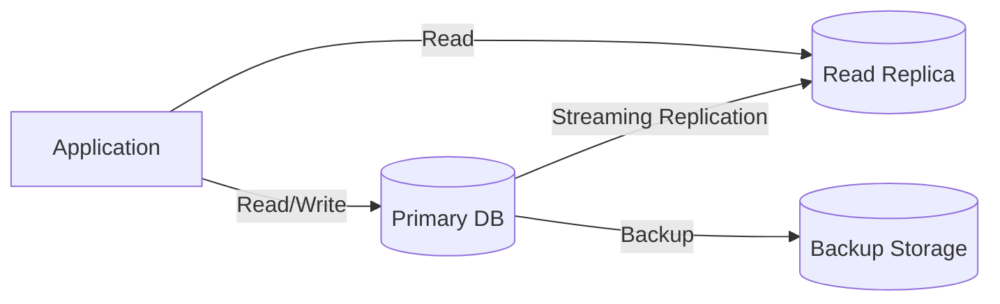
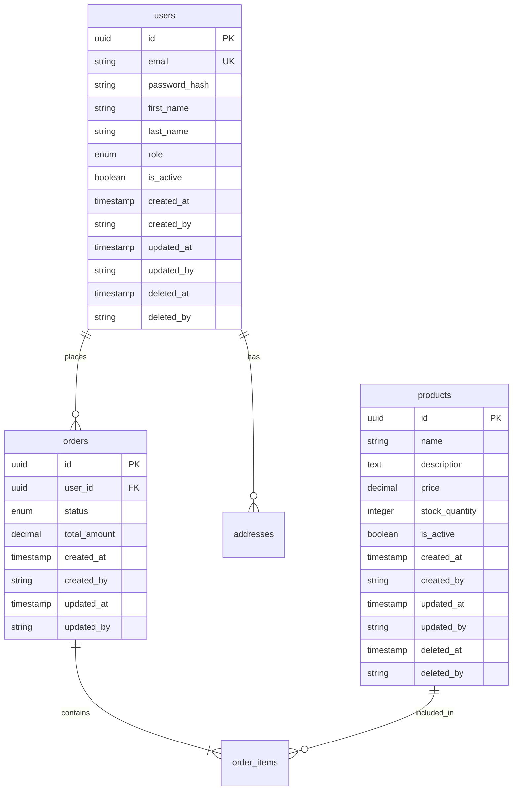

# Database Design Document

## Document Information
| Field | Value |
|-------|-------|
| Project Name | [PROJECT_NAME] |
| Version | 1.0 |
| Author | Architecture Dept. (DBA) |
| Date | [DATE] |
| Status | Draft / Review / Approved |
| DB Technology | [PostgreSQL / MySQL / MongoDB / etc.] |
| ORM | [Prisma / Drizzle / TypeORM / SQLAlchemy / GORM / etc.] |
| Related Blueprint | SAD-[NUMBER] |

---

## 1. Database Overview

### 1.1 Database Topology


### 1.2 Database List
| DB Name | Type | Purpose | Charset | Collation |
|---------|------|---------|---------|-----------|
| [project]_db | Relational | Main data | UTF-8 | utf8mb4_unicode_ci |
| [project]_cache | Key-Value | Cache/Session | - | - |
| [project]_search | Search | Full-text search | - | - |

---

## 2. ER Diagram



---

## 3. Table Definitions

### 3.1 [table_name]

**Purpose:** [What this table stores]

| Column | Type | Nullable | Default | Description |
|--------|------|----------|---------|------------|
| id | UUID | NOT NULL | gen_random_uuid() | Primary Key |
| [column] | VARCHAR(255) | NOT NULL | - | [Description] |
| [column] | INTEGER | NULL | 0 | [Description] |
| [column] | ENUM | NOT NULL | 'active' | [Description] |
| created_at | TIMESTAMP | NOT NULL | NOW() | Creation time |
| created_by | VARCHAR(255) | NOT NULL | 'system' | Created by |
| updated_at | TIMESTAMP | NOT NULL | NOW() | Update time |
| updated_by | VARCHAR(255) | NOT NULL | 'system' | Updated by |
| deleted_at | TIMESTAMP | NULL | NULL | Soft delete time |
| deleted_by | VARCHAR(255) | NULL | NULL | Deleted by |

**Indexes:**
| Index Name | Columns | Type | Purpose |
|-----------|---------|------|---------|
| pk_[table]_id | id | PRIMARY | PK |
| uk_[table]_[column] | [column] | UNIQUE | Unique value |
| idx_[table]_[column] | [column] | BTREE | Query performance |
| idx_[table]_deleted_at | deleted_at | BTREE | Soft delete filter |

**Constraints:**
| Constraint | Type | Detail |
|-----------|------|--------|
| fk_[table]_[ref] | FOREIGN KEY | REFERENCES [ref_table](id) |
| chk_[table]_[column] | CHECK | [column] > 0 |

**Triggers:**
| Trigger | Event | Action |
|---------|-------|--------|
| trg_[table]_updated_at | BEFORE UPDATE | SET updated_at = NOW() |
| trg_[table]_audit | AFTER INSERT/UPDATE/DELETE | INSERT INTO audit_log |

---

### 3.2 audit_log (MANDATORY - ISO 27001)

**Purpose:** Audit record of all data changes (DELETE/UPDATE PROHIBITED)

| Column | Type | Nullable | Description |
|--------|------|----------|------------|
| id | BIGSERIAL | NOT NULL | PK (auto-increment) |
| table_name | VARCHAR(100) | NOT NULL | Affected table |
| record_id | UUID | NOT NULL | Affected record ID |
| action | ENUM('INSERT','UPDATE','DELETE') | NOT NULL | Operation type |
| old_values | JSONB | NULL | Previous values |
| new_values | JSONB | NULL | New values |
| changed_by | VARCHAR(255) | NOT NULL | Operation performer |
| changed_at | TIMESTAMP | NOT NULL | Operation time |
| ip_address | INET | NULL | IP address |
| user_agent | TEXT | NULL | Browser/client information |

> **RULE:** UPDATE and DELETE operations are PROHIBITED on this table. Only INSERT is allowed.

---

## 4. PII Masking Rules

| Field | Example Data | Masked | Method |
|-------|-------------|--------|--------|
| Email | user@email.com | u***@e***.com | Partial mask |
| Phone | +905321234567 | +90***567 | Last 3 digits |
| National ID | 12345678901 | 123****901 | Middle mask |
| Credit Card | 4111111111111111 | ****1111 | Last 4 digits |
| Full Name | Ahmet Yilmaz | A*** Y*** | First char only |

---

## 5. Migration Strategy

### 5.1 Migration Rules
- Every migration MUST include both `up` and `down`
- Migration naming: `YYYYMMDDHHMMSS_description`
- BACKUP must be taken before production migration
- For zero-downtime migration: expand-contract pattern

### 5.2 Migration Example
```
migrations/
├── 20260101000000_create_users_table.sql
├── 20260101000001_create_orders_table.sql
├── 20260102000000_add_phone_to_users.sql
└── 20260103000000_create_audit_log.sql
```

### 5.3 Seed Data
| Table | Purpose | Environment |
|-------|---------|------------|
| roles | Default roles | All environments |
| permissions | Permission definitions | All environments |
| test_users | Test users | Dev/Staging |

---

## 6. Performance Optimization

### 6.1 Partitioning Strategy
| Table | Partitioning Type | Partition Key | Description |
|-------|-------------------|---------------|------------|
| audit_log | RANGE | changed_at | Monthly partition |
| [large_table] | HASH | id | 4 partitions |

### 6.2 Connection Pool
| Parameter | Development | Staging | Production |
|-----------|------------|---------|-----------|
| Min connections | 2 | 5 | 10 |
| Max connections | 10 | 25 | 100 |
| Idle timeout | 30s | 30s | 60s |

### 6.3 Query Performance Targets
| Query Type | p50 | p95 | p99 |
|-----------|-----|-----|-----|
| Simple SELECT | <5ms | <20ms | <50ms |
| JOIN (2 tables) | <20ms | <50ms | <100ms |
| Aggregation | <50ms | <200ms | <500ms |
| Full-text search | <100ms | <300ms | <1000ms |

---

## 7. Backup and Recovery

| Parameter | Value |
|-----------|-------|
| Backup frequency | Daily full + hourly incremental |
| Retention | 30 days |
| RPO (Recovery Point Objective) | < 1 hour |
| RTO (Recovery Time Objective) | < 4 hours |
| Test frequency | Monthly restore test |
| Backup location | Different region/zone |

---

## 8. Approval

| Role | Name | Date | Status |
|------|------|------|--------|
| DBA | VSH | [DATE] | Pending |
| Lead Architect | VSH | [DATE] | Pending |
| Security Lead | VSH | [DATE] | Pending |
