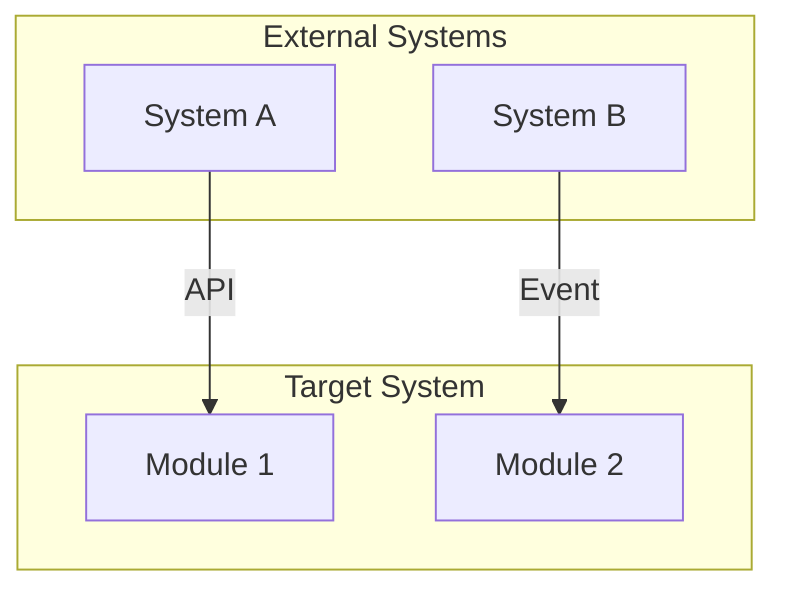
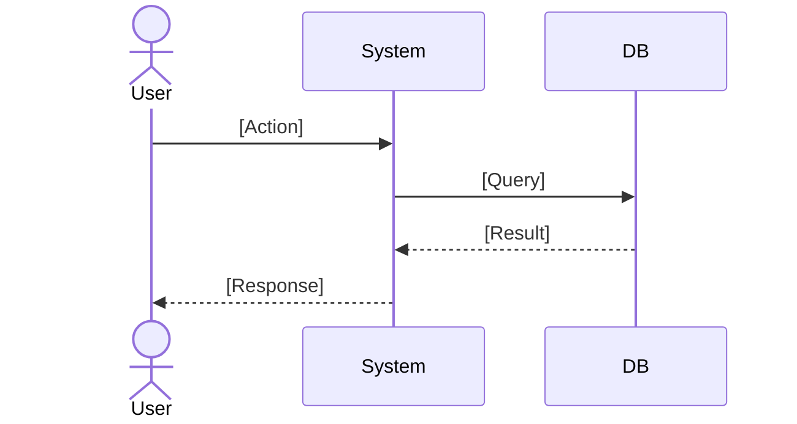
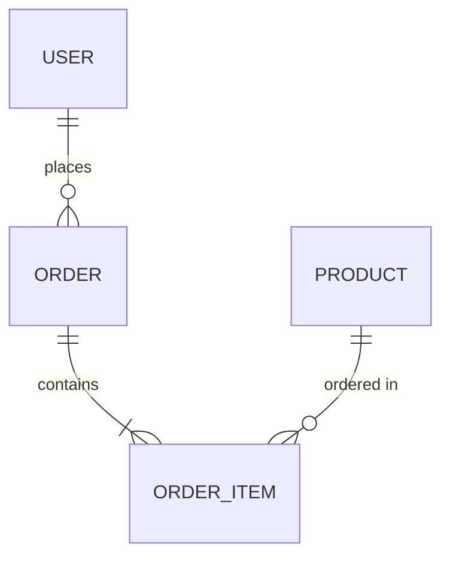

# Software Requirements Specification (SRS)

## Document Information
| Field | Value |
|-------|-------|
| Project Name | [PROJECT_NAME] |
| Version | 1.0 |
| Author | Analysis & Design Dept. |
| Date | [DATE] |
| Status | Draft / Review / Approved |
| Related PRD | PRD-[NUMBER] |
| Related RTM | FR-XXX, NFR-XXX |

---

## 1. Introduction

### 1.1 Purpose
[Purpose and scope of this document]

### 1.2 Scope
[What the system will and will not do]

### 1.3 Definitions and Abbreviations
| Term | Definition |
|------|-----------|
| [Term] | [Definition] |

### 1.4 References
| Document | Version | Description |
|----------|---------|-------------|
| PRD-XXX | v1.0 | Product requirements document |
| [Other] | [v] | [Description] |

---

## 2. General Description

### 2.1 Product Perspective
[The system's place in the big picture - its relationship with other systems]

### 2.2 Product Functions (Summary)
| No | Function | Description |
|----|----------|-------------|
| F1 | [Function] | [Brief description] |
| F2 | [Function] | [Brief description] |

### 2.3 User Classes and Characteristics
| User Class | Permission Level | Description |
|-----------|-----------------|-------------|
| Admin | Full access | [Description] |
| User | Limited | [Description] |
| Visitor | Read-only | [Description] |

### 2.4 Operating Environment
| Environment | Detail |
|------------|--------|
| Operating System | [OS] |
| Browser | [Chrome 90+, Firefox 88+, Safari 14+] |
| Mobile | [iOS 14+, Android 10+] |
| Server | [Node.js 18+, Python 3.11+, etc.] |

### 2.5 Constraints
- [Technical constraint 1]
- [Legal constraint 2]
- [Business constraint 3]

### 2.6 Assumptions and Dependencies
| No | Assumption/Dependency | Type | Risk |
|----|----------------------|------|------|
| A1 | [Assumption] | Assumption | Low |
| D1 | [Dependency] | Dependency | Medium |

---

## 3. Functional Requirements

### 3.1 Module: [Module Name]

#### FR-001: [Requirement Name]
| Field | Value |
|-------|-------|
| ID | FR-001 |
| Priority | Must / Should / Could / Won't |
| Source | PRD-XXX, Section X.Y |
| Trigger | [User action / System event] |

**Description:**
[Detailed requirement description]

**Input:**
| Parameter | Type | Required | Description |
|-----------|------|----------|-------------|
| [param] | string | Yes | [Description] |

**Output:**
| Parameter | Type | Description |
|-----------|------|-------------|
| [param] | object | [Description] |

**Business Rules:**
- BR-001: [Rule description]
- BR-002: [Rule description]

**Acceptance Criteria:**
- [ ] [Criterion 1]
- [ ] [Criterion 2]
- [ ] [Criterion 3]

**Flow Diagram:**

---

### 3.2 Module: [Module Name]

#### FR-002: [Requirement Name]
[Same format repeats]

---

## 4. Non-Functional Requirements

### 4.1 Performance Requirements
| ID | Requirement | Metric | Target | Measurement Method |
|----|-----------|--------|--------|-------------------|
| NFR-P001 | Page load time | Average ms | < 2000ms | Lighthouse |
| NFR-P002 | API response time | p95 ms | < 500ms | APM |
| NFR-P003 | Concurrent users | Max concurrent | 1000 | Load test |

### 4.2 Security Requirements
| ID | Requirement | Standard | Detail |
|----|-----------|----------|--------|
| NFR-S001 | Authentication | ISO 27001 A.9 | [Description] |
| NFR-S002 | Data encryption | AES-256 | [Description] |
| NFR-S003 | Input validation | OWASP | [Description] |
| NFR-S004 | Rate limiting | - | [Description] |

### 4.3 Accessibility Requirements
| ID | Requirement | Standard | Detail |
|----|-----------|----------|--------|
| NFR-A001 | WCAG compliance | WCAG 2.1 AA | [Description] |
| NFR-A002 | Screen reader | ARIA | [Description] |

### 4.4 Scalability Requirements
| ID | Requirement | Detail |
|----|-----------|--------|
| NFR-SC001 | Horizontal scaling | [Description] |
| NFR-SC002 | Database scaling | [Description] |

### 4.5 Usability Requirements
| ID | Requirement | Detail |
|----|-----------|--------|
| NFR-U001 | Learning time | < 30 minutes |
| NFR-U002 | Error rate | < 1% task failure |

### 4.6 Reliability Requirements
| ID | Requirement | Target |
|----|-----------|--------|
| NFR-R001 | Uptime | 99.9% |
| NFR-R002 | MTTR | < 1 hour |
| NFR-R003 | RPO | < 1 hour |
| NFR-R004 | RTO | < 4 hours |

---

## 5. External Interface Requirements

### 5.1 User Interface
[UI wireframe references, design system, responsive breakpoints]

### 5.2 Software Interfaces
| External System | Protocol | Format | Authorization |
|----------------|----------|--------|--------------|
| [System A] | REST API | JSON | OAuth 2.0 |
| [System B] | GraphQL | JSON | API Key |
| [System C] | gRPC | Protobuf | mTLS |

### 5.3 Hardware Interfaces
[Hardware integrations if any]

### 5.4 Communication Interfaces
| Protocol | Usage | Detail |
|----------|-------|--------|
| HTTPS | All API communication | TLS 1.3 |
| WebSocket | Real-time notifications | WSS |
| SMTP | Email notifications | TLS |

---

## 6. Data Requirements

### 6.1 Data Model (Summary)

### 6.2 Data Storage
| Data Type | Retention Period | Backup | Encryption |
|-----------|-----------------|--------|-----------|
| User data | Account active + 5 years | Daily | AES-256 |
| Log data | 1 year | Weekly | - |
| Audit trail | 7 years | Daily | AES-256 |

### 6.3 Data Migration
[Data migration requirements from existing system if any]

---

## 7. Traceability Matrix

| Requirement ID | PRD Reference | Design | Code | Test | Status |
|---------------|--------------|--------|------|------|--------|
| FR-001 | PRD 5.1 | SAD 3.1 | src/module | TC-001 | Planned |
| NFR-P001 | PRD 6.1 | SAD 4.1 | - | PT-001 | Planned |

---

## 8. Approval

| Role | Name | Date | Status |
|------|------|------|--------|
| Product Owner | VSH | [DATE] | Pending |
| Lead Architect | VSH | [DATE] | Pending |
| QA Lead | VSH | [DATE] | Pending |
| Security Lead | VSH | [DATE] | Pending |
