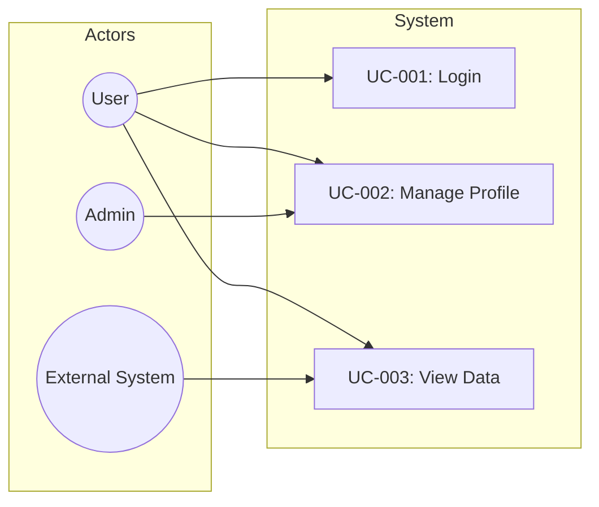
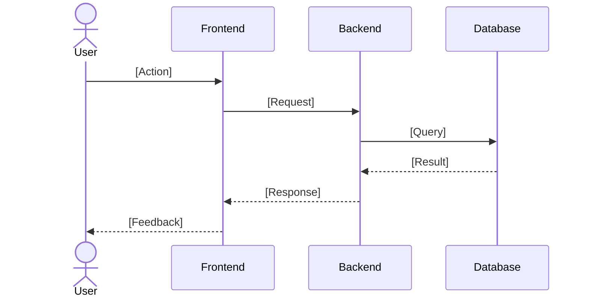

# Use Case Document

## Document Information
| Field | Value |
|-------|-------|
| Project Name | [PROJECT_NAME] |
| Version | 1.0 |
| Author | Analysis & Design Dept. |
| Date | [DATE] |
| Related SRS | SRS-[NUMBER] |

---

## 1. Actors

| Actor | Type | Description |
|-------|------|-------------|
| [Actor 1] | Primary | [Directly uses the system] |
| [Actor 2] | Secondary | [Indirectly interacts] |
| [External System] | System | [Integrated external system] |

---

## 2. Use Case Diagram (Overview)

---

## 3. Use Case Details

### UC-001: [Use Case Name]

| Field | Value |
|-------|-------|
| ID | UC-001 |
| Actor | [Primary actor] |
| Priority | Must / Should / Could |
| Precondition | [System state at start] |
| Postcondition | [System state on successful completion] |
| Trigger | [Event that initiates this use case] |
| Related FR | FR-001, FR-002 |

**Main Flow (Happy Path):**

| Step | Actor | System |
|------|-------|--------|
| 1 | [Actor action] | - |
| 2 | - | [System response] |
| 3 | [Actor action] | - |
| 4 | - | [System result] |

**Alternative Flows:**

**A1: [Alternative Scenario Name]**
| Step | Condition | Flow |
|------|----------|------|
| 2a | [Condition] | [Alternative steps] |

**Exception Flows:**

**E1: [Error Scenario]**
| Step | Error | System Response |
|------|-------|----------------|
| 2e | [Error condition] | [Error message and action] |

**Sequence Diagram:**

**Business Rules:**
- BR-001: [Rule]
- BR-002: [Rule]

---

### UC-002: [Use Case Name]
[Same format repeats]

---

## 4. CRUD Matrix

| Entity | Create | Read | Update | Delete |
|--------|--------|------|--------|--------|
| [Entity 1] | UC-001 | UC-003 | UC-002 | UC-004 |
| [Entity 2] | UC-005 | UC-003 | UC-006 | - |

---

## 5. Actor-Use Case Matrix

| Use Case | User | Admin | External System |
|----------|------|-------|----------------|
| UC-001 | X | X | - |
| UC-002 | X | - | - |
| UC-003 | - | X | X |

---

## 6. Priority and Phase Mapping

| Use Case | Priority | Sprint/Phase | Dependency |
|----------|----------|-------------|-----------|
| UC-001 | Must | Sprint 1 | - |
| UC-002 | Must | Sprint 1 | UC-001 |
| UC-003 | Should | Sprint 2 | UC-001 |
