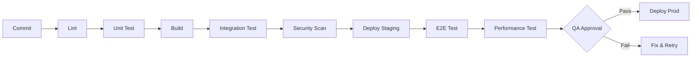

# Test Plan

## Document Information
| Field | Value |
|-------|-------|
| Project Name | [PROJECT_NAME] |
| Version | 1.0 |
| Author | QA & Security Dept. |
| Date | [DATE] |
| Status | Draft / Review / Approved |
| Related SRS | SRS-[NUMBER] |
| Related Sprint | Sprint [N] |
| Source Diagrams | DG-301, DG-401, DG-402, ... |

---

## 1. Test Scope

### 1.1 In Scope
| Module | Test Types | Priority |
|--------|-----------|----------|
| [Module 1] | Unit, Integration, E2E | High |
| [Module 2] | Unit, Integration | Medium |
| [Module 3] | Unit | Low |

### 1.2 Out of Scope
| Area | Reason |
|------|--------|
| [Area] | [Reason] |

---

## 2. Test Strategy

### 2.1 Test Pyramid
```
         /  E2E  \          <- 10% - Critical flows
        / Integration \      <- 30% - API + DB
       /    Unit Tests   \   <- 60% - Business logic
```

### 2.2 Test Types and Tools
| Test Type | Tool | Coverage Target | Environment |
|----------|------|----------------|-------------|
| Unit | [Jest/Pytest/Go test] | 80%+ | CI |
| Integration | [Supertest/TestContainers] | 70%+ | CI |
| E2E | [Playwright/Cypress] | Critical flows | CI + Staging |
| Performance | [k6/Artillery/JMeter] | NFR targets | Staging |
| Security | [OWASP ZAP/Snyk] | OWASP Top 10 | CI + Staging |
| Accessibility | [axe-core/Lighthouse] | WCAG 2.1 AA | CI |

### 2.3 Coverage Targets
| Metric | Minimum | Target |
|--------|---------|--------|
| Line coverage | 80% | 90% |
| Branch coverage | 70% | 85% |
| Function coverage | 80% | 90% |
| Critical path E2E | 100% | 100% |

---

## 3. Test Environments

| Environment | Purpose | DB | External Services |
|------------|---------|-----|------------------|
| Unit test | Isolated function testing | Mock | Mock |
| Integration test | API + DB testing | Test DB (Docker) | Mock/Stub |
| E2E test | End-to-end flow | Staging DB | Sandbox |
| Performance test | Load testing | Staging DB | Sandbox |

---

## 4. Test Scenarios (Summary)

### 4.1 Module: [Module Name]

| ID | Scenario | Type | Priority | Status |
|----|----------|------|----------|--------|
| TC-001 | [Scenario description] | Unit | P1 | Planned |
| TC-002 | [Scenario description] | Integration | P1 | Planned |
| TC-003 | [Scenario description] | E2E | P1 | Planned |

> Detailed test cases: TEST_CASES-[NUMBER]

### 4.2 Non-Functional Test Scenarios

#### Performance
| ID | Scenario | Metric | Target |
|----|----------|--------|--------|
| PT-001 | [N] concurrent users | Response time p95 | < 500ms |
| PT-002 | [N] req/s load | Throughput | > [N] req/s |
| PT-003 | 1-hour stress test | Error rate | < 0.1% |

#### Security
| ID | Scenario | OWASP | Target |
|----|----------|-------|--------|
| ST-001 | SQL injection test | A03 | Zero findings |
| ST-002 | XSS test | A07 | Zero findings |
| ST-003 | Auth bypass test | A01 | Zero findings |
| ST-004 | CSRF test | A01 | Zero findings |

---

## 5. Test Data Strategy

### 5.1 Test Data Generation
| Method | Usage | Tool |
|--------|-------|------|
| Factory | Unit/Integration tests | [faker/factory_boy] |
| Fixture | Fixed data sets | JSON/SQL seed |
| Snapshot | Previous prod data (anonymized) | [tool] |

### 5.2 PII Rules
- REAL personal data is NEVER used in test data
- If prod data is copied, PII must be anonymized
- Masked data is used in test environments

---

## 6. CI/CD Test Pipeline



### 6.1 Gate Criteria
| Gate | Criterion | Blocker |
|------|----------|---------|
| Unit Test | 80%+ coverage, 0 fail | Yes |
| Integration | 0 fail | Yes |
| Security Scan | 0 critical, 0 high | Yes |
| E2E | Critical flows 100% | Yes |
| Performance | NFR targets | No (warning) |

---

## 7. Bug Management

### 7.1 Bug Prioritization
| Level | Definition | SLA |
|-------|-----------|-----|
| P1 - Critical | System unusable | 4 hours |
| P2 - High | Major function broken | 1 business day |
| P3 - Medium | Minor function issue | 3 business days |
| P4 - Low | Cosmetic/improvement | Next sprint |

### 7.2 Bug Report Format
| Field | Description |
|-------|-------------|
| Title | Short and clear description |
| Steps | Reproducible steps |
| Expected | What should have happened |
| Actual | What happened |
| Environment | Browser/OS/version |
| Screenshot | If available |
| Log | Error logs |

---

## 8. Reporting

### 8.1 Daily Report
- Tests run: [N]
- Passed: [N] / Failed: [N]
- New bugs: [N]
- Resolved bugs: [N]
- Coverage: %[N]

### 8.2 End of Sprint Report
- Total test cases: [N]
- Automation rate: %[N]
- Coverage: %[N]
- Open bugs: [N] (P1: [N], P2: [N], P3: [N], P4: [N])
- Release readiness: Ready / Not Ready

---

## 9. Approval

| Role | Name | Date | Status |
|------|------|------|--------|
| QA Lead | VSH | [DATE] | Pending |
| Dev Lead | VSH | [DATE] | Pending |
| Product Owner | VSH | [DATE] | Pending |
